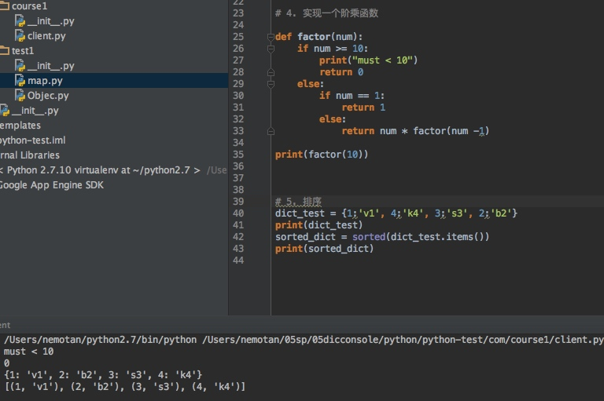

# one

```python

# coding=utf-8  ''' 
1、元组和列£表的区别？ 
	 列表: list是处理一组有序项目的数据结构，即你可以在一个列表中存储一个序列的项目。列表中的项目。列表中的项目应该包括在方括号中，这样python就知道你是在指明一个列表。一旦你创建了一个列表，你就可以添加，删除，或者是搜索列表中的项目。由于你可以增加或删除项目，我们说列表是可变的数据类型，即这种类型是可以被改变的，并且列表是可以嵌套的。相当于java中的集合,表示方式:['1','2','3']   
	 
	 元组: 元祖和列表十分相似，不过元组是不可变的。即你不能修改元组。元组通过圆括号中用逗号分隔的项目定义。元组通常用在使语句或用户定义的函数能够安全的采用一组值的时候，即被使用的元组的值不会改变。元组可以嵌套。表示方式:("1","2",'3")   
	 
	 字典: 就不说了,就是map  

2、python中分割列表用什么方式？ 
  	 ['fox','tiger','rabbit','snake'] 这种方式表示  
  
3、python中怎么进行多行注释？  
	 用三个单引号包裹, 中文注释 需要题头指定编码 
	 
4、实现一个函数，传入任意一个整数返回其阶乘的值，传入值必须小于10 

5、给定{1:'v1', 4:'k4', 3:'s3', 2:'b2'}，根据其键值进行排序 
```




