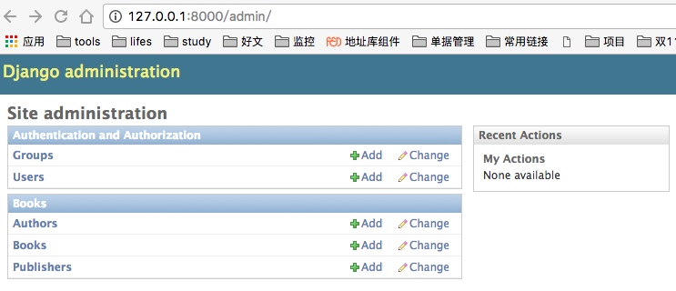

# 安装

[参考资源](http://www.runoob.com/django/django-install.html)

	pip install Django #安装Django in /Library/Python/2.7/site-packages
	django-admin.py startproject testdj #创建测试项目
	cd testdj  #进入项目
	python manage.py runserver #运行
	http://127.0.0.1:8000/ #访问

DB操作：

	python manage.py migrate #根据models进行创建表
	python manage.py makemigrations Publisher #通知更新具体的表
	

管理工具：
	
	http://127.0.0.1:8000/admin/ #访问
	python manage.py createsuperuser #创建超级用户
	打开mode中的admin.py, TestModel/admin.py #管理数据模型

管理工具如下图：

