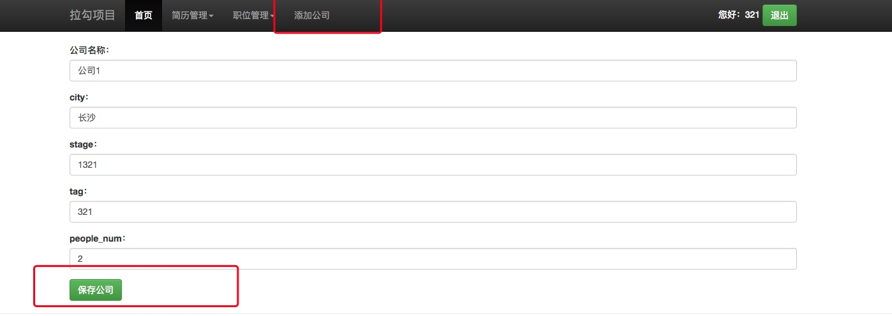
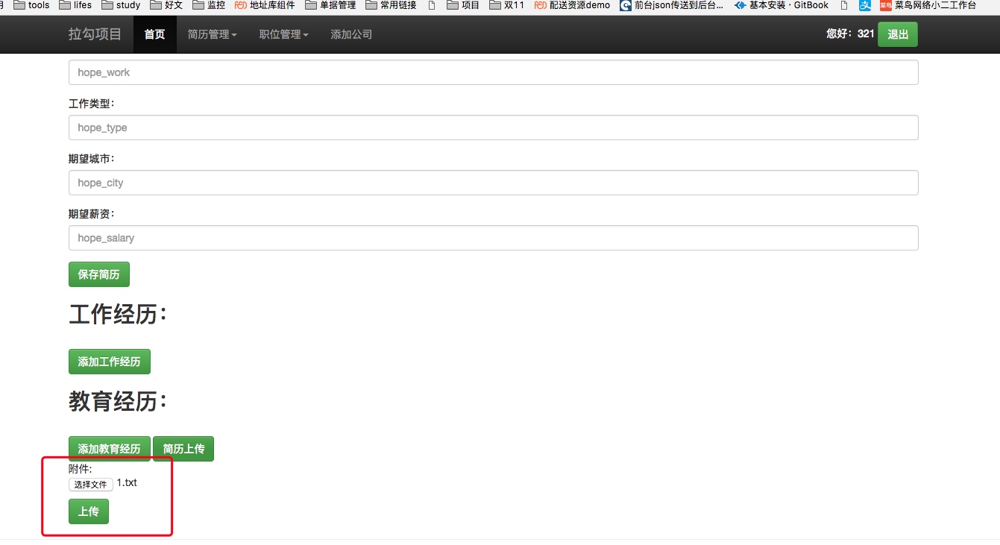

```phthon
def save_file(pars):
    x = web.input(filename={})
    ##测试代码
    web.debug(x['filename'].filename)  # This is the filename
    web.debug(x['filename'].value)  # This is the file contents
    web.debug(x['filename'].file.read())  # Or use a file(-like) object

    filedir = os.path.join(web.config['work_dir'], 'static',
                           'upload_files')  # change this to the directory you want to store the file in.
    if 'filename' in x:  # to check if the file-object is created
        filepath = x.filename.filename.replace('\\', '/')  # replaces the windows-style slashes with linux ones.
        filename = filepath.split('/')[-1]  # splits the and chooses the last part (the filename with extension)
        filename = filename.decode('utf-8')  ##decoding for windows file name
        fout = open(filedir + '/' + filename, 'wb')  # creates the file where the uploaded file should be stored
        fout.write(x.filename.file.read())  # writes the uploaded file to the newly created file.
        fout.close()  # closes the file, upload complete.

    return '/static/upload_files/' + filename

```

