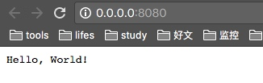
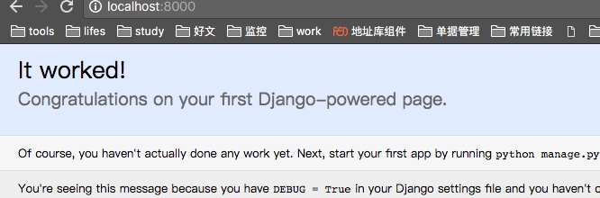
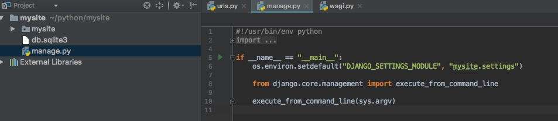
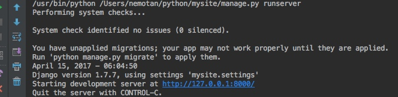

[toc]

## 安装
	
	brew install python
	which python
	sudo python get-pip.py

	#安装pip
	wget https://bootstrap.pypa.io/get-pip.py
	sudo python get-pip.py
	cd ~
	mkdir .pip
	touch pip.conf
	
	

## 编辑器
|名称|描述|
|:---:|:--:|
|Eclipse with PyDev|Eclipse 是非常流行的 IDE，而且已经有了很久的历史。Eclipse with Pydev 允许开发者创建有用和交互式的 Web 应用。PyDev 是 Eclipse 开发 Python 的 IDE，支持 Python，Jython和 IronPython 的开发。|
|Emacs|GNU Emacs 是可扩展，自定义的文本编辑器，甚至是更多的功能。Emacs 的核心是 Emacs Lisp 解析器，但是支持文本编辑。如果你已经使用过 Vim，可以尝试一下 Emacs。|
|PyCharm|PyCharm 是 JetBrains 开发的 Python IDE。PyCharm用于一般IDE具备的功能，比如， 调试、语法高亮、Project管理、代码跳转、智能提示、自动完成、单元测试、版本控制……另外，PyCharm还提供了一些很好的功能用于Django开发，同时支持Google App Engine，更酷的是，PyCharm支持IronPython！|
|PyScripter|PyScripter 是款免费开源的 Python 集成开发环境（IDE）。|
|The Eric Python IDE|Eric 是全功能的 Python 和 Ruby 编辑器和 IDE，是使用 Python 编写的。Eric 基于跨平台的 GUI 工具包 Qt，集成了高度灵活的 Scintilla 编辑器控件。Eric 包括一个插件系统，允许简单的对 IDE 进行功能性扩展。|

## web.py

[官网](http://webpy.org/)
	
### 安装web.py

	# 方式一
	pip list #查看所有的python包
	git clone git://github.com/webpy/webpy.git #进入目录
	python install setup.py #可以安装
	
	# 方式二
	pip uninstall web.py #先卸载
	pip install web.py # 就OK了 
	pip list查看安装的web.py的版本
	
	测试：终端进入python
	import web #引入web.py
	exit() #退出终端

### 测试

webtest.py 输入官网中的实例代码，启动
	
```python
import web

urls = (
    '/(.*)', 'hello'
)
app = web.application(urls, globals())

class hello:
    def GET(self, name):
        if not name:
            name = 'World'
        return 'Hello, ' + name + '!'

if __name__ == "__main__":
    app.run()
```

localhost:8080




## diango
### 安装	

	在线安装:sudo pip install Django==1.7.7
 	测试安装:进入python终端：import django ; django.get_version())
 	创建第一个项目:进入自己目录——>django-admin startproject mysite 
 	启动项目:python manage.py runserver [端口号，默认8000]
	访问测试页面:http://127.0.0.1:8000/
	



### idea开发测试

使用的ide是：PyCharm








