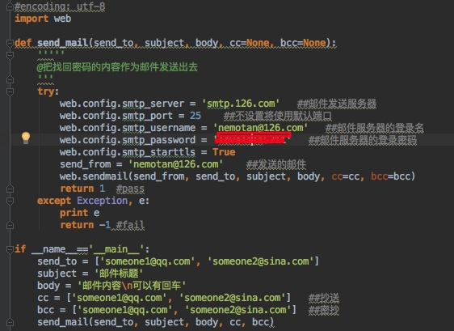
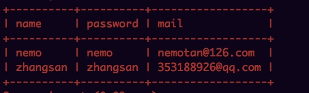
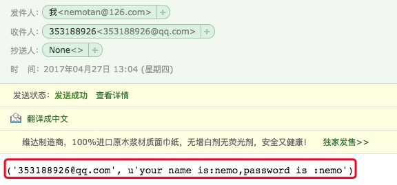
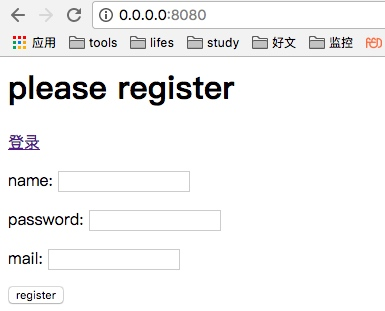
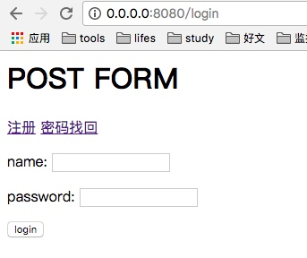
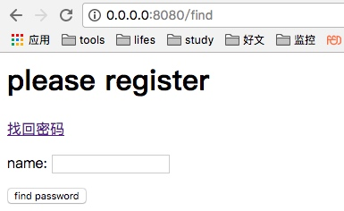

[toc]
# 实现一个注册、登录、邮件找回的功能
## 主要代码

**app.py**

```python
#!/usr/bin/python
# -*- coding: utf-8 -*-
import web

urls = (
    '/register', 'register',
    '/login', 'login',
    '/doLogin', 'doLogin',
    '/find', 'find',
    '/sendmail', 'sendmail',
    '/(.*)', 'default'
)

db = web.database(dbn='mysql', host='localhost', port=3306, user='root', pw='tan', db='test')
render = web.template.render('templates/')
app = web.application(urls, globals())
web.template.Template.globals['render'] = render


class hello:
    def GET(self, name):
        if not name:
            name = 'World'
        return 'Hello, ' + name + '!'

class register:
    def POST(self):
        par = web.input()
        name = par.name
        password = par.password
        mail = par.mail
        try:
            db.insert('customer', name=name, password=password, mail=mail)
            return 'register success!'
        except:
            return "register fail!"

class login:
    def GET(self):
        return render.login()

class doLogin:
    def POST(self):
        par = web.input()
        name = par.name
        password = par.password
        try:
            results = db.query('select name,password from customer where name=$name', vars={'name': name})
            if len(results) == 0:
                return render.error("login fail,can not find username!")

            for user in results:
                dbpassword = user.password

            if password == dbpassword:
                return 'login success!'
            else:
                return render.error("login fail,password is not right!")

        except Exception, e:
            print e
            return render.error("login error!")

class find:
    def GET(self):
        return render.update()

class sendmail:
    def POST(self):
        par = web.input()
        name = par.name
        try:
            results = db.query('select name,password,mail from customer where name=$name', vars={'name': name})
            if len(results) == 0:
                return "sendmail fail,can not find username!"

            for user in results:
                email = user.mail
                password = user.password

            #sendmail
            from sendmail import send_mail
            print 'email:'+ email
            body = 'your name is:'+name+",password is :"+password
            return send_mail(email, 'your name is:'+name+",password is :"+password, body)

        except Exception, e:
            print e
            return "sendmail fail!"


class default:
    def GET(self, name):
        return render.register()


if __name__ == "__main__":
    app.run()

```
**sendmail**




## 效果

**db**


**邮箱找回：**













