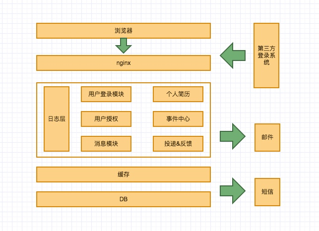
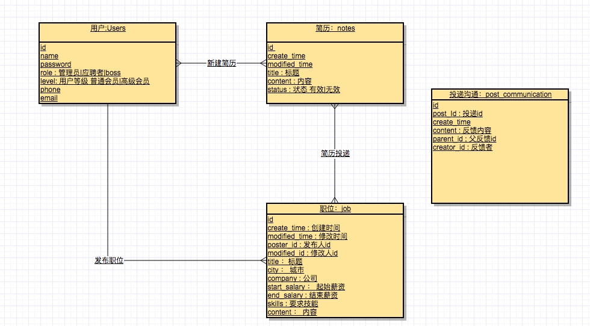
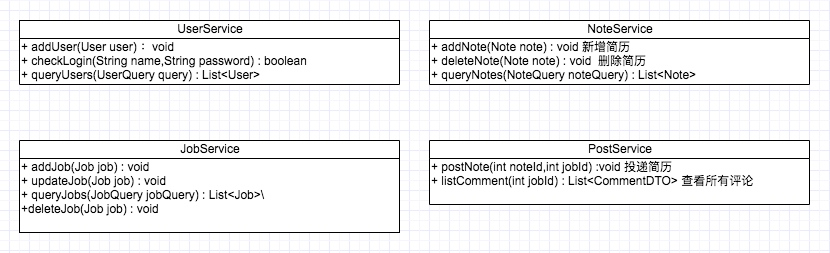
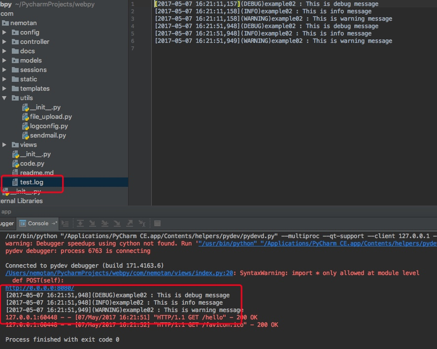

# 拉勾网设计
## 系统架构图


## E-R图




## UML类图



## log配置

在setting.py中添加log的配置代码

```python
#log 配置
import logging
import logging.config

configFiledir = os.path.join(web.config['work_dir'], 'config', 'logger.conf')
logging.config.fileConfig(configFiledir)

```


在index.py中使用日志

```python
def GET(self):
    logger = logging.getLogger("example02")
    logger.debug('This is debug message')
    logger.info('This is info message')
    logger.warning('This is warning message')
    return 'Hello,WORLD!'

```

结果：




