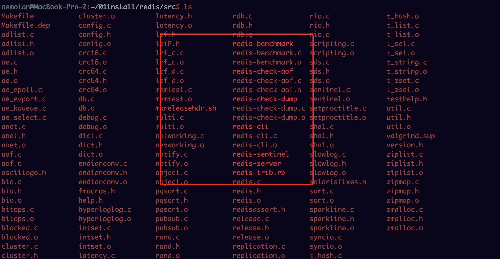
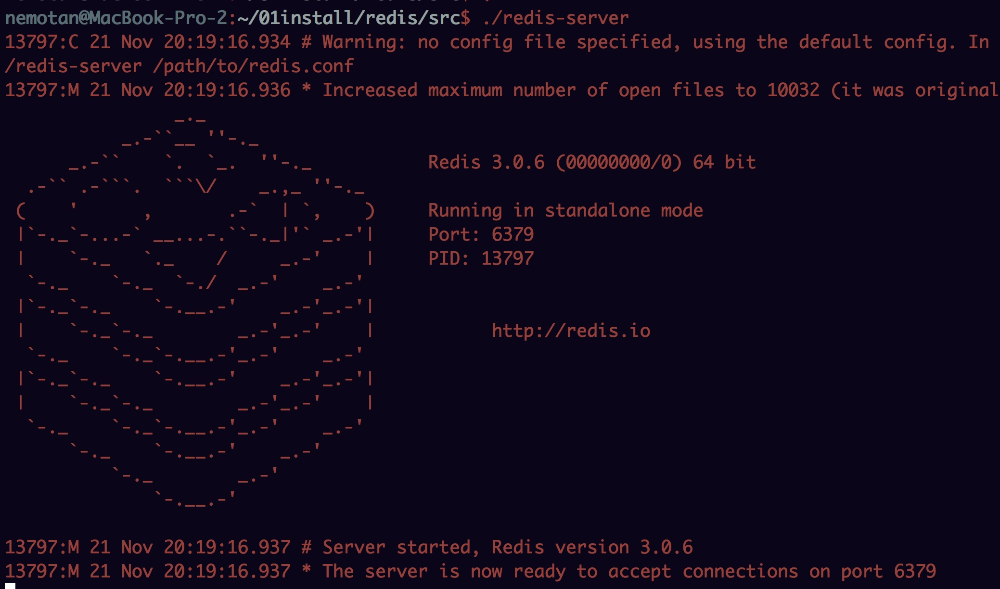
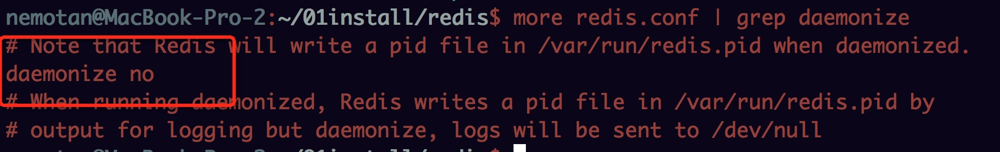
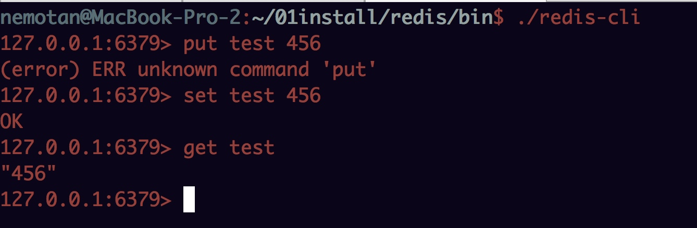
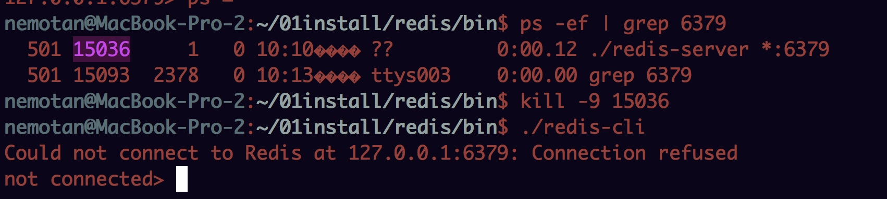

[toc]
# redis使用场景
	
1、会话缓存（Session Cache）

最常用的一种使用Redis的情景是会话缓存（session cache）。用Redis缓存会话比其他存储（如Memcached）的优势在于：Redis提供持久化。当维护一个不是严格要求一致性的缓存时，如果用户的购物车信息全部丢失，大部分人都会不高兴的，现在，他们还会这样吗？
幸运的是，随着 Redis 这些年的改进，很容易找到怎么恰当的使用Redis来缓存会话的文档。甚至广为人知的商业平台Magento也提供Redis的插件。

2、队列

Reids在内存存储引擎领域的一大优点是提供 list 和 set 操作，这使得Redis能作为一个很好的消息队列平台来使用。Redis作为队列使用的操作，就类似于本地程序语言（如Python）对 list 的 push/pop 操作。
如果你快速的在Google中搜索“Redis queues”，你马上就能找到大量的开源项目，这些项目的目的就是利用Redis创建非常好的后端工具，以满足各种队列需求。例如，Celery有一个后台就是使用Redis作为broker，你可以从这里去查看。

3、排行榜/计数器

Redis在内存中对数字进行递增或递减的操作实现的非常好。集合（Set）和有序集合（Sorted Set）也使得我们在执行这些操作的时候变的非常简单，Redis只是正好提供了这两种数据结构。所以，我们要从排序集合中获取到排名最靠前的10个用户–我们称之为“user_scores”，我们只需要像下面一样执行即可：
当然，这是假定你是根据你用户的分数做递增的排序。如果你想返回用户及用户的分数，你需要这样执行：
ZRANGE user_scores 0 10 WITHSCORES
Agora Games就是一个很好的例子，用Ruby实现的，它的排行榜就是使用Redis来存储数据的，你可以在这里看到。

4、发布/订阅

最后（但肯定不是最不重要的）是Redis的发布/订阅功能。发布/订阅的使用场景确实非常多。我已看见人们在社交网络连接中使用，还可作为基于发布/订阅的脚本触发器，甚至用Redis的发布/订阅功能来建立聊天系统！（不，这是真的，你可以去核实）。
Redis提供的所有特性中，我感觉这个是喜欢的人最少的一个，虽然它为用户提供如果此多功能。

# 优点

1、读写性能优异
2、支持数据持久化，支持AOF和RDB两种持久化方式
3、支持主从复制，主机会自动将数据同步到从机，可以进行读写分离。
4、数据结构丰富：除了支持string类型的value外还支持string、hash、set、sortedset、list等数据结构。

# 缺点

1、Redis不具备自动容错和恢复功能，主机从机的宕机都会导致前端部分读写请求失败，需要等待机器重启或者手动切换前端的IP才能恢复。
2、主机宕机，宕机前有部分数据未能及时同步到从机，切换IP后还会引入数据不一致的问题，降低了系统的可用性。
3、Redis的主从复制采用全量复制，复制过程中主机会fork出一个子进程对内存做一份快照，并将子进程的内存快照保存为文件发送给从机，这一过程需要确保主机有足够多的空余内存。若快照文件较大，对集群的服务能力会产生较大的影响，而且复制过程是在从机新加入集群或者从机和主机网络断开重连时都会进行，也就是网络波动都会造成主机和从机间的一次全量的数据复制，这对实际的系统运营造成了不小的麻烦。
4、Redis较难支持在线扩容，在集群容量达到上限时在线扩容会变得很复杂。为避免这一问题，运维人员在系统上线时必须确保有足够的空间，这对资源造成了很大的浪费。

# 安装

	wget http://download.redis.io/releases/redis-3.0.6.tar.gz
	tar zxvf redis-3.0.7.tar.gz
	cd redis
	make
	src/redis-server & 后台启动
	修改配置文件：daemonize yes 也可以后台启动
	src/redis-server 启动
	 
安装完成在src下有如下命令：

启动：

修改diamonize参数：

# linux自启动配置

	cd /etc
	mkdir redis
	cp /Users/nemotan/01install/redis/redis.conf 6379.conf
	cd /Users/nemotan/01install/redis/utils
	cp redis_init_script /etc/init.d/redisd
	修改 redisd中，增加注释
	添加EXEC和CONF配置项
	
# [mac自启动设置](http://blog.csdn.net/zwwnzb/article/details/71411533)
	
	由于设置系统自启动，主要是配置一些系统参数，这里不做设置，每次启动redis使用后台启动的方式。

# 其他常用命令
	
	redis-server redis服务器
	redis-cli redis客户端
	redis-benchmark redis性能测试工具
	redis-check-aof AOF文件修复工具
	redis-check-rdb RDB文件修复工具

# 启动

文件copy到一个bin下：

	./redis-server redis.conf  #启动
	./redis-cli 
	
连接客户端：

查看和关闭进程：

