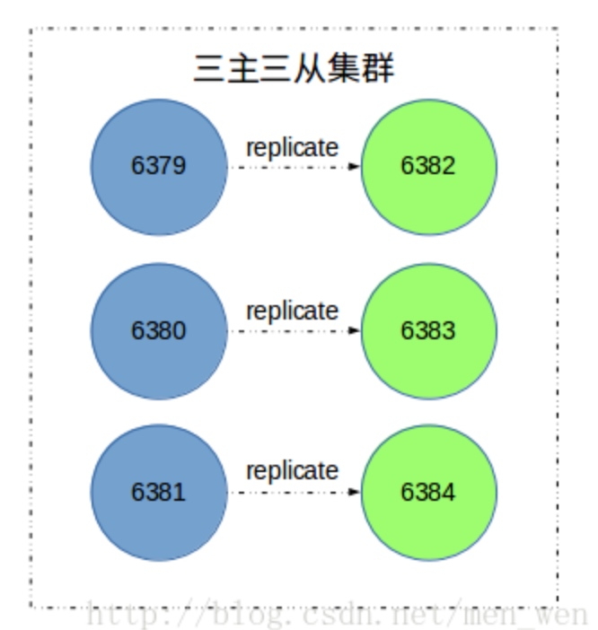
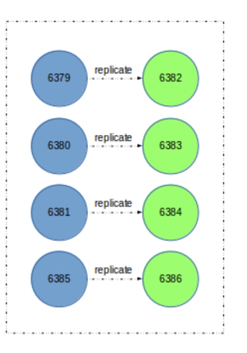
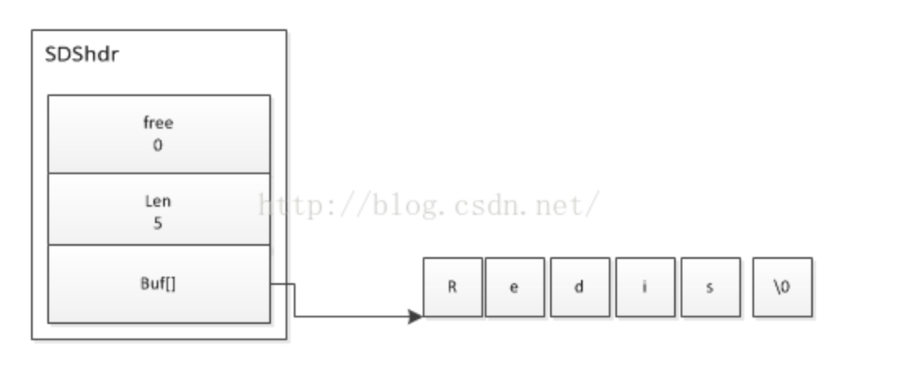
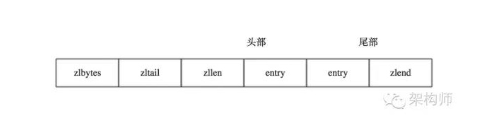

[toc]

## 目标
	
- 1.解释redis数据库是怎么扩容的？
- 2.用几句话描述sds结构和压缩列表
	
	
## 扩容

**举例从三主三从->四主四从：**

	
**扩容时机：**

- redis服务器负载表较高，cpu利用率高(90%以上)
- Redis是单进程的，只能占用1个CPU核，跑满了也就100%，无法利用机器的多核，而当CPU跑到100%时

**扩容步骤：**

- 准备新节点
	- 创建两个节点，端口分别为6385和6386，配置和之前集群节点配置基本相同
	- 启动两个节点
	- 启动后的新节点会作为孤儿节点运行，没有和其他节点与之通信。
- 加入集群
	- CLUSTER MEET命令将6385节点加入到集群中
	- 为新节点迁移槽和数据实现扩容。
	- 作为其他主节点的从节点负责故障转移
- 迁移槽和数据
	- 使用redis-trib.rb工具迁移

## SDS

SDS实例

- 1. free属性的值0，该SDS没有空闲的未使用空间。
- 2. len 为5，表示字符串的长度为5
- 3. buf为字符数组，最后一位为\0标识字符串的结束。

>SDS遵循C字符串以空字符结束的惯例，保留空字符的1字节的空间，不计算在SDS的len属性中，并且为空字符分配一个字节的空间，遵循这一惯例使得SDS仍然可以使用部分C语言字符串的一些函数。

## 压缩链表

名词解释：

压缩列表是一种数据结构，这种数据结构的功能是将一系列数据与其编码信息存储在一块连续的内存区域，这块内存物理上是连续的，逻辑上被分为多个组成部分，其目的是在一定可控的时间复杂读条件下尽可能的减少不必要的内存开销，从而达到节省内存的效果。

内存区域布编码：

- zlbytes：存储一个无符号整数，固定四个字节长度，用于存储压缩列表所占用的字节，当重新分配内存的时候使用，不需要遍历整个列表来计算内存大小。
- zltail：存储一个无符号整数，固定四个字节长度，代表指向列表尾部的偏移量，偏移量是指压缩列表的起始位置到指定列表节点的起始位置的距离。
- zllen：压缩列表包含的节点个数，固定两个字节长度，源码中指出当节点个数大于2^16-2个数的时候，该值将无效，此时需要遍历列表来计算列表节点的个数。
- entryX：列表节点区域，长度不定，由列表节点紧挨着组成。
- zlend：一字节长度固定值为255，用于表示列表结束。

Redis对于每种数据结构、无论是列表、哈希表还是有序集合，在决定**是否应用压缩列表**作为当前数据结构类型的底层编码的时候都会依赖一个开关和一个阈值，开关用来决定我们是否要启用压缩列表编码，阈值总的来说通常指当前结构存储的key数量有没有达到一个数值（条件），或者是value值长度有没有达到一定的长度（条件）。任何策略都有其应用场景，不同场景应用不同策略。为什么当前结构存储的数据条目达到一定数值使用压缩列表就不好？**压缩列表的新增、删除的操作平均时间复杂度为O(N)**，随着N的增大，时间必然会增加，他不像哈希表可以以O(1)的时间复杂度找到存取位置，然而在一定N内的时间复杂度我们可以容忍。然而**压缩列表利用巧妙的编码技术除了存储内容尽可能的减少不必要的内存开销**，将数据存储于连续的内存区域，这对于Redis本身来说是有意义的，因为Redis是一款内存数据库软件，想办法尽可能**减少内存的开销**是Redis设计者一定要考虑的事情。

	

