## 问题

	1.总结什么是set以及什么是sorted set，并完成对set以及sorted set的增删改查（查需要至少4种方式，比如列表，单个节点等）
	2.总结redis的事务特征，并且实际操作事务的提交  丢弃以及乐观锁

## 概念
	set：是一个去重的集合，集合中的元素都是不重复的。
	sorted set:是一个有序的去重的集合
## 操作

	
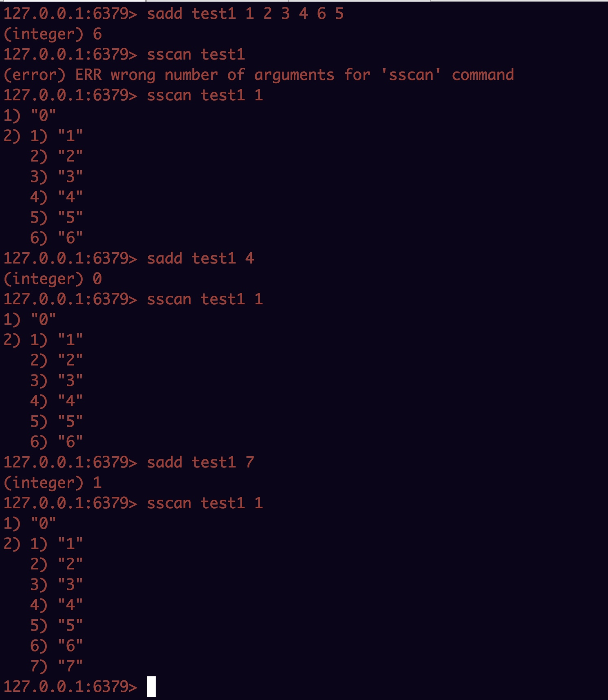

查询：

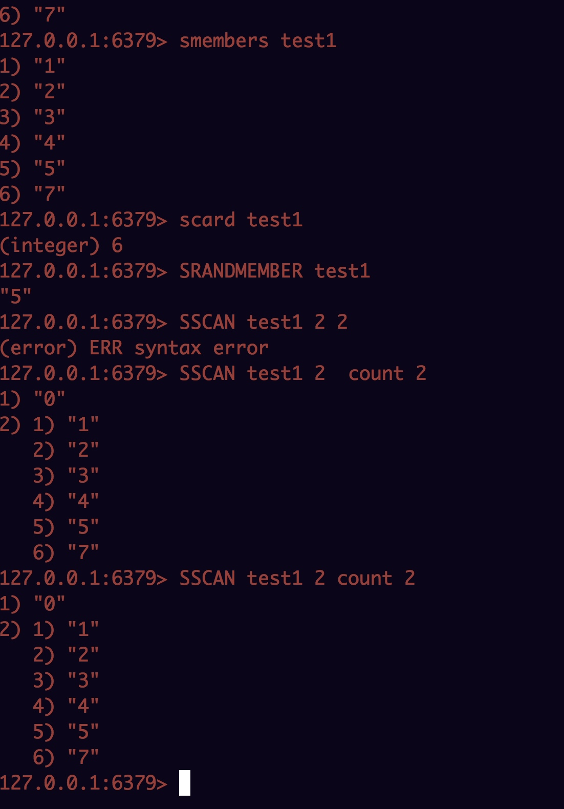

sorted set:

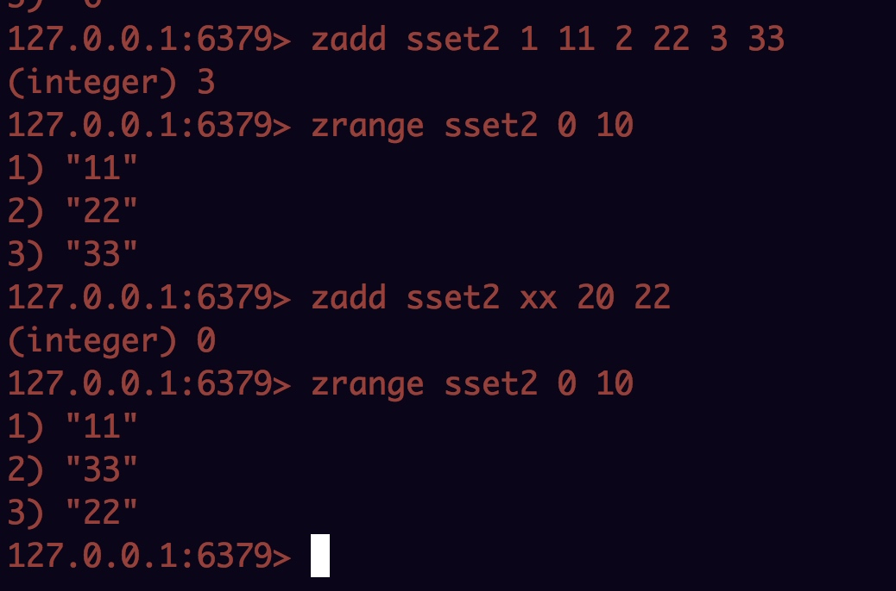

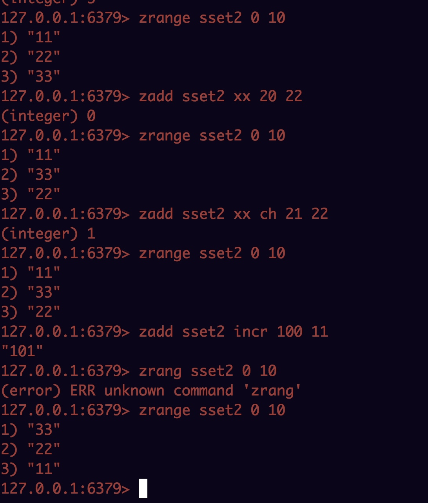

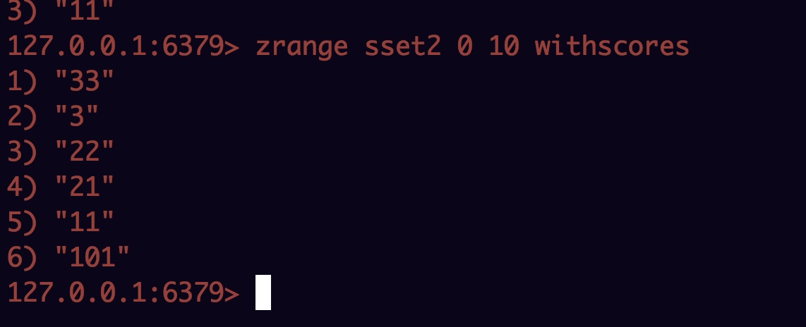

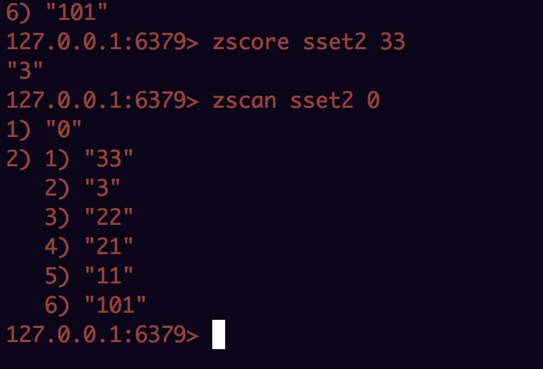

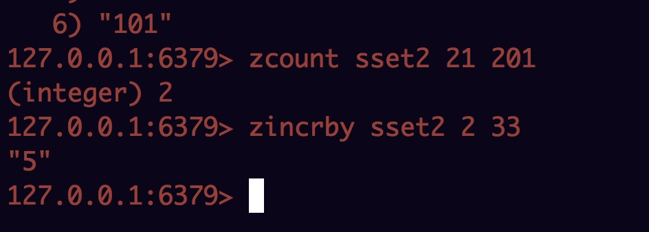

## 事务

隔离性
原子性
持久性
一致性

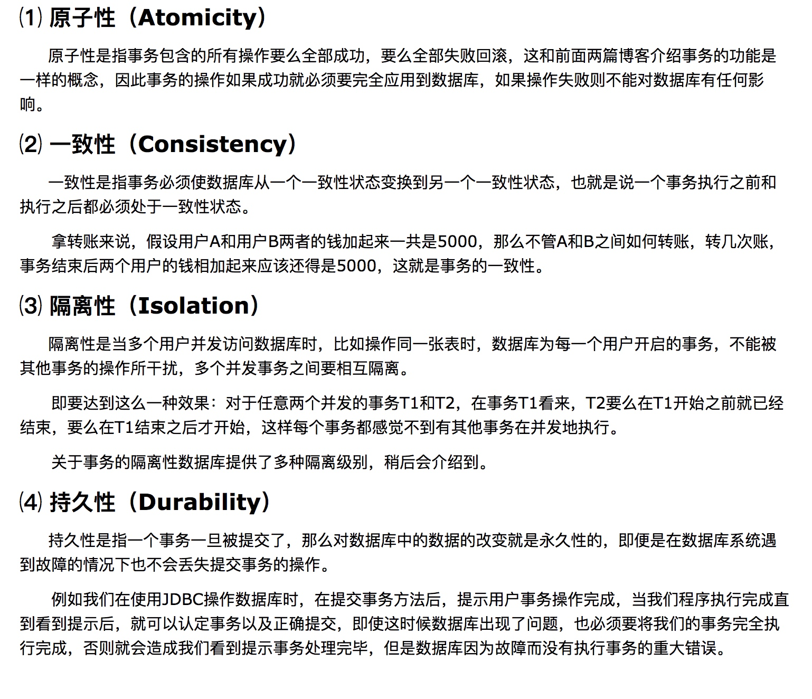

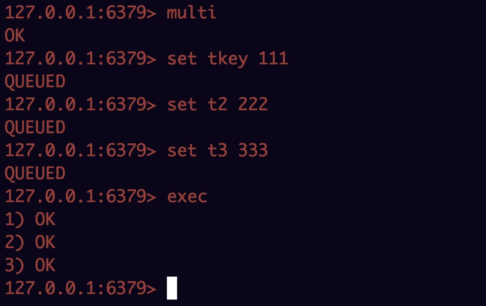

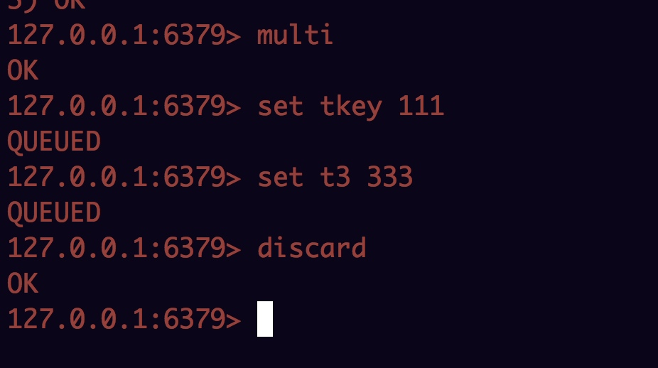

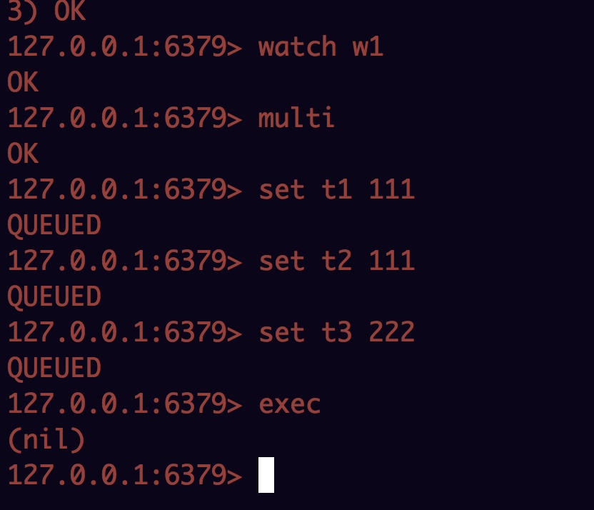

另外一个窗口：
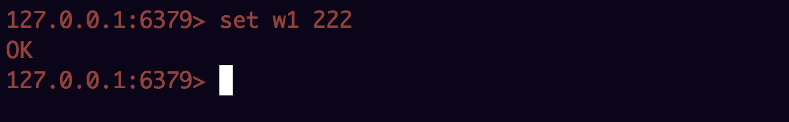

