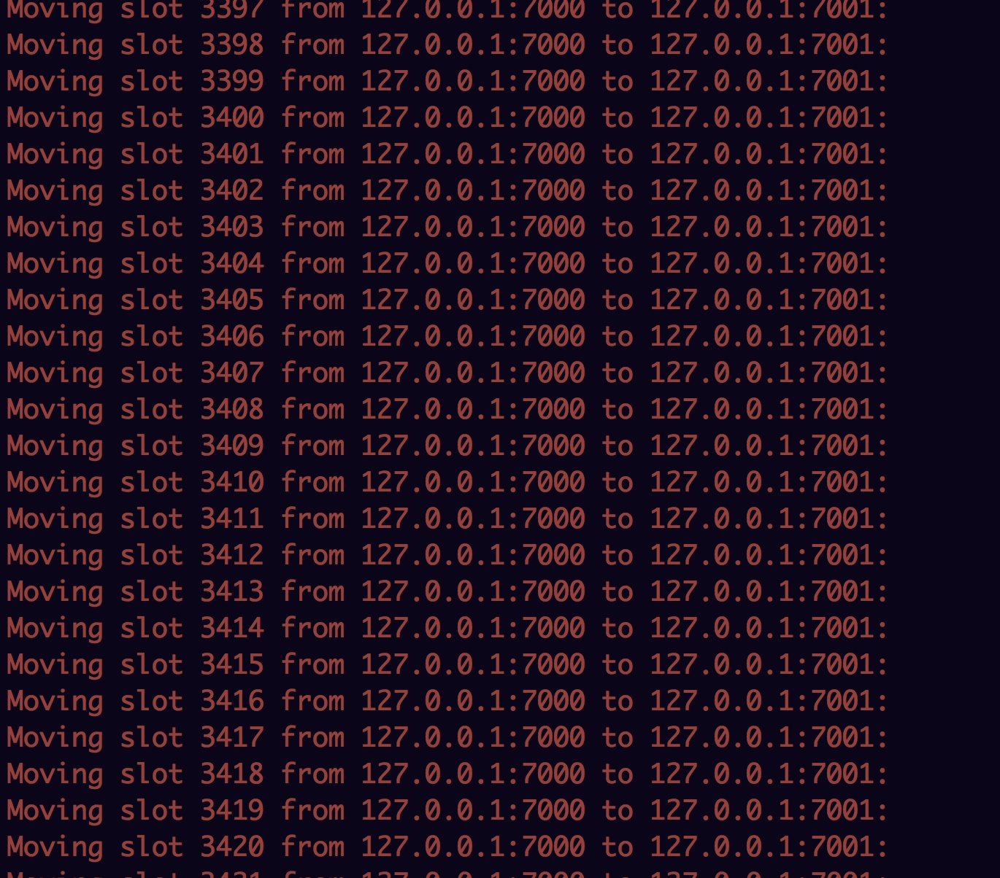

## 目标

1.通过jedis的分片api实现2个数据结构的操作（list  set中的2种数据结构）
2.部署集群，进行rehash操作，截图

## 分片操作

```
  // 通过jedis的分片api实现2个数据结构的操作（list  set中的2种数据结构）
  shardedJedis.lpush("bbbb","1","2","3");
  System.out.println("list:"+shardedJedis.lpop("bbbb"));
  shardedJedis.sadd("bbbbbbb","1");
  System.out.println("set:"+shardedJedis.spop("bbbbbbb"));
  
  输出：
  list:3
  set:1
```

## [redis集群安装](https://www.cnblogs.com/linjiqin/p/7451353.html)


- 创建6个节点：三个主节点、三个从节点，端口7001到7006


修改配置：

	daemonize yes                          #redis后台运行
	pidfile   /var/run/redis_7000.pid      #pidfile文件对应7000, 7001, 7002
	port 7000                              #端口7000, 7001, 7002
	cluster-enabled  yes                   #开启集群  把注释#去掉
	cluster-config-file  nodes_7000.conf   #集群的配置  配置文件首次启动自动生成 7000,7001,7002，存在/home/xm6f/dev/redis-3.2.4/src目录
	cluster-node-timeout  5000             #请求超时，设置5秒即可
	appendonly  yes                        #aof日志开启，有需要就开启，它会每次写操作都记录一条日志
	logfile "/home/xm6f/dev/redis_cluster/7000/logs/redis.log"
	bind 192.168.1.105 #绑定当前服务器的IP，否则的话在集群通信的时候会出现：[ERR] Sorry, can't connect to node 192.168.200.140:7001
	dbfilename dump_7000.rdb #存在/home/xm6f/dev/redis-3.2.4/src目录
	appendfilename "appendonly_7000.aof" #存在/home/xm6f/dev/redis-3.2.4/src目录
	
	requirepass 123456 #设置密码，每个节点的密码都必须一致的
	
	masterauth 123456


启动6个节点
	
	./redis-server redis.conf
	../../02/bin/redis-server ../../02/bin/redis.conf
	../../03/bin/redis-server ../../03/bin/redis.conf
	../../04/bin/redis-server ../../04/bin/redis.conf
	../../05/bin/redis-server ../../05/bin/redis.conf
	../../06/bin/redis-server ../../06/bin/redis.conf


查看服务
	
	ps -ef | grep redis #查看是否启动成功
	netstat -tnlp | grep redis #可以看到redis监听端口
	


杀死所有进程

	pkill -9 redis
	
mac安装ruby
	


	sudo gem install redis -v 3.0.6
	./../redis-3.0.6/src/redis-trib.rb
	执行ruby程序： ./redis-trib.rb
	
# 创建集群
	
	./redis-trib.rb create --replicas 1 127.0.0.1:7000 127.0.0.1:7001 127.0.0.1:7003 127.0.0.1:7004 127.0.0.1:7005 127.0.0.1:7006
	


连接集群
	
	redis-cli -h 127.0.0.1 -p 7000


## 查看集群信息

- 查看集群状态信息: CLUSTER INFO
- 查看槽 的分配信息: CLUSTER SLOTS
- 查看集群所有节点: CLUSTER NODES
- 返回某个key对 的槽 : CLUSTER KEYSLOT key
- 删除当前节点的槽 CLUSTER DELSLOTS slot [slot ...]
- 给当前节点添 槽 


重新分片：




