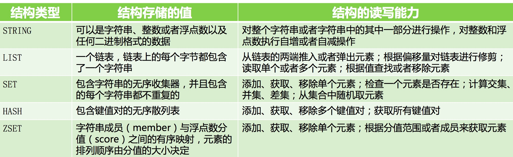
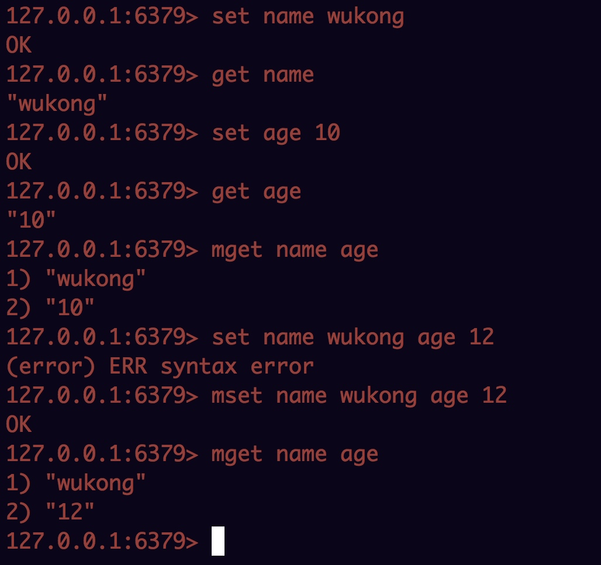
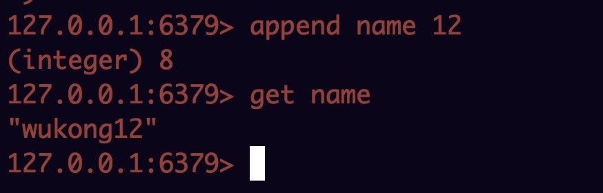
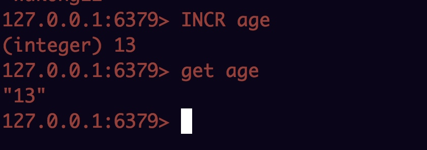
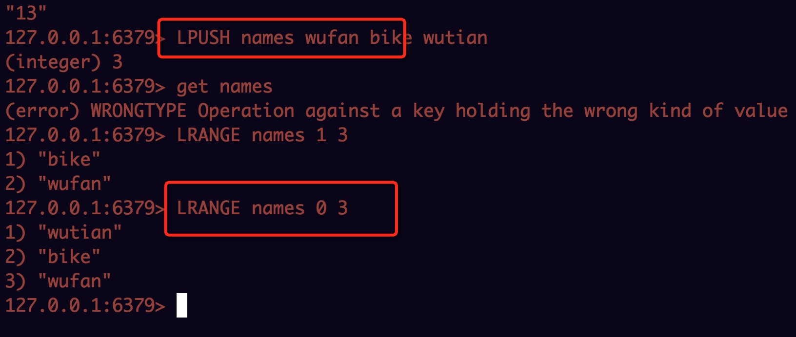
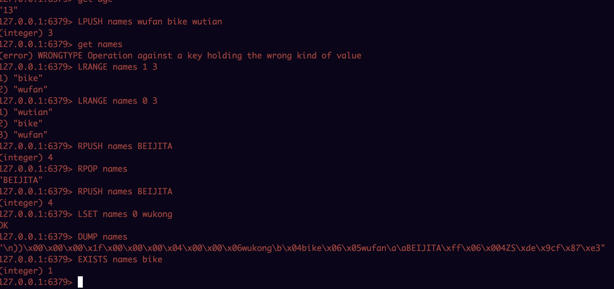
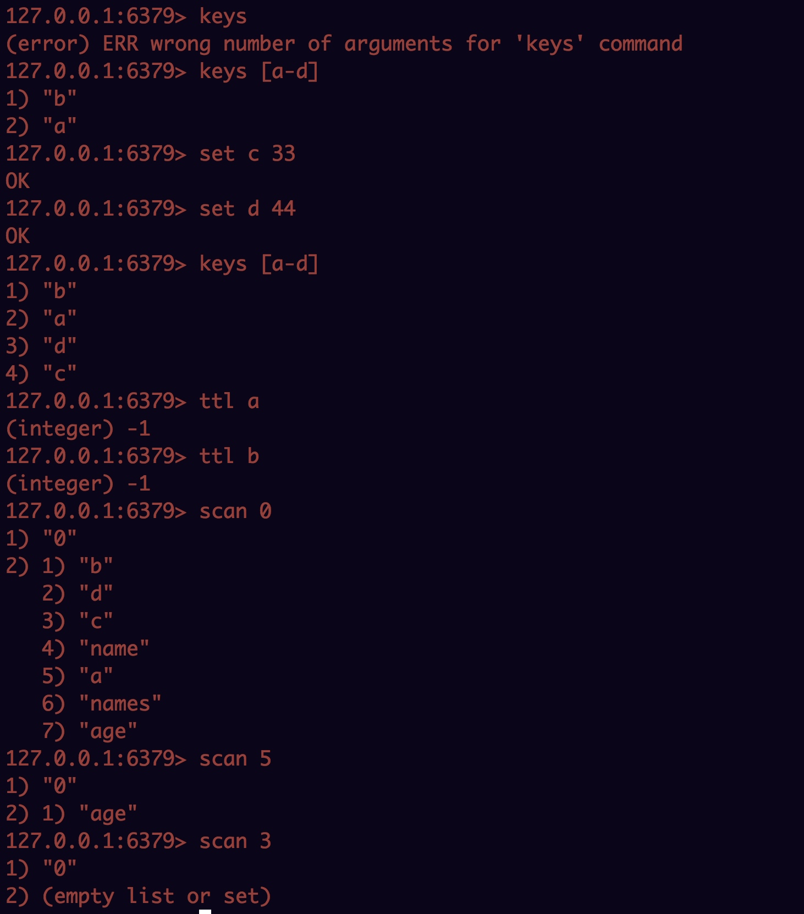
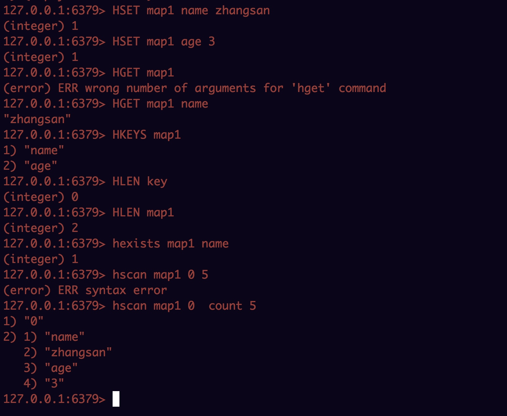

## 问题
	
	1.key string list hash结构中，每个至少完成5个命令，包含插入 修改 删除 查询，list 和hash还需要增加遍历的操作命令，把执行结果截图贴出来
	2.举例说明list和hash的应用场景，每个至少一个场景，比如：通过list实现秒杀的请求排队

key-value哈希存储结构，其中支持如下value五中数据结构：

set/get命令操作：

	SET key value [EX seconds] [PX milliseconds] [NX|XX] 
	
	EX 表设置超时时间，单位 妙 
	PX 表设置超时时间，单位 毫秒
	NX 表 有key 在才会执行
	XX 表， 有key 在才会更新
	如果成 ，返回ok，失败返回空 nil 
	
	GET key

	返回key的值
	
MGET/MSET/	MSETNX操作命令：
	
	- MGET key [key ...]
		- 返回指定的key的所有值，如果key 在则返回 个key的值 nil 
		- 返回对 key的值列表 
		
	- MSET key value [key value ...] 
		- 设置多个key value，如果某个key 及 在，则用新值覆盖旧值
		- 整个操作是原 操作，要么同时成 ，要么同时失败
		- 如果key 在 想覆盖的话，采用MSETNX命 
		- 总是返回ok，此操作 会失败
		
	- MSETNX key value [key value ...]
		
		- MSET类似，但是如果 要有一个key 在，则表示结果失败 
 		- 返回值 1表示设置成 ，0表示设置失败


## string操作

## list 操作

## key操作


## hash操作

 

## list和hash使用场景  

	1. list是链表，hash表是key-value结构
	2. list使用场景
		- 当成队列用，可以实现任务调度排队系统
		- 在变成中经常用LIST进行排序
	3. hash使用场景
		- 缓存使用
		- 校验去重使用
		



