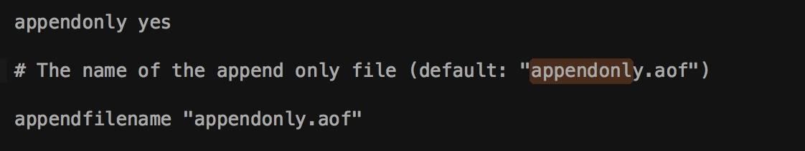

## 作业

	1.配置aof，并且形成rewrite之前和之后的对比
	2.配置rdb，手动命令和后台触发，截图对比持久化之前和之后的数据文件的差异
	

### aof

Append-only file，将**“操作 + 数据”**以格式化指令的方式追加到操作日志文件的尾部，在append操作返回后(已经写入到文件或者即将写入)，才进行实际的数据变更，“日志文件”保存了历史所有的操作过程；当server需要数据恢复时，可以直接replay此日志文件，即可还原所有的操作过程。AOF相对可靠，它和**mysql中bin.log、apache.log、zookeeper中txn-log**简直异曲同工。AOF文件内容是字符串，非常容易阅读和解析。 

**优点：**可以保持更高的数据完整性，如果设置追加file的时间是1s，如果redis发生故障，最多会丢失1s的数据；且如果日志写入不完整支持redis-check-aof来进行日志修复；AOF文件没被rewrite之前（文件过大时会对命令进行合并重写），可以删除其中的某些命令（比如误操作的flushall）。 

**缺点：**AOF文件比RDB文件大，且恢复速度慢。

**aof默认关闭：打开方式->修改配置文件reds.conf：appendonly yes**

	##此选项为aof功能的开关，默认为“no”，可以通过“yes”来开启aof功能  
	##只有在“yes”下，aof重写/文件同步等特性才会生效  
	appendonly yes  
	
	##指定aof文件名称  
	appendfilename appendonly.aof  
	
	##指定aof操作中文件同步策略，有三个合法值：always everysec no,默认为everysec  
	appendfsync everysec  
	##在aof-rewrite期间，appendfsync是否暂缓文件同步，"no"表示“不暂缓”，“yes”表示“暂缓”，默认为“no”  
	no-appendfsync-on-rewrite no  
	
	##aof文件rewrite触发的最小文件尺寸(mb,gb),只有大于此aof文件大于此尺寸是才会触发rewrite，默认“64mb”，建议“512mb”  
	auto-aof-rewrite-min-size 64mb  
	
	##相对于“上一次”rewrite，本次rewrite触发时aof文件应该增长的百分比。  
	##每一次rewrite之后，redis都会记录下此时“新aof”文件的大小(例如A)，那么当aof文件增长到A*(1 + p)之后  
	##触发下一次rewrite，每一次aof记录的添加，都会检测当前aof文件的尺寸。  
	auto-aof-rewrite-percentage 100  

redis提供了3中aof记录同步选项：

>	•	always：每一条aof记录都立即同步到文件，这是最安全的方式，也以为更多的磁盘操作和阻塞延迟，是IO开支较大。
	•	everysec：每秒同步一次，性能和安全都比较中庸的方式，也是redis推荐的方式。如果遇到物理服务器故障，有可能导致最近一秒内aof记录丢失(可能为部分丢失)。
	•	no：redis并不直接调用文件同步，而是交给操作系统来处理，操作系统可以根据buffer填充情况/通道空闲时间等择机触发同步；这是一种普通的文件操作方式。性能较好，在物理服务器故障时，数据丢失量会因OS配置有关。

AOF文件会不断增大，它的大小直接影响“故障恢复”的时间,而且AOF文件中历史操作是可以丢弃的。AOF rewrite操作就是“压缩”AOF文件的过程，当然redis并没有采用“基于原aof文件”来重写的方式，而是采取了类似snapshot的方式：基于copy-on-write，全量遍历内存中数据，然后逐个序列到aof文件中。因此AOF rewrite能够正确反应当前内存数据的状态，这正是我们所需要的；*rewrite过程中，对于新的变更操作将仍然被写入到原AOF文件中，同时这些新的变更操作也会被redis收集起来(buffer，copy-on-write方式下，最极端的可能是所有的key都在此期间被修改，将会耗费2倍内存)，当内存数据被全部写入到新的aof文件之后，收集的新的变更操作也将会一并追加到新的aof文件中，此后将会重命名新的aof文件为appendonly.aof,此后所有的操作都将被写入新的aof文件。如果在rewrite过程中，出现故障，将不会影响原AOF文件的正常工作，只有当rewrite完成之后才会切换文件，因为rewrite过程是比较可靠的。

触发rewrite的时机可以通过配置文件来声明，同时redis中可以通过bgrewriteaof指令人工干预。

>redis-cli -h ip -p port bgrewriteaof

### rdb

RDB是在某个时间点将数据写入一个**临时文件**，持久化结束后，用这个临时文件替换上次持久化的文件，达到数据恢复。

**优点：**使用单独子进程来进行持久化，主进程不会进行任何IO操作，保证了redis的高性能 
**缺点：**RDB是间隔一段时间进行持久化，如果持久化之间redis发生故障，会发生数据丢失。所以这种方式更适合数据要求不严谨的时候

**rdb默认开启：**

	#dbfilename：持久化数据存储在本地的文件
	dbfilename dump.rdb
	#dir：持久化数据存储在本地的路径，如果是在/redis/redis-3.0.6/src下启动的redis-cli，则数据会存储在当前src目录下
	dir ./
	##snapshot触发的时机，save <seconds> <changes>  
	##如下为900秒后，至少有一个变更操作，才会snapshot  
	##对于此值的设置，需要谨慎，评估系统的变更操作密集程度  
	##可以通过“save “””来关闭snapshot功能  
	#save时间，以下分别表示更改了1个key时间隔900s进行持久化存储；更改了10个key300s进行存储；更改10000个key60s进行存储。
	save 900 1
	save 300 10
	save 60 10000
	##当snapshot时出现错误无法继续时，是否阻塞客户端“变更操作”，“错误”可能因为磁盘已满/磁盘故障/OS级别异常等  
	stop-writes-on-bgsave-error yes  
	##是否启用rdb文件压缩，默认为“yes”，压缩往往意味着“额外的cpu消耗”，同时也意味这较小的文件尺寸以及较短的网络传输时间  
	rdbcompression yes  

**触发：**

- 手动触发：save 命令
- 自动触发：bgsave 命令 或者./redis-cli bgsave

配置：都设置成60s持久化

修改前：

修改后：这个文件发生了更新

 

