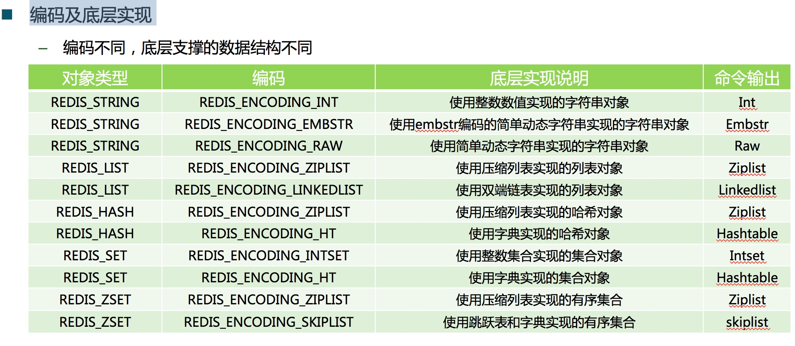
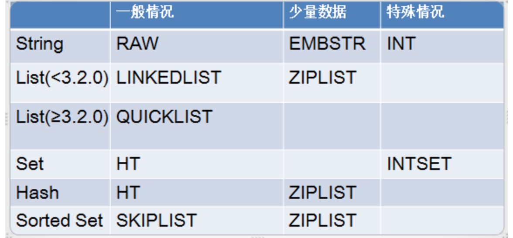

## 目标

1.总结redis在节省内存开销方面做过哪些设计
2.总结概括五种对象的关键点

## 跳跃表

- 优点
	- 相对于红黑树以及AVL树，实现相对简单
	- 查找性能相对单一的链表来说性能比较高效，节点越多，性能越能凸显，平均是O（logN
	- 因为链表的插入性能主要消耗在查找上，所以查找性能高效的情况下，插入性能也比较高效

## 整数集合

- 作用： 减少内存使用
- 结构：
	- Encoding  编码方式
	- Length 长度
	- Contens 保存的具体值，不重复按照从小到大的有序存储


## [redis内存管理设计](https://yq.aliyun.com/articles/67122)

1. String类型： 当字符串较小，Redis里字符串长度<=39时，会用EMBSTR编码方式。在这种编码方式下，字符串跟Object在连续的内存上，省去了多次内存分配。


2. 压缩列表，它相当于把所有的成员都叠在一起，没有额外的数据结构，空间占用比较小。缺点是读写的时候整个压缩列表都需要修改，所以一般在数据量小的时候才使用，一般能达到10倍的压缩比。数据量大小都可以通过配置文件更改，Hash和List的默认情况是512和64，需要利用时就对业务进行改造，可以按日期拆分，每天一个Key，也可以按数值取模，或按前缀拆分等。通过合理的拆分，充分利用压缩列表特性，压缩率可达10倍，平均为5倍。

3. **过期机制。Redis作为内存数据库，和普通的关系型数据库相比，优势在于快，劣势是持久化稍差。**实际上很多内存数据库都是来存一些时效性数据，比如限时优惠活动，缓存或者验证码可以采用Redis过期机制进行管理。这个时候千万不要忘记设立过期时间，若不设，只能等内存满了，一个个查看Key有没有使用。

4. 淘汰机制： 机器的内存是有限的，当Redis的内存超了允许的最大内存，Redis会按照设定的淘汰策略删掉超出部分的内容。在进行淘汰时，先判断是否设置了最大允许内存(server.maxmemory)；若是，会调用函数freeMemoryIfNeeded，再判断使用内存是否超出最大内存限制；若是，就按照设置的淘汰策略淘汰Key，直到使用内存小于最大内存。


## 对象 





- 字符串对象[REDIS_STRING]
	 - 关键技术：使用raw编码，如果保存的是字符串值，并且长度大于39字节。Embstr编码，如果保存的字符串值长度小于等于39字节，针对长度进行不同的编码设置以达到最高的数据性能，并且string是存的二进制，类型可以相互转换，文件也可以存储成二进制。

- 列表对象[REDIS_LIST]
	- 关键技术：
		- ZIPLIST:<64字节&&size<512 -> 效率高，查询性能好
		- lINKEDLIST: 其他情况 -> 内存连续，易于扩展
- 哈希对象[REDIS_HASH]
	- 关键技术：
		- ht编码方式，字段（注意不是键）和字段值都是使用redisObject进行存储的，因此，对于字符串类型的编码优化对也使用与散列的字段与字段值的优化
- 集合对象[REDIS_SET]
	- 关键技术
		- HT编码和ZIPLIST同上
- 有序集合对象[REDIS_ZSET]
	- 关键技术：
		- SKIPLIST-> 使用跳跃表
		- 相对于红黑树以及AVL树，实现相对简单
		- 查找性能相对单一的链表来说性能比较高效，节点越多，性能越能凸显，平均是O（logN
		- 因为链表的插入性能主要消耗在查找上，所以查找性能高效的情况下，插入性能也比较高效


	
编码方式：

```
/* Objects encoding. Some kind of objects like Strings and Hashes can be
 * internally represented in multiple ways. The 'encoding' field of the object
 * is set to one of this fields for this object. */
\#define OBJ_ENCODING_RAW 0     /* Raw representation */
\#define OBJ_ENCODING_INT 1     /* Encoded as integer */
\#define OBJ_ENCODING_HT 2      /* Encoded as hash table */
\#define OBJ_ENCODING_ZIPMAP 3  /* Encoded as zipmap */ // 已废弃
\#define OBJ_ENCODING_LINKEDLIST 4 /* Encoded as regular linked list */
\#define OBJ_ENCODING_ZIPLIST 5 /* Encoded as ziplist */
\#define OBJ_ENCODING_INTSET 6  /* Encoded as intset */
\#define OBJ_ENCODING_SKIPLIST 7  /* Encoded as skiplist */
\#define OBJ_ENCODING_EMBSTR 8  /* Embedded sds string encoding */
\#define OBJ_ENCODING_QUICKLIST 9 /* Encoded as linked list of ziplists */
```

不同对象对应的编码方式


