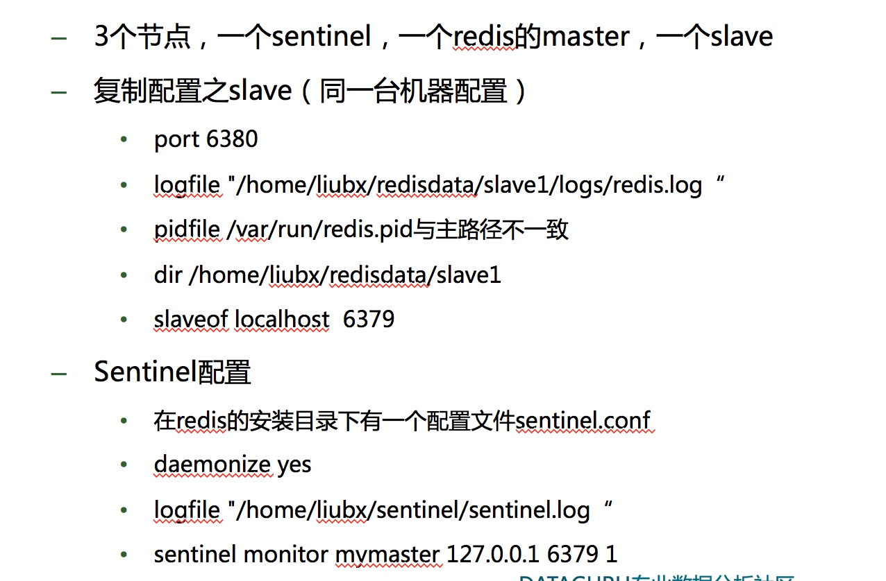
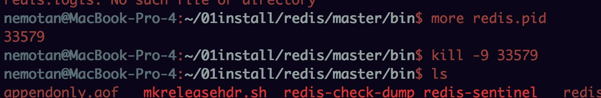
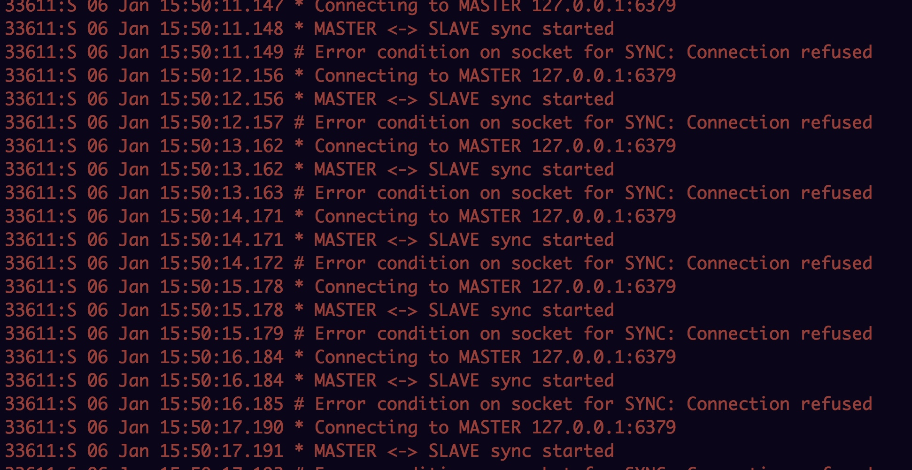
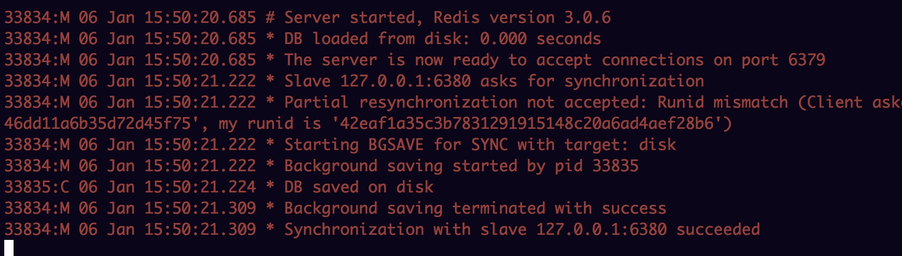
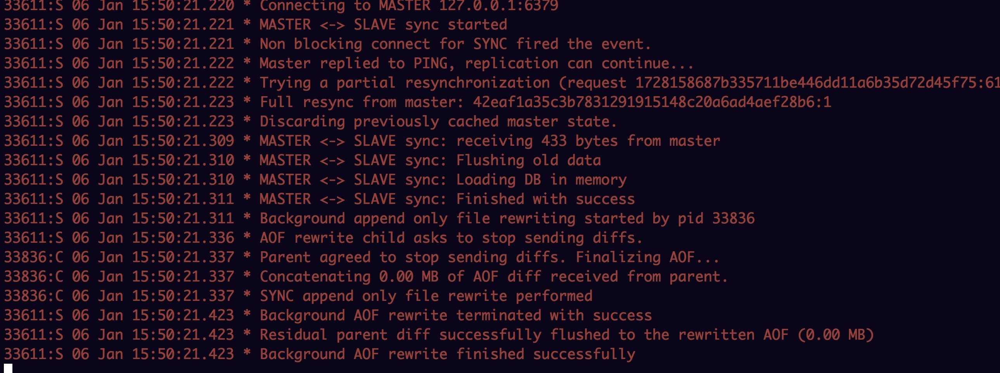
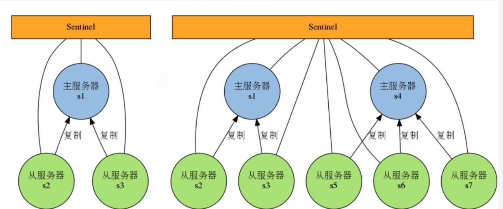
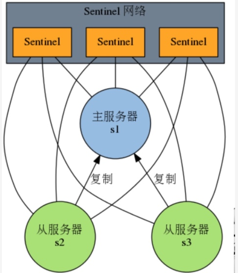

##课题

	1.配置主从复制，截图看日志
	2.配置一个哨兵，一主一从结构，并实现主宕机从接管的过程，截图显示
	3.总结哨兵的原理

## 配置

master&slave配置：

- 配置master端口为:port 6379
- copy master一份命名为slave1文件夹
- log日志： master和slave都配置log日志： logfile ./redis.log
- pid： master和slave都配置为：pidfile ./redis.pid
- slave的端口配置为:port 6380
- slave：配置 slaveof 127.0.0.1 6379 

sentinel配置：

- sentinel.conf 配置
- daemonize yes #守护
- 配置logfile: logfile ./sentinel.log
- 配置检测： sentinel monitor mymaster 127.0.0.1 6379 1

## 启用

- 启用master : ./redis-server  redis.conf
- 启用slave1 : ./redis-server  redis.conf
- 启用sentinel :
	- ./redis-sentinel sentinel.conf  或者
	- ./redis-server sentinel.conf   --sentinel

## master宕机

主节点：

从节点：

从节点变成master:

## master恢复

主节点：

从节点：

## 哨兵原理

Redis-Sentinel是Redis官方推荐的高可用性(HA) 解决方案，Redis-sentinel本身也是一个独立运行的进程，它能监控多个master-slave集群，发现master宕机后能进行自动切换。Sentinel可以监视任意多个主服务器（复用），以及主服务器属下的从服务器，并在被监视的主服务器下线时，自动执行故障转移操作。

为了防止sentinel的单点故障，可以对sentinel进行集群化，创建多个sentinel。

