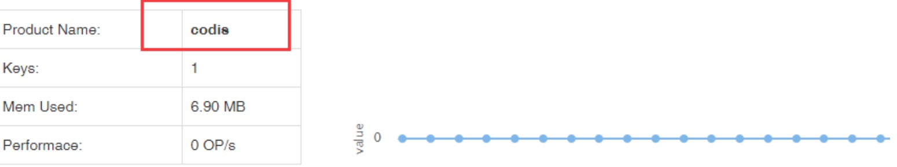

## 上节课程

https://github.com/CodisLabs/codis/issues/356#issuecomment-130929351

## 目标
	
	1.配置codis-ha
	2.总结对比codis的集群方式和redis的cluster集群的优缺点

### [配置codis-ha](https://www.cnblogs.com/cjing2011/p/9bafc11fc32e37d2ba29a8758f4b16ff.html)

go get github.com/ngaut/codis-ha //在linux任何目录 执行都行，但是需要安装go 境
• cd codis-ha //目录 于$GOPATH/src/github.com/ngaut
• go build //目录 于$GOPATH/src/github.com/ngaut/codis-ha

• nohup ./codis-ha --codis-config=localhost:18087 --productName=test & – codis-config:指定配置服 地址
– productName:产品 称
– nohup是把日志 出重定向到nohup文件
– &   方式运行

### 比较

Codis是一整套缓存解决方案，包含高可用、数据分片、监控、动态扩态 etc.。走的是 Apps->代理->redis cluster，一定规模后基本都采用这种方式。

Codis引入了Group的概念，每个Group包括1个Redis Master及至少1个Redis Slave，这是和Twemproxy的区别之一。这样做的好处是，如果当前Master有问题，则运维人员可通过Dashboard“自助式”切换到Slave，而不需要小心翼翼地修改程序配置文件。

为支持数据热迁移（Auto Rebalance），出品方修改了Redis Server源码，并称之为Codis Server。

Codis采用预先分片（Pre-Sharding）机制，事先规定好了，分成1024个slots（也就是说，最多能支持后端1024个Codis Server），这些路由信息保存在ZooKeeper中。

Codis仅负责维护当前Redis Server列表，由运维人员自己去保证主从数据的一致性。

cluster:

codis:

codis是选用了一系列已证明靠谱的方案来构建（如zk选主/存放元数据；采用无状态proxy，而不是smart client等）
为方便运维提供了一系列工具/接口
再加上公司内部的一定规模应用

