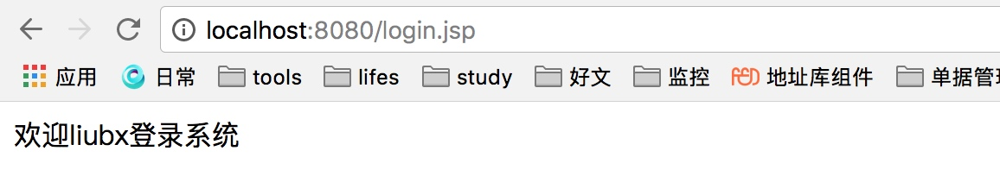

## 目标

1.完善集群用户会话管理项目，包含以下两项:

    1)用户的失效时间需要随着用户访问系统而延长
	 2）用户退出


## 项目结构


**登录页面**


**登录成功会话**




**注销登录**


## 用户随着访问的时间

1. 添加一个过滤器，只要访问url则进调用该过滤器
2. 时间设置更新

```java

    public static void refreshUser(User u){
        Jedis jedis = pool.getResource();
        Map<String, String> user = new HashMap<String, String>();
        user.put("uid", String.valueOf(u.getUid()));
        user.put("name", u.getName());
        user.put("pwd", u.getPasswd());
        if(jedis.exists(String.valueOf(u.getUid()))){
            jedis.hmset(String.valueOf(u.getUid()), user);
            jedis.expire(String.valueOf(u.getUid()), 1 * 60 * 60);// 一个小时的超时时间
        }
        jedis.close();
    }

```


