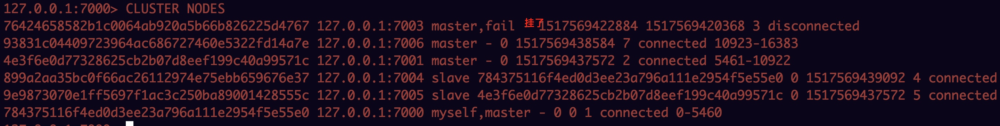

## 课程目标

	1.cluster的故障转移操作，截图展示
	2.部署codis，并写代码访问codis

## 查看集群信息，接上文

- ./redis-cli -p 7000
- 查看集群状态信息: CLUSTER INFO
- 查看槽 的分配信息: CLUSTER SLOTS
- 查看集群所有节点: CLUSTER NODES
- 返回某个key对 的槽 : CLUSTER KEYSLOT key
- 删除当前节点的槽 CLUSTER DELSLOTS slot [slot ...]
- 给当前节点添 槽 

**节点信息如下：**

**故障转移模拟：**

- kill7001这个主节点进程
- 故障之后如下图：7003挂了，7006由slaver变成master

- 再挂掉7006节点

	
## [mac安装codis](http://lib.csdn.net/article/redis/22539)

- 安装go并且设置go环境变量
- 环境验证： go  env

- 安装zookeeper

- [安装codis](http://blog.csdn.net/wangqi880/article/details/65443830)
	- 下载git源码
	- make编译，编译发生了错误参考[codis搭建](https://www.cnblogs.com/reblue520/p/6874925.html)
	- make: *** [codis-dashboard] Error 1

问题： cannot find package "github.com/docopt/docopt-go" in any of: [解决](http://sohoku.iteye.com/blog/2228846)

**环境变量设置：**

由于我是在mac下编译的，一直报如下错误：，这个问题我再查查，只差最后一步安装codisle，下节课补上这一块！

代码如下：

