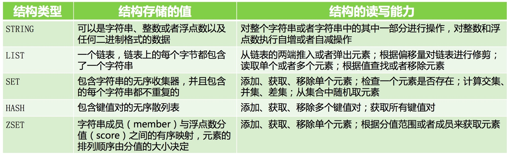

[toc]

## 目标

1.基于连接池方式实现对五个数据类型操作，每种数据类型2个操作
2.基于spring-data-redis 基于jedis来实现对五种数据类型操作，每种数据类型实现两个操作，包括事务
以上为基于java语言开发


学员可以采用其它语言进行开发，要求如下：
1.总结你选择的框架的优缺点
2.五种数据类型基本操作，每种数据类型完成3个操作，额外增加事务的实现
3.必须把测试执行成功的效果图截图展示

### 五中数据结构操作



代码：

```java
private void testStr(Jedis jedis) {
    System.out.println("----------------redis-String-----------------");
    //set:返回操作结果
    System.out.println("name=>wsy:" + jedis.set("name", "wsy"));

    //get:value
    System.out.println("name:" + jedis.get("name"));

    //append:字符串长度
    System.out.println("append:" + jedis.append("name", "_ss"));

    //strlen:字符串长度
    System.out.println("strlen:" + jedis.strlen("name"));

    //getrange:返回不包括起始坐标的值
    System.out.println("getrange:" + jedis.getrange("name", 10, 13));

    //setrange:从起始坐标考试替换，未替换的保持
    System.out.println("setrange:" + jedis.setrange("name", 10, "#"));

    //mset:批量设置，返回批量设置结果
    System.out.println("mset:" + jedis.mset("name", "wsy", "age", "29"));

    //mget:返回数组
    System.out.println("mget:" + jedis.mget("name", "age"));

    //incr:value自增1后，返回value
    System.out.println("incr:" + jedis.incr("age"));

    //incr:value自增传参值后，返回value
    System.out.println("incrBy:" + jedis.incrBy("age", 3));

    //decr:value自减1，返回value
    System.out.println("decr:" + jedis.decr("age"));

    //decrBy:value自减入参值，返回value
    System.out.println("decrBy:" + jedis.decrBy("age", 3));

    //setex:设置key值+有效时间，如果key存在则覆盖value
    System.out.println("setex:" + jedis.setex("phone", 10, "13600000001"));

    //setnx:当key不存在时，设置才成功
    System.out.println("setnx:" + jedis.setnx("address", "china"));

    //del:删除对应key
    System.out.println("del:" + jedis.del("address1"));

    System.out.println("----------------redis-String-----------------\n");
}

private void testList(Jedis jedis) {
    System.out.println("----------------redis-List-----------------");
    //
    jedis.del("contacts");
    jedis.del("contacts_old");

    //lpush:批量头部插入，返回List的size
    System.out.println("lpush:" + jedis.lpush("contacts", "xx", "yy", "zz"));

    //lpushx:单个头部插入，返回List的size
    System.out.println("lpushx:" + jedis.lpushx("contacts", "aa"));

    //linsert:指定对象位置(前or后)插入
    System.out.println("linsert:" + jedis.linsert("contacts", BinaryClient.LIST_POSITION.BEFORE, "zz", "bb"));

    //lset:将指定的位置设置值（替换旧值）
    System.out.println("lset:" + jedis.lset("contacts", 2, "cc"));

    //lpop:链表头的对象
    System.out.println("lpop:" + jedis.lpop("contacts"));

    //lrange:获取list指定start、end位置value
    System.out.println("lrange:" + jedis.lrange("contacts", 1, 3));

    //ltrim:只剩start\end中list值，其余删除
    System.out.println("ltrim:" + jedis.ltrim("contacts", 1, 3));

    //lrem:删除list指定值（次数指定），返回删除个数
    System.out.println("lrem:" + jedis.lrem("contacts", 2, "yy"));

    //rpoplpush:将源list尾部对象移到目标list对象头部
    System.out.println("rpoplpush:" + jedis.rpoplpush("contacts", "contacts_old"));

    //rpush:在list尾部对象添加值
    System.out.println("rpush:" + jedis.rpush("contacts", "aa", "bb"));

    //rpop:移除在list尾部值，返回移除的对象
    System.out.println("rpop:" + jedis.rpop("contacts"));

    //brpop:阻塞尾部对象抛出，指定超时时间，返回抛出值
    System.out.println("brpop:" + jedis.brpop(1, "contacts"));

    System.out.println("blpop:" + jedis.blpop(1, "contacts"));

    System.out.println("blpop（阻塞1秒返回）:" + jedis.blpop(1, "contacts"));

    System.out.println("----------------redis-List-----------------\n");

}

private void testSet(Jedis jedis) {
    System.out.println("----------------redis-Set-----------------");
    jedis.del("phones");
    jedis.del("phones_old");
    jedis.del("phones_old_1");
    jedis.del("phones_new");

    //sadd:集合添加元素,返回添加成功后数据
    System.out.println("sadd:" + jedis.sadd("phones", "13600000001", "13300000001"));
    System.out.println("sadd:" + jedis.sadd("phones", "13600000002", "13300000002"));

    //scard:返回集合中元素数
    System.out.println("scard:" + jedis.scard("phones"));

    jedis.sadd("phones_old", "13600000002");
    jedis.sadd("phones_old_1", "13300000001");

    //sdiff:首set与其他set之间的差集，返回差集值
    System.out.println("sdiff:" + jedis.sdiff("phones", "phones_old", "phones_old_1"));

    //sdiffstore:首set与其他set之间的差集保存至新set，返回差集数
    System.out.println("sdiffstore:" + jedis.sdiffstore("phones_new", "phones", "phones_old"));

    //sinter:返回集合的交集
    System.out.println("sinter:" + jedis.sinter("phones", "phones_new"));

    //sismember:判断value是否为set的值
    System.out.println("sismember:" + jedis.sismember("phones", "13600000001"));

    //smembers:返回集合中成员
    System.out.println("smembers:" + jedis.smembers("phones"));

    //smove:将首源set中元素移动目标set，返回移动数
    System.out.println("smove:" + jedis.smove("phones", "phones_new", "13600000002"));

    //spop:随机移除set的一元素，返回移除元素
    System.out.println("spop:" + jedis.spop("phones"));

    //srandmember:随机取出集合中一个元素
    System.out.println("srandmember:" + jedis.srandmember("phones_new"));

    //srem:删除集合中指定元素
    System.out.println("srem:" + jedis.srem("phones_new", "13600000002"));

    //sunion:集合中并集
    System.out.println("sunion:" + jedis.sunion("phones", "phones_new", "phones_old"));

    System.out.println("----------------redis-Set-----------------\n");
}

private void testHash(Jedis jedis) {
    System.out.println("----------------redis-HashSet-----------------");
    String KEY = "hash";

    String FIELD = "name";

    String VALUE = "layman";
    jedis.hset(KEY, FIELD, VALUE);
    Map<String, String> map = new HashMap<String, String>();
    map.put(FIELD + 0, VALUE + 0);
    map.put(FIELD + 1, VALUE + 1);
    map.put(FIELD + 2, VALUE + 2);
    jedis.hmset(KEY, map);

    Map<String, String> mapResult = jedis.hgetAll(KEY);
    System.out.println(mapResult);
    System.out.println("----------------redis-HashSet-----------------");
}

private void testZSET(Jedis jedis) {
    System.out.println("----------------redis-SortedSet-----------------\n");
    jedis.del("scores");
    jedis.del("scores_1");
    jedis.del("scores_total");
    jedis.del("score_inter");
    jedis.del("score_max");

    //zadd:sortedSet添加元素
    System.out.println("zadd:" + jedis.zadd("scores", 610.5, "xx"));
    jedis.zadd("scores", 630, "yy");

    //zcard:返回sortedset中元素数
    System.out.println("zcard:" + jedis.zcard("scores"));

    //zcount:返回指定分值（包括）的元素数
    System.out.println("zcount:" + jedis.zcount("scores", 610, 620));

    //zincrby:将指定值分数加分，返回加后的分数
    System.out.println("zincrby:" + jedis.zincrby("scores", 10, "xx"));

    //zrange:返回指定坐标的值
    System.out.println("zrange:" + jedis.zrange("scores", 0, 1));

    //zrangeByScore:返回指定分数范围内的对象
    System.out.println("zrangeByScore:" + jedis.zrangeByScore("scores", 600, 700));

    //zrank:返回指定值的位置（分数低->高，0开始）
    System.out.println("zrank:" + jedis.zrank("scores", "yy"));

    //zrevrank:返回指定值的位置（分数高->低，0开始）
    System.out.println("zrevrank:" + jedis.zrevrank("scores", "yy"));

    //zrem:删除，其中还有zremrangeByRank\zremrangeByScore
    System.out.println("zrem:" + jedis.zrem("scores", "yy"));

    jedis.zadd("scores", 630, "yy");
    jedis.zadd("scores", 640, "zz");
    //zrevrange：获取指定位置数据（分数从高->低）
    System.out.println(":" + jedis.zrevrange("scores", 0, 1));

    System.out.println("zrangeByScoreWithScores:" + jedis.zrangeByScoreWithScores("scores", 600, 700));

    //zscore:获取指定分数
    System.out.println("zscore:" + jedis.zscore("scores", "xx"));
    jedis.zadd("scores_1", 630.5, "xx");
    jedis.zadd("scores_1", 610.5, "bb");
    jedis.zadd("scores_1", 622.5, "cc");

    //zunionstore:sortedset集合的并集并保存,如果集合中元素相同，则分数相加
    System.out.println("zunionstore:" + jedis.zunionstore("score_total", "scores", "scores_1"));

    ZParams zParams = new ZParams();
    zParams.aggregate(ZParams.Aggregate.MAX);//指定分数操作：+，最小，最大
    zParams.weightsByDouble(1, 0.1);//分数中的乘法因子
    System.out.println("zunionstore:" + jedis.zunionstore("score_max", zParams, "scores", "scores_1"));

    //zinterstore:集合元素取交集，相同元素值相加(默认)
    System.out.println("zinterstore:" + jedis.zinterstore("score_inter", "scores", "scores_1"));

    System.out.println("----------------redis-SortedSet-----------------\n");
}

@Test
public void testFiveTypes() {
    JedisPool pool = new JedisPool(new JedisPoolConfig(), hnp.getHost(), hnp.getPort(), 2000);
    Jedis jedis = pool.getResource();
    // 测试string类型
    testStr(jedis);
    // 测试List
    testList(jedis);
    // 测试SET
    testSet(jedis);
    // 测试HASH
    testHash(jedis);
    // 测试ZSET
    testZSET(jedis);
    jedis.close();
    pool.destroy();
    assertTrue(pool.isClosed());
}


```
结果：

	----------------redis-String-----------------
	name=>wsy:OK
	name:wsy
	append:6
	strlen:6
	getrange:
	setrange:11
	mset:OK
	mget:[wsy, 29]
	incr:30
	incrBy:33
	decr:32
	decrBy:29
	setex:OK
	setnx:0
	del:0
	----------------redis-String-----------------
	
	----------------redis-List-----------------
	lpush:3
	lpushx:4
	linsert:5
	lset:OK
	lpop:aa
	lrange:[cc, yy, xx]
	ltrim:OK
	lrem:1
	rpoplpush:xx
	rpush:3
	rpop:bb
	brpop:[contacts, aa]
	blpop:[contacts, cc]
	blpop（阻塞1秒返回）:null
	----------------redis-List-----------------
	
	----------------redis-Set-----------------
	sadd:2
	sadd:2
	scard:4
	sdiff:[13300000002, 13600000001]
	sdiffstore:3
	sinter:[13300000001, 13300000002, 13600000001]
	sismember:true
	smembers:[13300000001, 13300000002, 13600000001, 13600000002]
	smove:1
	spop:13600000001
	srandmember:13300000002
	srem:1
	sunion:[13300000001, 13300000002, 13600000001, 13600000002]
	----------------redis-Set-----------------
	
	----------------redis-HashSet-----------------
	{name=layman, name2=layman2, name1=layman1, name0=layman0}
	----------------redis-HashSet-----------------
	----------------redis-SortedSet-----------------
	
	zadd:1
	zcard:2
	zcount:1
	zincrby:620.5
	zrange:[xx, yy]
	zrangeByScore:[xx, yy]
	zrank:1
	zrevrank:0
	zrem:1
	:[zz, yy]
	zrangeByScoreWithScores:[[[120, 120],620.5], [[121, 121],630.0], [[122, 122],640.0]]
	zscore:620.5
	zunionstore:5
	zunionstore:5
	zinterstore:1
	----------------redis-SortedSet-----------------


### spring-data-redis操作
	
代码

	public void test5type() {
	    // string
	    print("----testStr");
	    template1.opsForValue().set("name", "nemo");
	    template1.opsForValue().set("age", 18);
	    print(template1.opsForValue().get("name"));
	    print(template1.opsForValue().get("age"));
	    print("----/n");

    // list
    print("----testList");
    template1.opsForList().rightPush("frulits","apple");
    template1.opsForList().rightPush("frulits","orange");
    print("size:"+template1.opsForList().size("frulits"));
    print(template1.opsForList().rightPop("frulits"));
    print("----/n");

    // set
    print("----testset");
    template1.opsForSet().add("colors","red");
    template1.opsForSet().add("colors","yellow");
    print("size:"+template1.opsForSet().size("colors"));
    print(template1.opsForSet().pop("colors"));
    print("----/n");

    // hash
    print("----hash");
    template1.opsForHash().put("testHash","country","china");
    template1.opsForHash().put("testHash","city","hangzhou");
    print("size:"+template1.opsForHash().size("testHash"));
    print(template1.opsForHash().get("testHash","city"));
    print("----/n");

    // zset
    print("----zset");
    template1.opsForZSet().add("colorss","red",1);
    template1.opsForZSet().add("colorss","yellow",2);
    print("size:"+template1.opsForZSet().size("colorss"));
    print("----/n");


	 }

结果:

	----testStr
	nemo
	18
	----/n
	----testList
	size:2
	orange
	----/n
	----testset
	size:2
	red
	----/n
	----hash
	size:2
	hangzhou
	----/n
	----zset
	size:2
	----/n

添加事务：
	
	// 添加事务
	template1.execute(new RedisCallback<Object>() {
	    public Object doInRedis(RedisConnection connection) throws DataAccessException {
	        template1.opsForValue().set("name", "nemo");
	        template1.opsForValue().set("age", 18);
	        return true;
	    }
	});


2017-12-24 11:14:09.112 |TmsPlanRouteServiceImpl - WARN |deliveryPlanRoute|HSFBizProcessor-DEFAULT-8-thread-545|- cnprism|null|0b853c0a15140852475982353d0865|0.1.1.11136133206.2.19.33|11.179.178.147|RouteRequestForDelivery start>> :RouteRequestForDelivery{lpNo='LP00091137018589', serviceItemId='5000000000014', detailAddress='合肥市六安路99号新华大厦1105', areaId=340103, warehouseCode='SHA204', endDistributionBrand='CHENGBANG', warehouseDepartureTime=Sun Dec 24 20:00:00 CST 2017, expectReceiveTime=Mon Dec 25 23:59:00 CST 2017, distributionResourceCode='DISTRIBUTOR_525923', scheduleType='103', preciseTimeMatch=false, orderCreateTime=Sun Dec 24 11:14:08 CST 2017, currentNode=null, tnmVersion='214158', warehouseCutoffTime='null', warehouseWaveCode='null'}


2017-12-24 11:14:09.204 |PathRouteManagerImpl - WARN |route|HSFBizProcessor-DEFAULT-8-thread-545|- cnprism|null|0b853c0a15140852475982353d0865|0.1.1.11136133206.2.19.33|11.179.178.147|action=TmsRoute_doFDCnull,success=T,errorCode=null,callApp=fdc,outBizNo=LP00091137018589,cpCode=CHENGBANGPEISONG-0001,areaId=340103,versionId=214158,matchCondition=timeLimit#103|carrier#CBWL|pickUp#97|tarSite#24277|industry#40|customer#C00005|,resultStr=958|24277|,runTimeInfo=versionId#214158|routeId#8660|,systemInfo=traceId#0b853c0a15140852475982353d0865|ip#11.179.178.147|serviceTime#2|


2017-12-24 11:14:09.205 |ConnectorServiceImpl - WARN |execute|HSFBizProcessor-DEFAULT-8-thread-545|- cnprism|null|0b853c0a15140852475982353d0865|0.1.1.11136133206.2.19.33|11.179.178.147|service connector start>>nodes:RouteNode{cpCode:CHENGBANGPEISONG-0001,nodeType:DIS_STA_CP,nodeCode:055F01,nodeId:958}#,param:ConnectParam{scheduleType:103,orderCode:LP00091137018589,mailNo:null,currentNode:RouteNode{cpCode:cainiao,nodeType:PICKUP_STA,nodeCode:SHA204,nodeId:97},operationType:WH_OUT,operationTime:2017-12-24 20:00:00,ignoreFirstNode:false,ignoreFirstTrans:false,versionId:214158,endDisCpCode:null}


2017-12-24 11:14:09.206 |RouteNodeMerge - WARN |doMerge|HSFBizProcessor-DEFAULT-8-thread-545|- cnprism|null|0b853c0a15140852475982353d0865|0.1.1.11136133206.2.19.33|11.179.178.147|merge route request>>{"routeInfoDTOS":[{"children":[],"cpCode":"CHENGBANGPEISONG-0001","endNodeCode":"N_W_00000196","nodeCode":"ln1010059","nodeId":"499","nodeTypeCode":"TRANS","serviceItemId":"5000000000014","startNodeCode":"SHA204"},{"children":[],"cpCode":"CHENGBANGPEISONG-0001","nodeCode":"055F01","nodeId":"958","nodeTypeCode":"DIS_STA_CP","serviceItemId":"5000000000014","upResCode":"DISTRIBUTOR_525923"}],"routeUniqueCode":"TRANS_SHA204_N_W_00000196#DIS_STA_CP_958#"}


2017-12-24 11:14:09.206 |RouteNodeMerge - WARN |doMerge|HSFBizProcessor-DEFAULT-8-thread-545|- cnprism|null|0b853c0a15140852475982353d0865|0.1.1.11136133206.2.19.33|11.179.178.147|merge route response>>{"result":{"routeInfoDTOS":[{"children":[{"children":[],"cpCode":"CHENGBANGPEISONG-0001","endNodeCode":"N_W_00000196","nodeCode":"ln1010059","nodeId":"499","nodeTypeCode":"TRANS","serviceItemId":"5000000000014","startNodeCode":"SHA204"},{"children":[],"cpCode":"CHENGBANGPEISONG-0001","nodeCode":"055F01","nodeId":"958","nodeTypeCode":"DIS_STA_CP","serviceItemId":"5000000000014","upResCode":"DISTRIBUTOR_525923"}],"cpCode":"CHENGBANGPEISONG-0001","nodeCode":"055F01","nodeId":"958","nodeTypeCode":"DIS","serviceItemId":"5000000000014","upResCode":"DISTRIBUTOR_525923"}],"routeUniqueCode":"TRANS_SHA204_N_W_00000196#DIS_STA_CP_958#"},"success":true}


2017-12-24 11:14:09.206 |RouteNodeMerge - WARN |doMerge|HSFBizProcessor-DEFAULT-8-thread-545|- cnprism|null|0b853c0a15140852475982353d0865|0.1.1.11136133206.2.19.33|11.179.178.147|merge node plan:[{"operationPlan":{"batchCode":"055F01-S-21:30","checkTime":"2017-12-24 23:00:00","endCheckTime":"2017-12-25 06:00:00","endTime":"2017-12-25 06:00:00","startTime":"2017-12-24 23:00:00"},"routeNode":{"cainiao":false,"cpCode":"CHENGBANGPEISONG-0001","dis":true,"disSta":false,"nodeCode":"DISTRIBUTOR_525923","nodeId":958,"nodeTypeCode":"DIS","pickupSta":false,"site":false,"station":false,"trans":false,"uniqueCode":"DIS_DISTRIBUTOR_525923"}}]
2017-12-24 11

