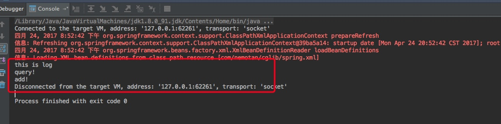

# 使用正则表达式打印日志
## 源码
## Query
```java

public class Query {

    public void query() {
        System.out.println("query!");
    }

    public void add() {
        System.out.println("add!");
    }
}

```
## QueryInterceptor
```java
public class QueryInterceptor implements MethodInterceptor {

    Object target;
    String methodExpress;

    public QueryInterceptor(Object target, String methodExpress) {
        this.target = target;
        this.methodExpress = methodExpress;
    }

    @Override
    public Object intercept(Object o, Method method, Object[] args, MethodProxy methodProxy) throws Throwable {
        Pattern pattern = Pattern.compile(methodExpress);
        Matcher matcher = pattern.matcher(method.getName());
        if (matcher.find()) {
            System.out.println("this is log");
        }
        Object result = methodProxy.invoke(target, args);
        return result;
    }
}
```
## AopBeanpostProcessor
```java
public class AopBeanpostProcessor implements BeanPostProcessor {

    String classExpress;
    String methodExpress;

    @Override
    public Object postProcessBeforeInitialization(Object bean, String beanName) throws BeansException {
        return bean;
    }

    @Override
    public Object postProcessAfterInitialization(Object bean, String beanName) throws BeansException {
        Pattern pattern = Pattern.compile(classExpress);
        Matcher matcher = pattern.matcher(beanName);
        if (matcher.find()) {
            return createProxy(bean);
        }
        return bean;
    }

    public <T> T createProxy(Object bean) {
        Enhancer hancer = new Enhancer();
        hancer.setSuperclass(bean.getClass());
        hancer.setCallback(new QueryInterceptor(bean, methodExpress));
        return (T)hancer.create();
    }

    public String getClassExpress() {
        return classExpress;
    }

    public void setClassExpress(String classExpress) {
        this.classExpress = classExpress;
    }

    public String getMethodExpress() {
        return methodExpress;
    }

    public void setMethodExpress(String methodExpress) {
        this.methodExpress = methodExpress;
    }
}
```
## Client
```java
public class Client {

    public static ApplicationContext context;

    public static void main(String args[]) {
        context = new ClassPathXmlApplicationContext("com/nemotan/cglib/spring.xml");
        Query query = (Query)context.getBean("query");
        query.query();
        query.add();
    }
}
```
## spring.xml
```java

<beans xmlns:xsi="http://www.w3.org/2001/XMLSchema-instance"
       xmlns="http://www.springframework.org/schema/beans"
       xsi:schemaLocation="http://www.springframework.org/schema/beans http://www.springframework.org/schema/beans/spring-beans-3.0.xsd">


    <bean id="query" class="com.nemotan.cglib.Query"/>
    <bean id="aopBeanpostProcessor" class="com.nemotan.cglib.AopBeanpostProcessor">
        <property name="classExpress" value="query"></property>
        <property name="methodExpress" value="query"></property>
    </bean>

</beans>
```

## 结果：



	query方法经过正则表达式，进行打印了日志
	


