[toc]

# spring依赖注入原理、bean注册和bean注册事件分析
## 一. 整体解析说明

`各接口UML图`
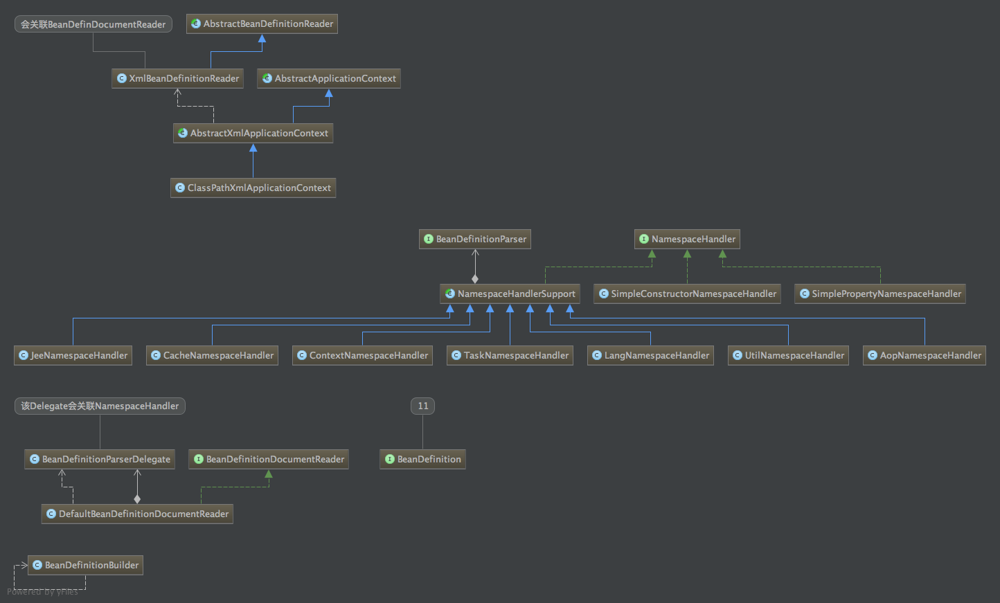

`各接口调用堆栈`
	
	调用推展如下图：
	依次调用如下接口进行bean定义的注册。
	
	- AbstractApplicationContext. refresh();
	- AbstractApplicationContext. obtainFreshBeanFactory();
	- AbstractRefreshableApplicationContext. refreshBeanFactory();
	- AbstractXmlApplicationContext. loadBeanDefinitions(DefaultListableBeanFactory beanFactory)
	- AbstractXmlApplicationContext. loadBeanDefinitions(XmlBeanDefinitionReader reader);
	- AbstractBeanDefinitionReader. loadBeanDefinitions(String... locations)
	- AbstractBeanDefinitionReader. loadBeanDefinitions(String location)
	- AbstractBeanDefinitionReader. loadBeanDefinitions(resources)
	- XmlBeanDefinitionReader.  doLoadBeanDefinitions(InputSource inputSource, Resource resource) #返回bean注册的个数
	- XmlBeanDefinitionReader. registerBeanDefinitions(Document doc, Resource resource)
	- DefaultBeanDefinitionDocumentReader. registerBeanDefinitions(Document doc, XmlReaderContext readerContext)
	- DefaultBeanDefinitionDocumentReader. doRegisterBeanDefinitions(Element root) 
	- DefaultBeanDefinitionDocumentReader. parseBeanDefinitions(Element root, BeanDefinitionParserDelegate delegate)
	- DefaultBeanDefinitionDocumentReader. processBeanDefinition(Element ele, BeanDefinitionParserDelegate delegate) #这里会进行 bean装饰-bean定义注册-bean注册事件发布

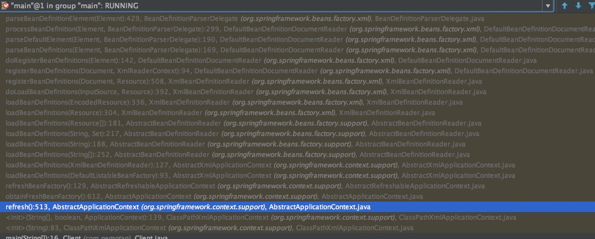


	1. Application 接口是整个容器上下文的接口，会关联一个BeanFactory实例，在进行加载bean定义的时候，会把该实例作为XmlBeanDefinitionReader的构造参数。
	2. BeanDefinitionReader #bean定义读取基本接口，主要参数为：resource，配置文件的路径，并且依赖：BeanDefinitionRegistry、BeanFactory接口，直接进行bean定义注册
	3. BeanDefinitionDocumentReader接口，关联Document和XmlReaderContext，ReaderContext中关联XmlBeanDefinitionReader。该接口解析到bean定义之后，会直接调用readerContext.reader.registry进行注册bean定义。如下图：
	
	最终的bean经过BeanDefinitionDocumentReader读取配置文件解析之后，会把bean定义全部注册到Application的BeanFactory实例中。

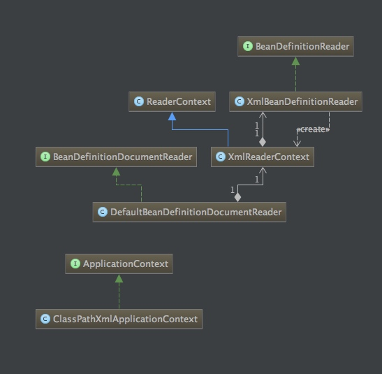

## 二. 文件解析过程
	
	1. 每一个resource文件都解析成一个Element
	2. 首先判是否默认的命名空间，实际是判断配置文件的URL：<beans xmlns="http://www.springframework.org/schema/beans"，如果等于这个URL就是true
	3. 如果是默认的spring命名空间，这里会去读取配置文件中的【profile】属性，这个应用常用【测试环境】【线上环境】的环境隔离 //TODO 分析spring的profile和environment
	4. 接下来会调用 pre,parse,post三个方法，

	

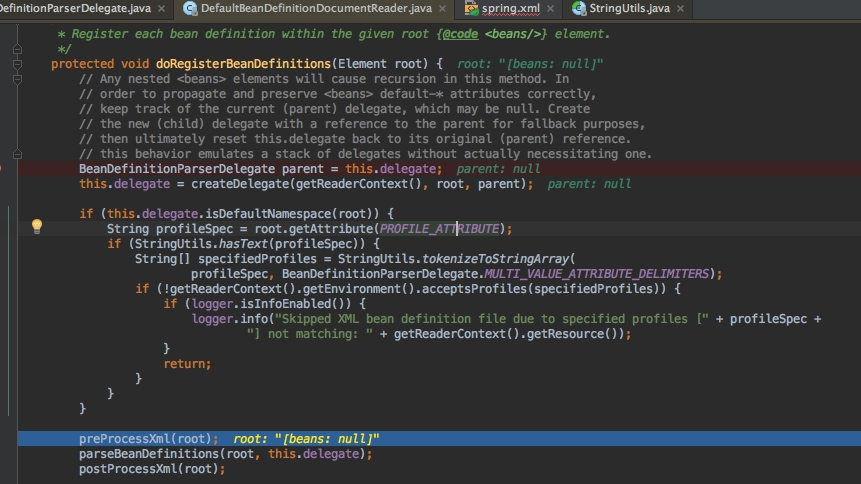

### 2.1 preProcessXml(root)&&postProcessXml(root)

	这两个方法是扩展方法，其中pre方法可以让我们在处理bean定义之前先处理处理自定义标签，这是一个所有的预处理的xml扩展点
	
```java
	/**
	 * Allow the XML to be extensible by processing any custom element types first,
	 * before we start to process the bean definitions. This method is a natural
	 * extension point for any other custom pre-processing of the XML.
	 * <p>The default implementation is empty. Subclasses can override this method to
	 * convert custom elements into standard Spring bean definitions, for example.
	 * Implementors have access to the parser's bean definition reader and the
	 * underlying XML resource, through the corresponding accessors.
	 * @see #getReaderContext()
	 */
	protected void preProcessXml(Element root) {
	}

	/**
	 * Allow the XML to be extensible by processing any custom element types last,
	 * after we finished processing the bean definitions. This method is a natural
	 * extension point for any other custom post-processing of the XML.
	 * <p>The default implementation is empty. Subclasses can override this method to
	 * convert custom elements into standard Spring bean definitions, for example.
	 * Implementors have access to the parser's bean definition reader and the
	 * underlying XML resource, through the corresponding accessors.
	 * @see #getReaderContext()
	 */
	protected void postProcessXml(Element root) {
	}
```	

### 2.2 processBeanDefinition 解析
	
	在解析bean定的时候主要做了三件事情。
	1. 解析配置文件，并且把bean封装成BeanDefinitionHolder实例
	2. 会进行对BeanDefinitionHolder实例装饰
	3. 就是在第一点中特别提到的ReaderContext的中Registry实例，会把BeanHolder使用Registry进行注册。
	4. 发送bean注册事件

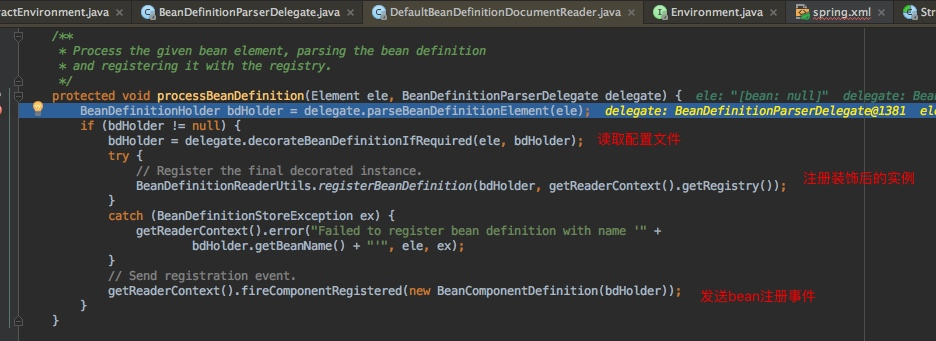


## 三. 解析BeanDefinitionHolder
## 四. 封装-装饰-注册bean定义
	
### 4.1 `封装BeanDefinitionHolder`	

	1. 在解析出AbstractBeanDefinition的一个实例之后会给bean定义注册把别名
	2. 会封装成BeanDefinitionHolder实例
	
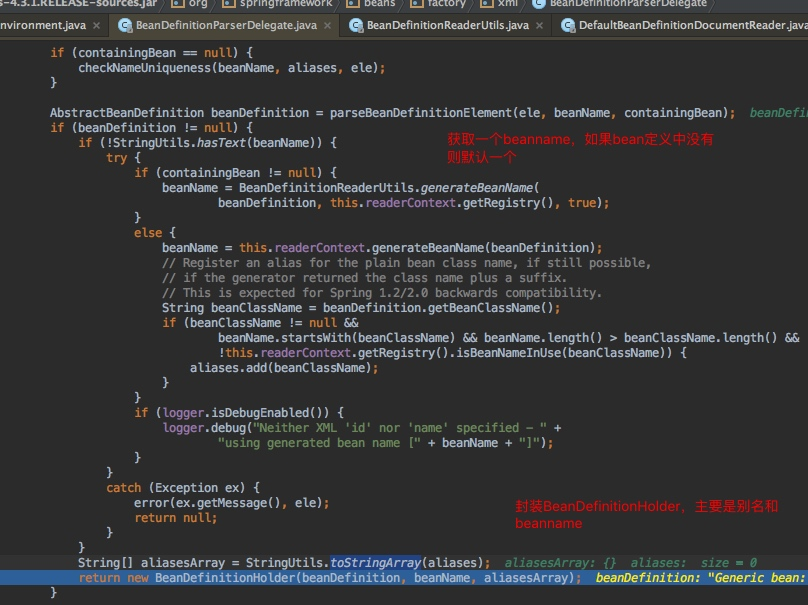

### 4.2 `装饰`
	
	1. 基于自定义属性的装饰
	2. 基于嵌入的标签的装饰
	3. 这一块也比较复杂，最终会调用
	
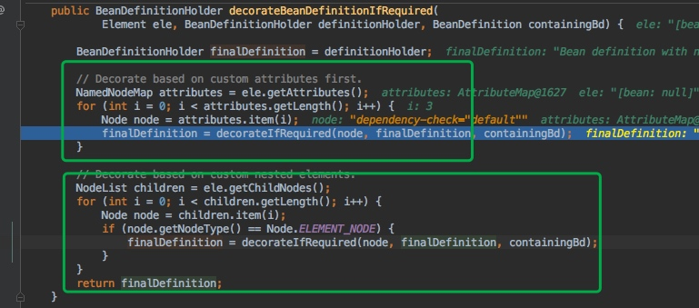

	
### 4.3 `注册`

	
	1. 根据beanname注册bean
	2. 根据beanname注册bean的别名，spring的bean别名
	
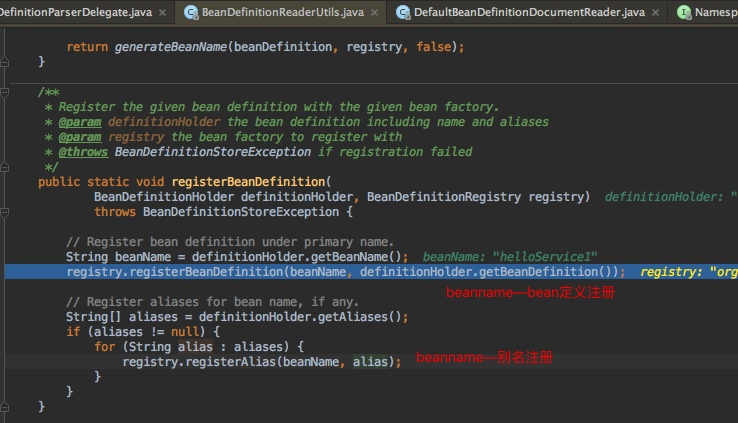
	
	1.使用DefaultListableBeanFactory.java进行注册bean


**已经存在该bean的注册：**
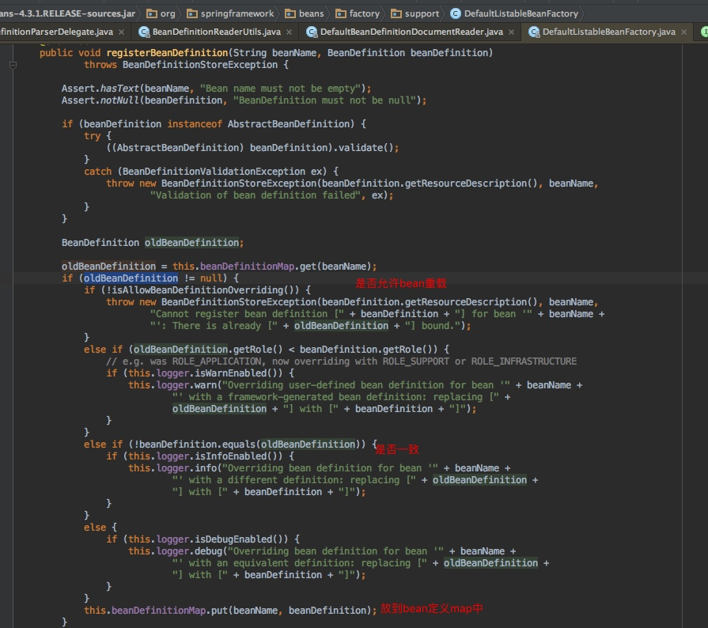

**该bean不存在的注册：**
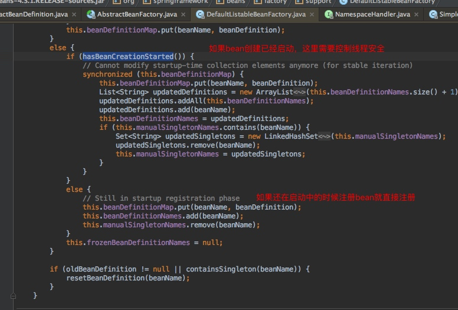


**重置bean定义**
	
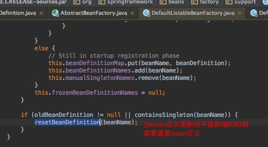xx


	这里为啥需要销毁单例的呢？
	当bean定义更新的时候，如果这个bean设置的是单例，当bean定义都发生改变的时候，肯定该类的实例会改变，因此需要销毁单例bean。
	
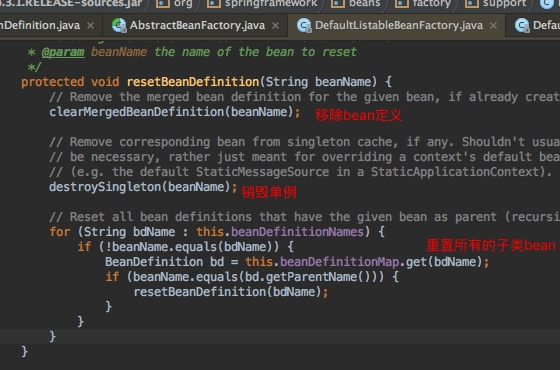

`总结：`
	
	1. bean定义注册最终是存放在beanDefintionMap中


## 五. 注册事件发布

### 5.1 事件发布和监听
	
	 监听器接口：ReaderEventListener
	 bean定义事件：BeanComponentDefinition

	
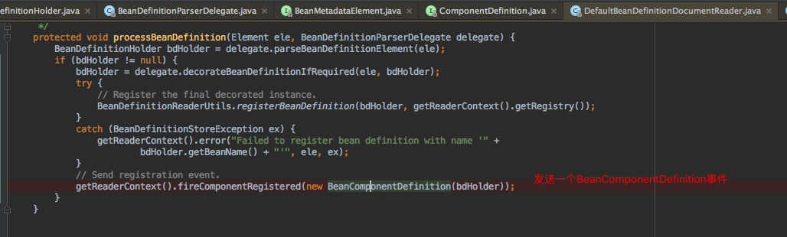

	发送bean定义事件之后，ReaderContext中的Listener都会进行监听该事件

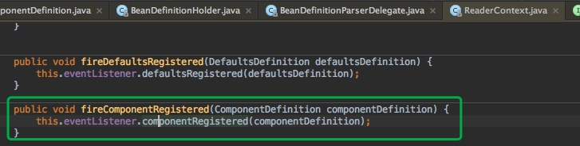


### 5.2 监听器初始化

 	那么ReaderContext中的监听器是在哪里初始化的呢？怎么样才能监听到一个Bean注册事件呢？
 	
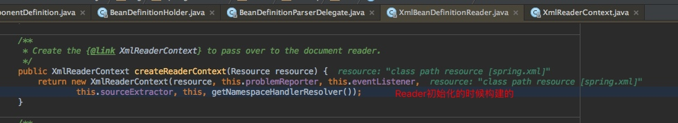

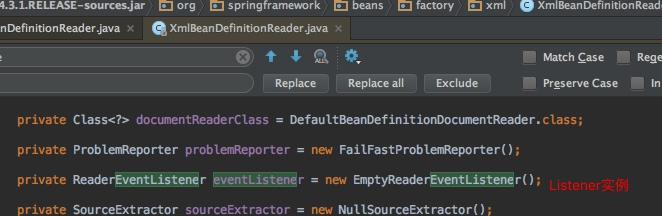

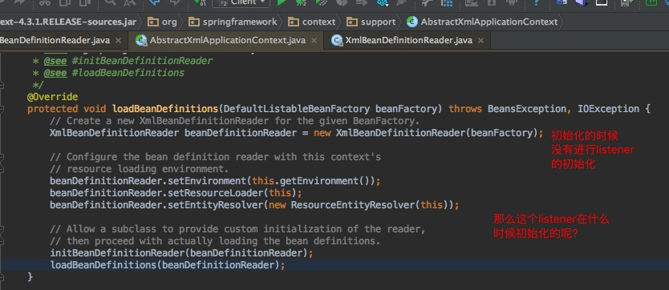


### 5.3 ApplicationEvent和ApplicationListener回顾
	
	这个spring容器用一个Event和Listener事件中心。
	1. listener注册：ApplicationListener是在refresh()的方法的registerListeners()会检查所有的Listener并且放到listner集合中
	2. 事件发布：spring contenxt内置事件，发布事件之后，所有的listener会进行通知，根据source进行主题订阅

