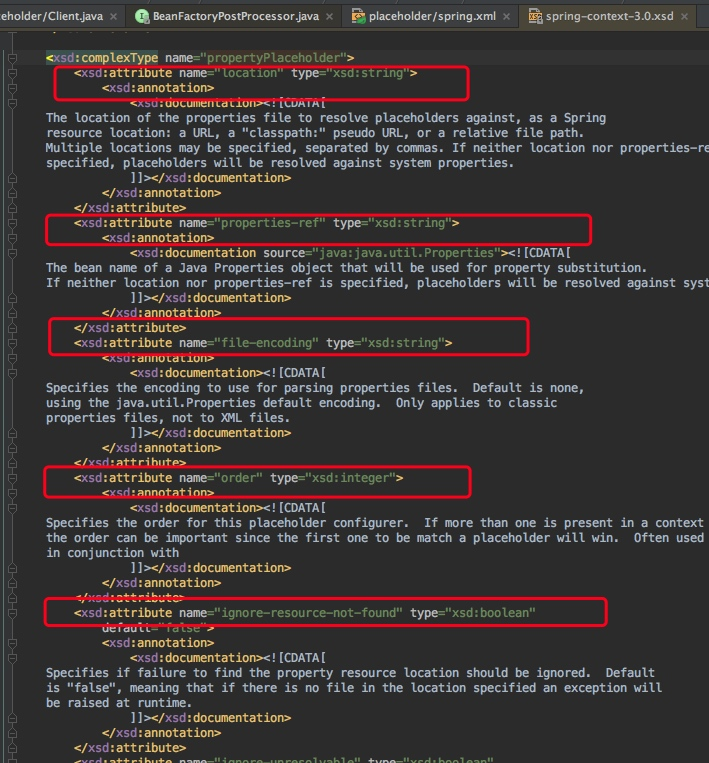
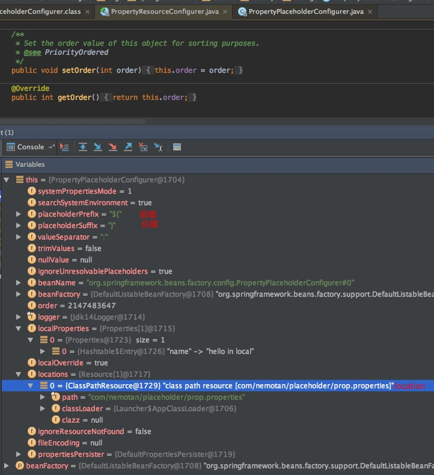
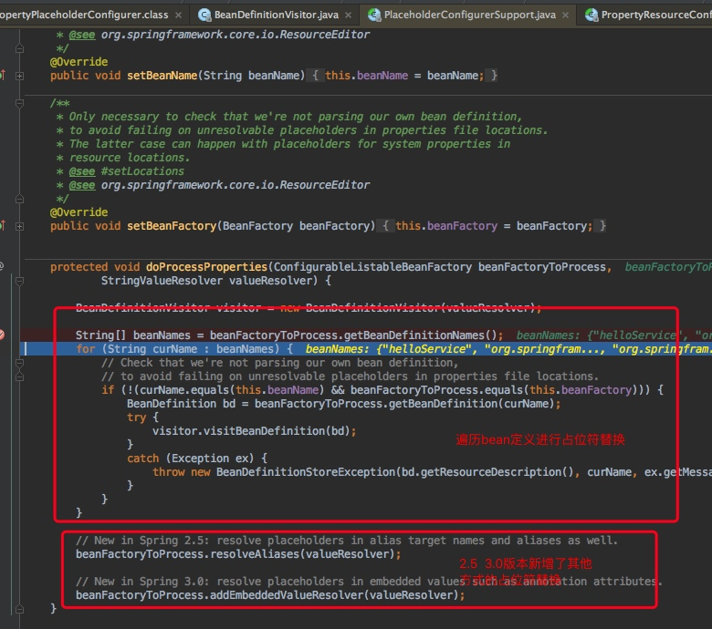
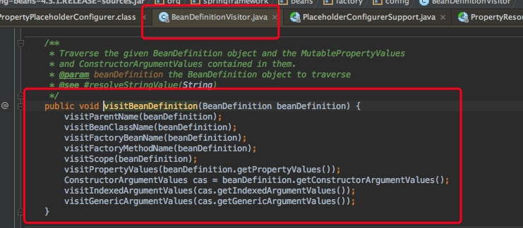
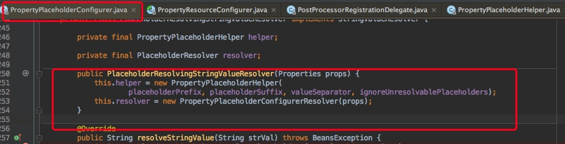

[toc]

## placeholder标签解析&原理
### 标签属性
使用spring的placeholder特性，需要在配置文件中配置<context:property-placeholder/\>

其中该Element的属性如下图：



### 分析标签签命名空间解析类

通过源码文件找到spring.handlers配置中的对应的Handler处理类：ContextNamespaceHandler


	http\://www.springframework.org/schema/context=org.springframework.context.config.ContextNamespaceHandler

```java
registerBeanDefinitionParser("property-placeholder", new PropertyPlaceholderBeanDefinitionParser());
```

PropertyPlaceholderBeanDefinitionParser中返回的bean定义的class为：PropertySourcesPlaceholderConfigurer

```java
protected Class<?> getBeanClass(Element element) {
		// As of Spring 3.1, the default value of system-properties-mode has changed from
		// 'FALLBACK' to 'ENVIRONMENT'. This latter value indicates that resolution of
		// placeholders against system properties is a function of the Environment and
		// its current set of PropertySources.
		if (SYSTEM_PROPERTIES_MODE_DEFAULT.equals(element.getAttribute(SYSTEM_PROPERTIES_MODE_ATTRIBUTE))) {
			return PropertySourcesPlaceholderConfigurer.class;
		}

		// The user has explicitly specified a value for system-properties-mode: revert to
		// PropertyPlaceholderConfigurer to ensure backward compatibility with 3.0 and earlier.
		return PropertyPlaceholderConfigurer.class;
	}
```

### PropertyPlaceholderConfigurer类

该类实现了BeanFactoryPostProcessor接口，在bean定义加载完成之后会执行postProcessBeanFactory方法，在这个方法中会对beanFactory中的所有bean定义进行占位符替换，PropertyPlaceholderConfigurer的属性如下图：


## 占位符替换

在postProcessBeanFactory源码如下：会一次执行如下步骤

- 获取并且合并Properties，这里面分为两种情况：**本地配置重载和不重载**
	- 根据location读取properties和读取本地的properties属性
	- 可以重载：则本地的覆盖location中读取的属性
	- 不可重载：则出现相同属性的时候，则取location文件中属性
	- 如果name不一样，则两者的属性都会保留。
- 转换属性
- 让类执行这行属性

```java

public void postProcessBeanFactory(ConfigurableListableBeanFactory beanFactory) throws BeansException {
		try {
			Properties mergedProps = mergeProperties();

			// Convert the merged properties, if necessary.
			convertProperties(mergedProps);

			// Let the subclass process the properties.
			processProperties(beanFactory, mergedProps);
		}
		catch (IOException ex) {
			throw new BeanInitializationException("Could not load properties", ex);
		}
}
```

### 本地properties实例

```xml
 <context:property-placeholder ignore-unresolvable="true" properties-ref="localProp" local-override="true"
                                  location="classpath:com/nemotan/placeholder/prop.properties"/>
    <util:properties local-override="true" id="localProp">
        <prop key="name">
            hello in local
        </prop>
    </util:properties>
```
上面的配置文件中，就使用了local配置的重载属性，当设置为local-override="true"的时候，如果：prop.properties和util:properties出现同一name的属性，则取util中的property。

### processProperties

构建了**PlaceholderResolvingStringValueResolver**实例，这个实例中有一些占位符标记${  }等的一些属性。

```java
@Override
	protected void processProperties(ConfigurableListableBeanFactory beanFactoryToProcess, Properties props)
			throws BeansException {

		StringValueResolver valueResolver = new PlaceholderResolvingStringValueResolver(props);
		doProcessProperties(beanFactoryToProcess, valueResolver);
	}
```

最后会遍历beanFactory中的bean定义，进行逐个bean定义中的占位符替换。


这里委派给：BeanDefinitionVisitor进行占位符替换，其中又分为了好几部



## BeanDefinitionVisitor分析
	
	1. BeanDefinitionVisitor.  visitBeanDefinition(BeanDefinition beanDefinition) #Visitor关联 StringValueResolver
	2. PlaceholderResolvingStringValueResolver .resolveStringValue(String strVal) 

**PlaceholderResolvingStringValueResolver实例：关联一个resolver和Helper**	


	3. PropertyPlaceholderHelper. resolveStringValue(String strVal) #
	4. PropertyPlaceholderConfigurer .resolvePlaceholder(String placeholder, Properties props, int systemPropertiesMode) #获取占位符
	

## 实例：实现自己的placehold，这里实现一个加密的替换

- 需要在PropertyPlaceholderConfigurer resolver占位符的时候进行替换，从这里进行切入。

**自定义一个类:CustomerPropertyPlaceholderConfigurer**

```java
public class CustomerPropertyPlaceholderConfigurer extends PropertyPlaceholderConfigurer {

    @Override
    protected String resolvePlaceholder(String placeholder, Properties props) {
        return decrypStr(props.getProperty(placeholder));
    }

    /**
     * 解密
     *
     * @param enStr 加密字符串
     * @return 解密算法
     */
    private String decrypStr(String enStr) {
        // 算法进行mock一下
        if (enStr.startsWith("123456789")) {
            return enStr.substring(9);
        }else{
            return enStr;
        }
    }

}
```


**spring.xml配置**

	1. 可以先移除context:property-placeholder标签，如果不移除，需要设置自定义类的order，一定要<系统的默认order值。当然系统默认的是Integer.MAX_VALUE
	

```xml
  <context:property-placeholder ignore-unresolvable="true" properties-ref="localProp" local-override="true"
                                  location="classpath:com/nemotan/placeholder/prop.properties"/>
    <bean id ="customerPropertyPlaceholderConfigurer" class="com.nemotan.placeholder.CustomerPropertyPlaceholderConfigurer">
        <property name="location" value="classpath:com/nemotan/placeholder/prop.properties"></property>
        <property name="order" value="1"></property>
    </bean>
    
  <bean id="hello" class="com.nemotan.placeholder.HelloWorld">
        <property name="name" value="${name}"/>
        <property name="password" value="${password}"/>
  </bean>
```


**properties:**

```xml
name=zhangsan
password=123456789lisi
```


**Client:**

```java

ApplicationContext context = new ClassPathXmlApplicationContext("com/nemotan/placeholder/spring.xml");
HelloWorld helloWorld = (HelloWorld)context.getBean("hello");
System.out.println(helloWorld.getName());
System.out.println("password:"+helloWorld.getPassword());
```

**result:**

	zhangsan
	password:lisi


	

