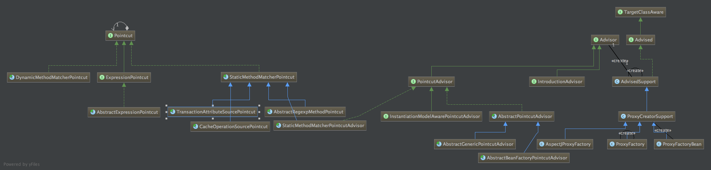
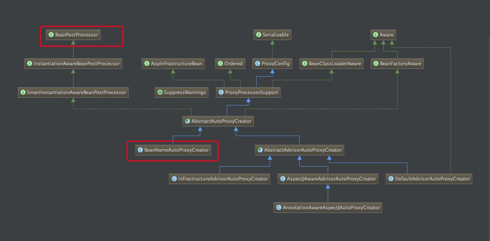

[toc]
# jdk动态代理和cglib
## jdk动态代理
**实例：**

```java
public class MyProxy {
    public interface IHello {
        void sayHello();
    }

    static class Hello implements IHello {
        @Override
        public void sayHello() {
            System.out.println("Hello world!!");
        }
    }

    //自定义InvocationHandler
    static class HWInvocationHandler implements InvocationHandler {
        //目标对象
        private Object target;

        public HWInvocationHandler(Object target) {
            this.target = target;
        }

        @Override
        public Object invoke(Object proxy, Method method, Object[] args) throws Throwable {
            System.out.println("------插入前置通知代码-------------");
            //执行相应的目标方法
            Object rs = method.invoke(target, args);
            System.out.println("------插入后置处理代码-------------");
            return rs;
        }
    }

    public static void main(String[] args) throws Exception {
        //生成$Proxy0的class文件
        System.getProperties().put("sun.misc.ProxyGenerator.saveGeneratedFiles", "true");
        //获取动态代理类
        Class proxyClazz = Proxy.getProxyClass(IHello.class.getClassLoader(), IHello.class);
        //获得代理类的构造函数，并传入参数类型InvocationHandler.class
        Constructor constructor = proxyClazz.getConstructor(InvocationHandler.class);
        //通过构造函数来创建动态代理对象，将自定义的InvocationHandler实例传入
        IHello iHello = (IHello)constructor.newInstance(new HWInvocationHandler(new Hello()));
        //通过代理对象调用目标方法
        iHello.sayHello();
    }
}

```
## cglib

**实例：**

```java

public class Cglib {
    public static class SayHello {
        public void say() {
            System.out.println("hello everyone");
        }
    }

    public static class CglibProxy implements MethodInterceptor {
        private Enhancer enhancer = new Enhancer();

        public Object getProxy(Class clazz) {
            //设置需要创建子类的类
            enhancer.setSuperclass(clazz);
            enhancer.setCallback(this);
            //通过字节码技术动态创建子类实例
            return enhancer.create();
        }

        //实现MethodInterceptor接口方法
        public Object intercept(Object obj, Method method, Object[] args,
                                MethodProxy proxy) throws Throwable {
            System.out.println("前置代理");
            //通过代理类调用父类中的方法
            Object result = proxy.invokeSuper(obj, args);
            System.out.println("后置代理");
            return result;
        }
    }

    public static class DoCGLib {
        public static void main(String[] args) {
            CglibProxy proxy = new CglibProxy();
            //通过生成子类的方式创建代理类
            SayHello proxyImp = (SayHello)proxy.getProxy(SayHello.class);
            proxyImp.say();
        }
    }
}
```


## 区别和特性
- JDK动态代理基于借口进行代理
- 没有接口的类，如何实现动态代理呢，这就需要CGLib了
- CGLib创建的动态代理对象性能比JDK创建的动态代理对象的性能高不少，但是CGLib在创建代理对象时所花费的时间却比JDK多得多，所以对于单例的对象，因为无需频繁创建对象，用CGLib合适，反之，使用JDK方式要更为合适一些。同时，由于CGLib由于是采用动态创建子类的方法，对于final方法，无法进行代理。

# spring aop底层原理
## 基本概念

- Pointcut： 切入点
- Advice ： 它是某个连接点所采用的处理逻辑，也就是向连接点注入的代码。例如：输出的日志信息   就是一个Advice
- Advisor是Pointcut和Advice的配置器，它包括Pointcut和Advice，是将Advice注入程序中Pointcut位置的代码

---




- ProxyFactory，ProxyFactoryBean 继承AdvisedSupport
- AdvisedSupport 依赖Advisor
- Advisor依赖 Advice和pointcut
- Advice是切入的处理逻辑，如打印日志
- Pointcut是切入的点，如某个方法进行切入

## ProxyFactory实现原理
**demo：**

spring实现aop的最最基础的类是spring-aop包中ProxyFactory类。
该类核心方法**getProxy（）**会返回代理类，从而实现AOP的功能。

-	设置一个需要代理的类target
- 	添加advice【代理类】
-  proxyFactory.getProxy(...)#获取一代理类
-  代理类执行方法

```java

		//利用spring的API,创建代理工厂
        ProxyFactory proxyFactory = new ProxyFactory(interfaces);
        //设置目标对象
        proxyFactory.setTarget(new HelloWorldServiceImpl());
        /**
         * Set whether proxies created by this configuration should be prevented from being cast to Advised to query
         * proxy status.
         Default is "false", meaning that any AOP proxy can be cast to Advised.
         * */
        proxyFactory.setOpaque(true);
        //添加方法前置通知
        proxyFactory.addAdvice(new MethodBeforeAdvice() {
            @Override
            public void before(Method method, Object[] args, Object target)
                throws Throwable {
                System.out.println("1111111111在方法调用之前拦截");
            }
        });
        
      Object proxy = proxyFactory.getProxy(proxyFactory.getClass().getClassLoader());
        HelloWorldService helloWorldService = (HelloWorldService)proxy;
        helloWorldService.sayHelloWorld();
```

在上面我们介绍了jdk动态代理和cglib代理方式，那么spring底层实现获取代理也是使用的这两种方式。

-	把aop的配置文件封装在AdvisedSupport实例中
- AdvisedSupport包含添加的advice
- 根据被代理的类【是否为接口】判断用jdk动态代理还是cglib代理方式

```java
public class DefaultAopProxyFactory implements AopProxyFactory, Serializable {

    @Override
    public AopProxy createAopProxy(AdvisedSupport config) throws AopConfigException {
        if (config.isOptimize() || config.isProxyTargetClass() || hasNoUserSuppliedProxyInterfaces(config)) {
            Class<?> targetClass = config.getTargetClass();
            if (targetClass == null) {
                throw new AopConfigException("TargetSource cannot determine target class: " +
                        "Either an interface or a target is required for proxy creation.");
            }
            if (targetClass.isInterface() || Proxy.isProxyClass(targetClass)) {
                return new JdkDynamicAopProxy(config);
            }
            return new ObjenesisCglibAopProxy(config);
        }
        else {
            return new JdkDynamicAopProxy(config);
        }
    }
```


## ProxyFactoryBean实现AOP原理
- 配置ProxyFactoryBean实例，设置target
- 在spring factory实例化该bean的时候，会从factory getObject()中获取该对象
- 该对象初始化，会根据class的类型进行使用工厂模式创建：jdk动态代理还是cglib对象

---

**配置文件：**

```java
 <bean id="helloWorldTarget" class="com.nemotan.proxyfactory.beanfactory.HelloWorld"/>
    <bean id="log" class="com.nemotan.proxyfactory.beanfactory.Log"/>

    <!--代理目标类的指定方法-->
    <bean id="logAdvisor" class="org.springframework.aop.support.RegexpMethodPointcutAdvisor">
        <property name="advice">
            <ref bean="log"/>
        </property>

        <!--指定要代理的方法-->
        <property name="patterns">
            <value>.*hello.*</value>
        </property>
    </bean>

    <!--设定代理类-->
    <bean id="helloWorld" class="org.springframework.aop.framework.ProxyFactoryBean">
        <property name="proxyInterfaces">
            <value>com.nemotan.proxyfactory.beanfactory.IHello</value>
        </property>

        <property name="target">
            <ref bean="helloWorldTarget"/>
        </property>

        <property name="interceptorNames">
            <list>
                <value>logAdvisor</value>
            </list>
        </property>
    </bean>
```


**ProxyFactoryBean实现步骤：**

-	配送文件中配置一个代理类：ProxyFactoryBean	ie=helloWorld
- spring容器初始化该bean定义
- spring容器实例化该bean	（获取ProxyFactoryBean实例）
- 实例化该bean的时候会判断该bean是否Factorybean，如果不是直接返回singleTon实例，反之需要根据工厂bean进行获取bean
- 这里：ProxyFactoryBean是一个工厂bean
- 该bean的实例有advisor、target属性
- 工厂bean会调用getObject()获取该工厂bean包装的实例
-	ProxyFactoryBean这个工厂bean最终返回了target的代理类实例
- 核心代码如下	

**ProxyFactoryBean.ProxyFactoryBean**
	
```java
private synchronized Object getSingletonInstance() {
        if (this.singletonInstance == null) {
            this.targetSource = freshTargetSource();
            if (this.autodetectInterfaces && getProxiedInterfaces().length == 0 && !isProxyTargetClass()) {
                // Rely on AOP infrastructure to tell us what interfaces to proxy.
                Class<?> targetClass = getTargetClass();
                if (targetClass == null) {
                    throw new FactoryBeanNotInitializedException("Cannot determine target class for proxy");
                }
                setInterfaces(ClassUtils.getAllInterfacesForClass(targetClass, this.proxyClassLoader));
            }
            // Initialize the shared singleton instance.
            super.setFrozen(this.freezeProxy);
            this.singletonInstance = getProxy(createAopProxy());
            # createAopProxy 获取一个AopProxy
			  # 
         }
        return this.singletonInstance;
    }
 
 
 protected final synchronized AopProxy createAopProxy() {
        if (!this.active) {
            activate();
        }
        return getAopProxyFactory().createAopProxy(this);
        # 获取getAopProxyFactory ,获取AOP代理工厂实例
        # 最终的底层原理是和ProxyFactory底层一样，获取ProxyFactory进行获取带来
        # createAopProxy 该方法就会获取代理类，根据代理class判断使用jdk，cglib
}
```


## BeanNameAutoProxyCreator--自动代理实现原理
**源码：**
	
```java

 <bean id="helloWorldService" class="com.nemotan.proxyfactory.autoproxy.HelloWorldServiceImpl"/>
    <bean id="beforeAdvice" class="com.nemotan.proxyfactory.autoproxy.LogBeforeAdvice"/>
    <bean id="logAdvice" class="com.nemotan.proxyfactory.autoproxy.LogAdvice"/>

    <bean class="org.springframework.aop.framework.autoproxy.BeanNameAutoProxyCreator">
        <property name="beanNames">
            <list>
                <value>helloWorldService</value>
            </list>
        </property>
        <property name="interceptorNames">
            <list>
                <value>beforeAdvice</value>
                <value>logAdvice</value>
            </list>
        </property>
    </bean>
```

**类图：**
	
	该类实现了bean的后置处理器，类图如下：
	


**核心原理：**	
	
- 1. 在获取helloWorldService实例
- 2. BeanNameAutoProxyCreator执行bean后置处理器
- 3. 判断该helloWorldService是否需要进行代理
- 4. 如果需要代理，则创建ProxyFactory实例
- 5. 

---

```java

protected Object wrapIfNecessary(Object bean, String beanName, Object cacheKey) {
        if (beanName != null && this.targetSourcedBeans.contains(beanName)) {
            return bean;
        }
        if (Boolean.FALSE.equals(this.advisedBeans.get(cacheKey))) {
            return bean;
        }
        if (isInfrastructureClass(bean.getClass()) || shouldSkip(bean.getClass(), beanName)) {
            this.advisedBeans.put(cacheKey, Boolean.FALSE);
            return bean;
        }

        // Create proxy if we have advice.
        Object[] specificInterceptors = getAdvicesAndAdvisorsForBean(bean.getClass(), beanName, null);
        if (specificInterceptors != DO_NOT_PROXY) {
            this.advisedBeans.put(cacheKey, Boolean.TRUE);
            // 创建代理

            Object proxy = createProxy(
                    bean.getClass(), beanName, specificInterceptors, new SingletonTargetSource(bean));
            this.proxyTypes.put(cacheKey, proxy.getClass());
            return proxy;
        }

        this.advisedBeans.put(cacheKey, Boolean.FALSE);
        return bean;
    }
```

```java
protected Object createProxy(
            Class<?> beanClass, String beanName, Object[] specificInterceptors, TargetSource targetSource) {

        if (this.beanFactory instanceof ConfigurableListableBeanFactory) {
            AutoProxyUtils.exposeTargetClass((ConfigurableListableBeanFactory) this.beanFactory, beanName, beanClass);
        }

        ProxyFactory proxyFactory = new ProxyFactory();
        proxyFactory.copyFrom(this);

        if (!proxyFactory.isProxyTargetClass()) {
            if (shouldProxyTargetClass(beanClass, beanName)) {
                proxyFactory.setProxyTargetClass(true);
            }
            else {
                evaluateProxyInterfaces(beanClass, proxyFactory);
            }
        }

        Advisor[] advisors = buildAdvisors(beanName, specificInterceptors);
        for (Advisor advisor : advisors) {
            proxyFactory.addAdvisor(advisor);
        }

        proxyFactory.setTargetSource(targetSource);
        customizeProxyFactory(proxyFactory);

        proxyFactory.setFrozen(this.freezeProxy);
        if (advisorsPreFiltered()) {
        // 创建代理
            proxyFactory.setPreFiltered(true);
        }

        return proxyFactory.getProxy(getProxyClassLoader());
    }

```


 


