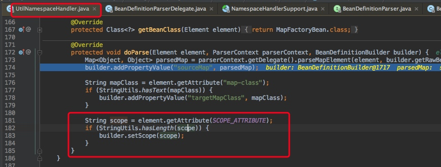
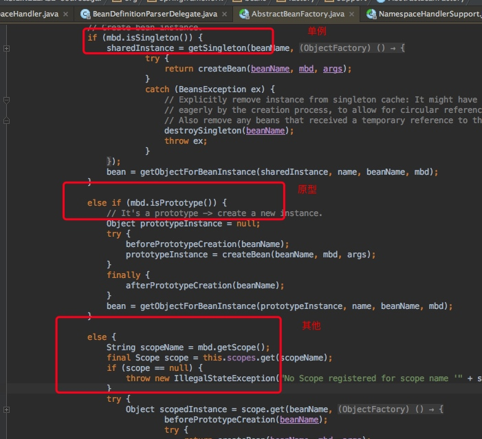
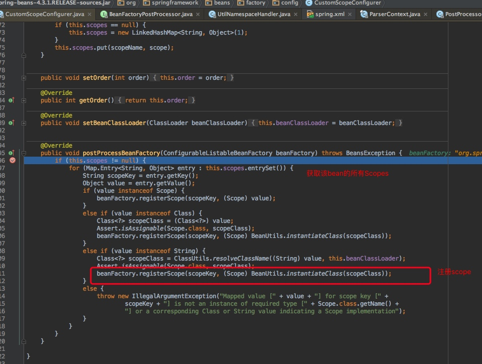
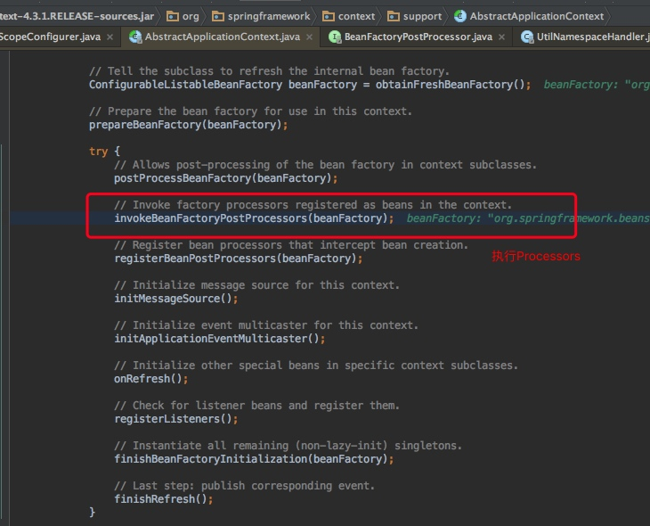
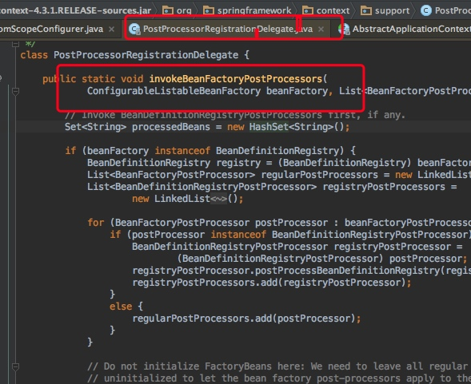
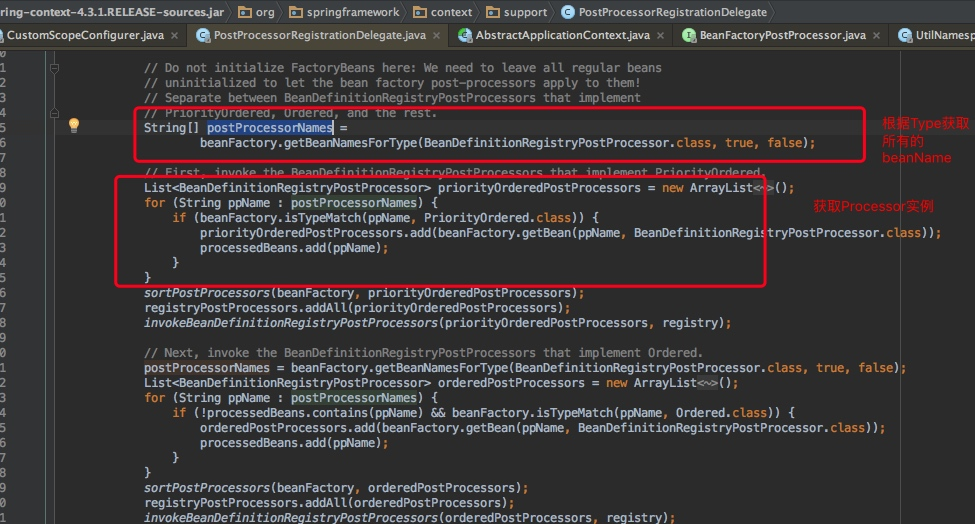

[toc]

# scope的应用以及自定义scope
## 概述	
### scope类型

	1.	singleton 表示在spring容器中的单例，通过spring容器获得该bean时总是返回唯一的实例
	2.	prototype表示每次获得bean都会生成一个新的对象
	3.	request表示在一次http请求内有效（只适用于web应用）
	4.	session表示在一个用户会话内有效（只适用于web应用）
	5.	globalSession表示在全局会话内有效（只适用于web应用）

### bean定义的scope

	在前面说了，在加载bean定义的时候，解析标签会进行解析标签中的scope属性
	解析了scope,并且设置到Beandefinition中
	这个时候在Beandefinition中是一个String类型。
	


### bean加载的scope
	
	在AbstractFactory getBean的时候会进行判断，要获取的bean定义的scope
	1. 如果是singleton则getSingleton()
	2. 如果是prototype则使用原型的方式实例化bean
	3. 其他的则数组用户自定义的scope，如request,session等都是
	4. 如果是其他的bean，那么就会从beanFactory的scopes这个map中获取一个Scope接口的一个实例
	
	由此得出spring的核心scople就是singleton和prototype




### Scope接口
### beanFactory注册Scope方法
	
	看一下AbstractBeanFactory的registerScope源码，这里会注册一个Scope。
	并且把Scope实例放到scope这个Map中
	
```java
public void registerScope(String scopeName, Scope scope) {
		Assert.notNull(scopeName, "Scope identifier must not be null");
		Assert.notNull(scope, "Scope must not be null");
		if (SCOPE_SINGLETON.equals(scopeName) || SCOPE_PROTOTYPE.equals(scopeName)) {
			throw new IllegalArgumentException("Cannot replace existing scopes 'singleton' and 'prototype'");
		}
		Scope previous = this.scopes.put(scopeName, scope);
		if (previous != null && previous != scope) {
			if (logger.isInfoEnabled()) {
				logger.info("Replacing scope '" + scopeName + "' from [" + previous + "] to [" + scope + "]");
			}
		}
		else {
			if (logger.isDebugEnabled()) {
				logger.debug("Registering scope '" + scopeName + "' with implementation [" + scope + "]");
			}
		}
	}
```		

### 自定义Scope--CustomScopeConfigurer类分析

CustomScopeConfigurer类实现了BeanFactoryPostProcessor接口

```java
public class CustomScopeConfigurer implements BeanFactoryPostProcessor, BeanClassLoaderAware, Ordered 
```

CustomScopeConfigurer在初始化之后，会把注入的Scope实例进行register到BeanFactory中。




### BeanFactoryPostProcessor实现原理

`执行原理：`

BeanFactoryPostProcessor可以对bean的定义（配置元数据）进行处理。也就是说，Spring IoC容器允许BeanFactoryPostProcessor在容器实际实例化任何其它的bean之前读取配置元数据，并有可能修改它。如果你愿意，你可以配置多个BeanFactoryPostProcessor。你还能通过设置'order'属性来控制BeanFactoryPostProcessor的执行次序。

通过beanFactory可以获取bean的示例或定义等。同时可以修改bean的属性，在上面图中，在postProcessBeanFactory方法中可以修改。


```java
public interface BeanFactoryPostProcessor {

	/**
	 * Modify the application context's internal bean factory after its standard
	 * initialization. All bean definitions will have been loaded, but no beans
	 * will have been instantiated yet. This allows for overriding or adding
	 * properties even to eager-initializing beans.
	 * @param beanFactory the bean factory used by the application context
	 * @throws org.springframework.beans.BeansException in case of errors
	 */
	void postProcessBeanFactory(ConfigurableListableBeanFactory beanFactory) throws BeansException;

}
```

在初始化整个ApplicationContext的时候，有一个步骤叫做：invokeBeanFactoryPostProcessors(beanFactory)，这个方法主要是执行所有的BeanFactoryPostProcessor实例。





`获取所有的Processor：`






## 自定义一个scope

在spring-context包中有个线程Scope：SimpleThreadScope，来分析一下在应用中，如何自顶一个线程Scop。

上面说到CustomScopeConfigurer初始化之后的方法postProcessBeanFactory中会进行SCOP的注册。因此只需要注入这个bean，spring容器加载完bean定义之后，就会执行postProcessBeanFactory方法：

```xml
<bean class="org.springframework.beans.factory.config.CustomScopeConfigurer">
        <property name="scopes">
            <map>
                <entry key="thread">
                    <bean class="org.springframework.context.support.SimpleThreadScope"/>
                </entry>
            </map>
        </property>
    </bean>
```

在postProcessBeanFactory方法中我们可以看到，beanFactory会注册在spring中注入的Scope，这里注入了SimpleThreadScope。

```java
  public void postProcessBeanFactory(ConfigurableListableBeanFactory beanFactory) throws BeansException {
		if (this.scopes != null) {
			for (Map.Entry<String, Object> entry : this.scopes.entrySet()) {
				String scopeKey = entry.getKey();
				Object value = entry.getValue();
				if (value instanceof Scope) {
					beanFactory.registerScope(scopeKey, (Scope) value);
				}
				else if (value instanceof Class) {
					Class<?> scopeClass = (Class<?>) value;
					Assert.isAssignable(Scope.class, scopeClass);
					beanFactory.registerScope(scopeKey, (Scope) BeanUtils.instantiateClass(scopeClass));
				}
				else if (value instanceof String) {
					Class<?> scopeClass = ClassUtils.resolveClassName((String) value, this.beanClassLoader);
					Assert.isAssignable(Scope.class, scopeClass);
					beanFactory.registerScope(scopeKey, (Scope) BeanUtils.instantiateClass(scopeClass));
				}
				else {
					throw new IllegalArgumentException("Mapped value [" + value + "] for scope key [" +
							scopeKey + "] is not an instance of required type [" + Scope.class.getName() +
							"] or a corresponding Class or String value indicating a Scope implementation");
				}
			}
		}
	}

```


当其他bean指定scope=thread的时候，就会从SimpleThreadScope中获取这个bean。


**SimpleThreadScope:**

这个Scope获取bean实例就是从ThreadLocal中获取bean实例，以保证线程安全。

```java

public class SimpleThreadScope implements Scope {

	private static final Log logger = LogFactory.getLog(SimpleThreadScope.class);

	private final ThreadLocal<Map<String, Object>> threadScope =
			new NamedThreadLocal<Map<String, Object>>("SimpleThreadScope") {
				@Override
				protected Map<String, Object> initialValue() {
					return new HashMap<String, Object>();
				}
			};


	@Override
	public Object get(String name, ObjectFactory<?> objectFactory) {
		Map<String, Object> scope = this.threadScope.get();
		Object object = scope.get(name);
		if (object == null) {
			object = objectFactory.getObject();
			scope.put(name, object);
		}
		return object;
	}
```

