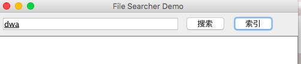
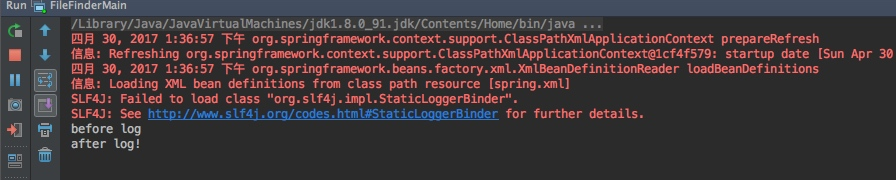
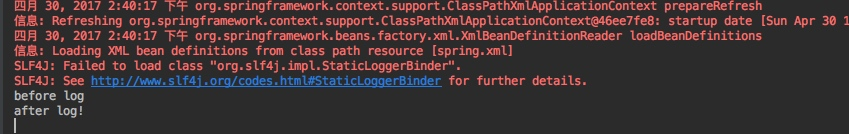

# 文件索引器添加log
## BeanNameAutoProxyCreator方式
**配置文件：**

```java
<bean id="beforeAdvice" class="com.nemotan.ch12.hw.aop.LogBeforeAdvice"/>
    <bean id="logAdvice" class="com.nemotan.ch12.hw.aop.LogAdvice"/>
    <bean class="org.springframework.aop.framework.autoproxy.BeanNameAutoProxyCreator">
        <property name="beanNames">
            <list>
                <value>dbIndexIO</value>
            </list>
        </property>
        <property name="interceptorNames">
            <list>
                <value>beforeAdvice</value>
                <value>logAdvice</value>
            </list>
        </property>
    </bean>
```

**需要代理的bean**

```java
@Component("dbIndexIO")
public class FullTextIndexIO implements IIndexIO {

```

**advice类**

```java
public class LogBeforeAdvice implements MethodBeforeAdvice{
    @Override
    public void before(Method method, Object[] args, Object target) throws Throwable {
        System.out.println("before log");
    }
}

```

**运行结果：**



	在输入搜索之后会进行打印日志




## aop:config方式

**引入依赖**

```java
  <dependency>
            <groupId>aspectj</groupId>
            <artifactId>aspectjweaver</artifactId>
            <version>1.5.3</version>
        </dependency>
```
**配置文件**

```java
   <aop:config>
        <aop:pointcut expression="(execution(* find*(..)))"  id="mypoint"/>
        <aop:advisor advice-ref="beforeAdvice" pointcut-ref="mypoint"/>
        <aop:advisor advice-ref="logAdvice" pointcut-ref="mypoint"/>
    </aop:config>
```

**运行结果**





