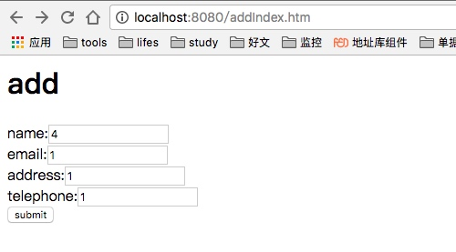
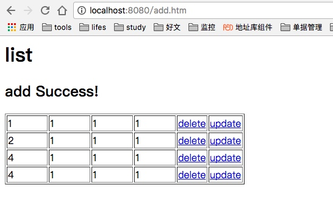
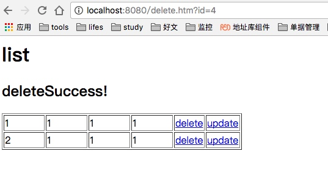
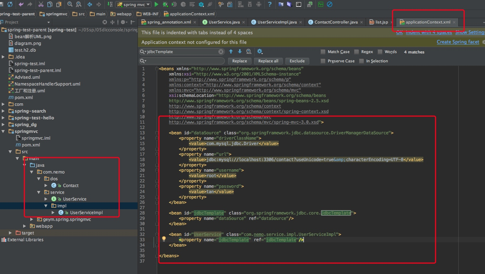

[toc]

# spring mvc
 
##  demo











## 配置
xml配置

```xml
<listener>
	// 配置spring context监听器，初始化spring容器
	<listener-class>org.springframework.web.context.ContextLoaderListener</listener-class>
	</listener>
	
	<servlet>
		<servlet-name>mvc-dispatcher</servlet-name>
		<servlet-class>org.springframework.web.servlet.DispatcherServlet</servlet-class>
		<load-on-startup>1</load-on-startup>
	</servlet>

	<servlet-mapping>
		<servlet-name>mvc-dispatcher</servlet-name>
		<url-pattern>*.htm</url-pattern>
	</servlet-mapping>
```

spring.xml

```java

<bean id="viewResolver"		class="org.springframework.web.servlet.view.InternalResourceViewResolver">
		<property name="prefix">
			<value>/WEB-INF/pages/</value>
		</property>
		<property name="suffix">
			<value>.jsp</value>
		</property>
	</bean>
```


## 加载原理
- ContextLoaderListener:servletContext 加载完成监听器
	- 监听servletContext
	- 初始化spring容器
	- 加载bean定义：InternalResourceViewResolver
- DispatcherServlet 初始化spring mvc的servlet
- FrameworkServlet .ContextRefreshListener #spring mvc的servlet监听spring context刷新事件


FrameworkServlet 监听spring容器刷新事件

```java

private class ContextRefreshListener implements ApplicationListener<ContextRefreshedEvent> {

		@Override
		public void onApplicationEvent(ContextRefreshedEvent event) {
			FrameworkServlet.this.onApplicationEvent(event);
		}
}
	
public void onApplicationEvent(ContextRefreshedEvent event) {
		this.refreshEventReceived = true;
		onRefresh(event.getApplicationContext());
}
```

DispatcherServlet.java 初始化servlet的策略

```java
protected void initStrategies(ApplicationContext context) {
		initMultipartResolver(context);
		initLocaleResolver(context);
		initThemeResolver(context);
		initHandlerMappings(context);
		initHandlerAdapters(context);
		initHandlerExceptionResolvers(context);
		initRequestToViewNameTranslator(context);
		// 初始化view resolvers
		initViewResolvers(context);
		initFlashMapManager(context);
}

/**
	 * Initialize the ViewResolvers used by this class.
	 * <p>If no ViewResolver beans are defined in the BeanFactory for this
	 * namespace, we default to InternalResourceViewResolver.
	 */
	private void initViewResolvers(ApplicationContext context) {
		this.viewResolvers = null;

		if (this.detectAllViewResolvers) {
			// Find all ViewResolvers in the ApplicationContext, including ancestor contexts.
			Map<String, ViewResolver> matchingBeans =
					BeanFactoryUtils.beansOfTypeIncludingAncestors(context, ViewResolver.class, true, false);
			if (!matchingBeans.isEmpty()) {
				this.viewResolvers = new ArrayList<ViewResolver>(matchingBeans.values());
				// We keep ViewResolvers in sorted order.
				AnnotationAwareOrderComparator.sort(this.viewResolvers);
			}
		}
		else {
			try {
				ViewResolver vr = context.getBean(VIEW_RESOLVER_BEAN_NAME, ViewResolver.class);
				this.viewResolvers = Collections.singletonList(vr);
			}
			catch (NoSuchBeanDefinitionException ex) {
				// Ignore, we'll add a default ViewResolver later.
			}
		}

		// Ensure we have at least one ViewResolver, by registering
		// a default ViewResolver if no other resolvers are found.
		if (this.viewResolvers == null) {
			this.viewResolvers = getDefaultStrategies(context, ViewResolver.class);
			if (logger.isDebugEnabled()) {
				logger.debug("No ViewResolvers found in servlet '" + getServletName() + "': using default");
			}
		}
	}
```

	
DispatcherServlet.java处理请求。

- doDispatch(HttpServletRequest request, HttpServletResponse response)#处理请求
- HandlerAdapter ha = getHandlerAdapter(mappedHandler.getHandler());#根据request获取Handler
- processDispatchResult(processedRequest, response, mappedHandler, mv, dispatchException); #执行跳转结果
- render(mv, request, response); #渲染mv
- View view = resolveViewName(mv.getViewName(), mv.getModelInternal(), locale, request);


```java
protected void render(ModelAndView mv, HttpServletRequest request, HttpServletResponse response) throws Exception {
		// Determine locale for request and apply it to the response.
		Locale locale = this.localeResolver.resolveLocale(request);
		response.setLocale(locale);

		View view;
		if (mv.isReference()) {
			// We need to resolve the view name. 根据view name去处理
			view = resolveViewName(mv.getViewName(), mv.getModelInternal(), locale, request);
			if (view == null) {
				throw new ServletException("Could not resolve view with name '" + mv.getViewName() +
						"' in servlet with name '" + getServletName() + "'");
			}
		}
		else {
			// No need to lookup: the ModelAndView object contains the actual View object.
			view = mv.getView();
			if (view == null) {
				throw new ServletException("ModelAndView [" + mv + "] neither contains a view name nor a " +
						"View object in servlet with name '" + getServletName() + "'");
			}
		}

		// Delegate to the View object for rendering.
		if (logger.isDebugEnabled()) {
			logger.debug("Rendering view [" + view + "] in DispatcherServlet with name '" + getServletName() + "'");
		}
		try {
			if (mv.getStatus() != null) {
				response.setStatus(mv.getStatus().value());
			}
			view.render(mv.getModelInternal(), request, response);
		}
		catch (Exception ex) {
			if (logger.isDebugEnabled()) {
				logger.debug("Error rendering view [" + view + "] in DispatcherServlet with name '" +
						getServletName() + "'", ex);
			}
			throw ex;
		}
	}

// 根据viewName处理该请求
protected View resolveViewName(String viewName, Map<String, Object> model, Locale locale,
			HttpServletRequest request) throws Exception {
		
		// 遍历所有ViewResolver，进行处理，viewResolver是在上面的init的时候初始化的
		for (ViewResolver viewResolver : this.viewResolvers) {
			View view = viewResolver.resolveViewName(viewName, locale);
			if (view != null) {
				return view;
			}
		}
		return null;
	}

```


 


