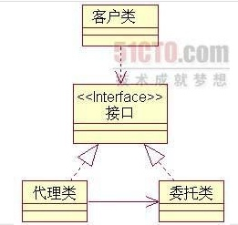

[toc]

## 一. 代理模式
### 1.1 UML类图

### 1.2 优点和作用

- 职责清晰
真实的角色就是实现实际的业务逻辑，不用关心其他非本职责的事务，通过后期的代理完成一件完成-事务，附带的结果就是编程简洁清晰。
- 代理对象可以在客户端和目标对象之间起到中介的作用，这样起到了中介的作用和保护了目标对象的作用。
- 高扩展性。

## 二. 代理模式在spring中的应用--AOP

### 2.1 功能

- 1.事务管理: (1)数据库事务:(2)编程事务(3)声明事物:Spring AOP-->声明事物   
- 2.日志处理:
- 3.安全验证: Spring AOP---OOP升级  

### 2.2. 定义

- 1. 切入点  Pointcut
- 2. 通知Advice
- 3. Advisor

## 三. 实例

