[toc]

## 一. 观察者模式的使用
`概述：`

	有时被称作发布/订阅模式，观察者模式定义了一种一对多的依赖关系。    
	让多个观察者对象同时监听某一个主题对象。
	这个主题对象在状态发生变化时，会通知所有观察者对象，使它们能够自动更新自己。

`作用:`
	
	将一个系统分割成一个一些类相互协作的类有一个不好的副作用，那就是需要维护相关对象间的一致性。
	我们不希望为了维持一致性而使各类紧密耦合，这样会给维护、扩展和重用都带来不便。观察者就是解决这类的耦合关系的。
	
`UML基本类图如下：`

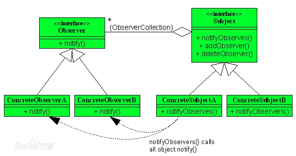

`总结：`
	
	观察者模式又叫发布订阅模式，在java设计中使用的最多的是监听器的实现。
	从上面的类图来讲：每个观察者都有一个通知方法。
	主题SUBJECT接口：每一个主题会添加一些观察者，当然也会提供删除观察者的方法，当主题发生改变的时候，会进行notifyObservers()，进行通知到观察者，具体的代码就不写了，具体在spring的源码中进行分析。
	
## 二. spring中的观察者模式的使用
### 2.1 事件基本原理
	之前分析过spring容器初始化bean的过程，会调用refresh（）方法。
	在下面会调用:
	// Initialize event multicaster for this context. 
	// 初始化上下文的事件广播
	initApplicationEventMulticaster();

	// Check for listener beans and register them.
	// 检查监听器bean并且注册
	registerListeners();

`initApplicationEventMulticaster`

	这个比较简单，就是初始化ApplicationEventMulticaster


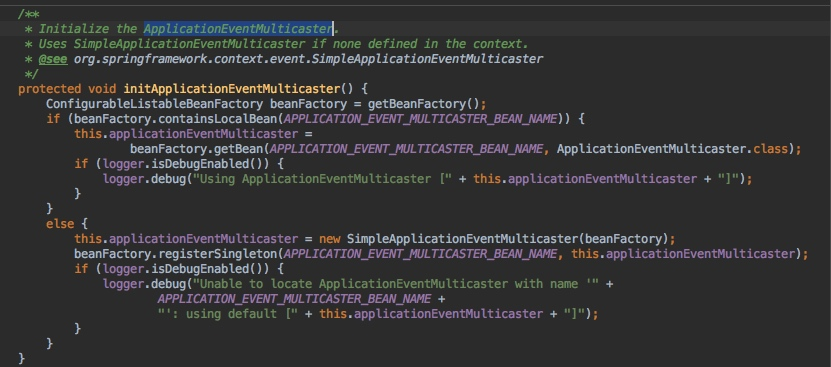
	
	
	接下来进行注册listener：
	1. 获取了所有的监听器添加到Multicaster中
	2. 发布early事件
	3. 接下来会调用调用Listener的onApplication(event)事件
	
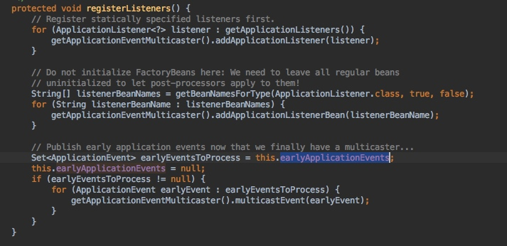
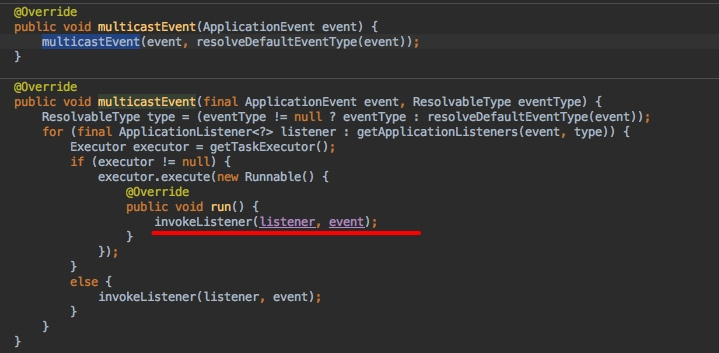
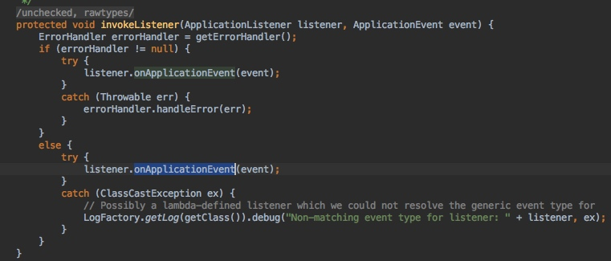


	
`spring-conrext模块的event包uml图：`
	
	从下图总可以看出:
	ApplicationEventMulticater 是事件广播，自雷是SimplexxxEventMulticaster
	ApplicationContextEvent: 事件
	
	
	
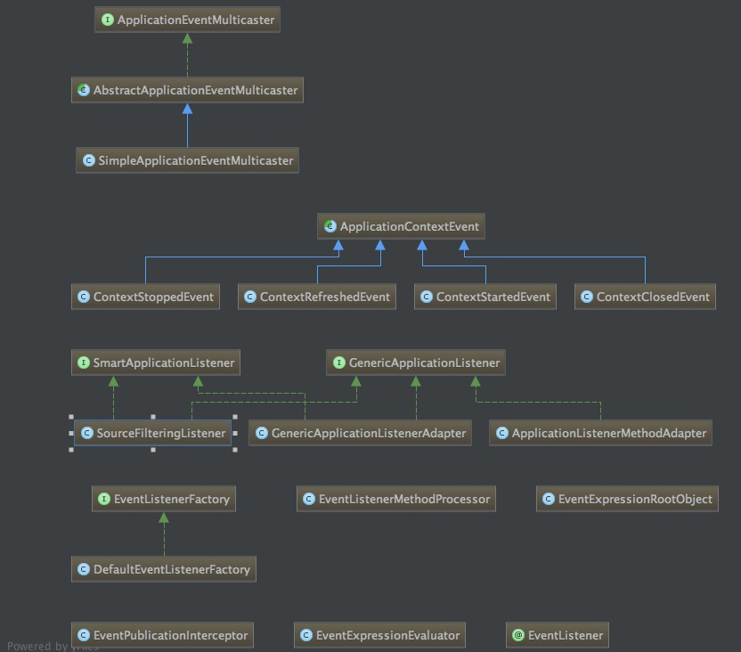


### 2.2 context内置event
	
- ContextRefreshedEvent：ApplicationContext容器初始化或刷新时触发该事件。此处的初始化是指：所有的Bean被成功装载，后处理Bean被检测并激活，所有Singleton Bean 被预实例化，ApplicationContext容器已就绪可用

- ContextStartedEvent：当使用ConfigurableApplicationContext(ApplicationContext的子接口）接口的start()方法启动ApplicationContext容器时触发该事件。容器管理声明周期的Bean实例将获得一个指定的启动信号，这在经常需要停止后重新启动的场合比较常见

- ContextClosedEvent：当使用ConfigurableApplicationContext接口的close()方法关闭ApplicationContext时触发该事件

- ContextStoppedEvent：当使用ConfigurableApplicationContext接口的stop()方法使ApplicationContext容器停止时触发该事件。此处的停止，意味着容器管理生命周期的Bean实例将获得一个指定的停止信号，被停止的Spring容器可再次调用start()方法重新启动。

- RequestHandledEvent：Web相关事件，只能应用于使用DispatcherServlet的Web应用。在使用Spring作为前端的MVC控制器时，当Spring处理用户请求结束后，系统会自动触发该事件。

### 2.3 ContextRefreshedEvent内置事件发布

	上面说到context几个系统内置事件，那么这几个内置事件，是什么时候publish的呢？
	拿ContextRefreshedEvent说明在ApplicationContext的refreash（）方法之后，
	会调用finishRefresh（）方法，进行ContextRefreshedEvent事件发布。
	1. event的source就是this,xxxContextEvent的source是ApplicationContext实例，ApplicationEvent的source是Object，自己定义事件的时候，可以随意定义source。
	2. 发布的时候，会根据event获取一个默认的ResolvableType，
	3. 根据event和type获取listener
	
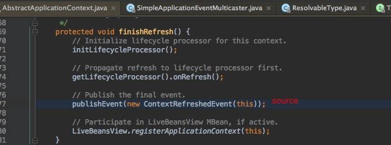

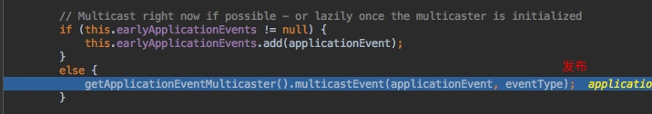
	
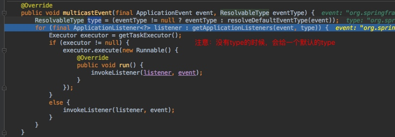

### 2.4 实现一个Listener监听ContextRefreshedEvent事件
	
	上面介绍了context加载完毕的时候会发送一个事件，那么我们来个监听器监听这个事件
	1. 创建一个listener
	2. register这个bean

```java
public class ContextRefreshListener implements ApplicationListener {
    /**
     * Handle an application event.
     *
     * @param event the event to respond to
     */
    @Override
    public void onApplicationEvent(ApplicationEvent event) {
        System.out.println("source:" + event.getSource());
        if (event.getSource() instanceof ClassPathXmlApplicationContext) {
            System.out.println("刷新事件!");
        }
    }
}

<bean id="contextRefreshListener" class="com.nemotan.listener.ContextRefreshListener"/>

```
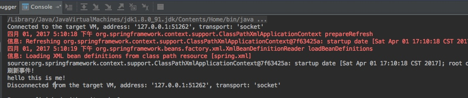

### 2.5 事件发布接口：ApplicationEventPublisher

	
	ClassPathXmlApplicationContext在finishRefreash()之后执行了发布方法，其最终实现的是ApplicationEventPublisher接口。


### 2.6 事件监听监听注入
	
	在multicaster获取listeners的时候，会根据source和type进行从缓存中获取，那么我们来研究下这一块代码：
	下面是获取listener的代码，这里没有什么问题，那么主要是在加载获取listener的时候。
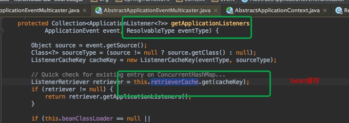
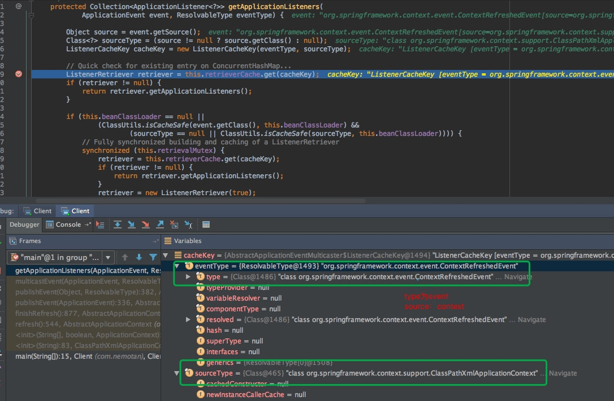

### 2.7 listener加载
	
	1. 在simpleApplicationEventMultiaster的发发布时间的时候会从cache获取listener
	2. 在2.1的时候加载所有的listener都已经加载到Multiaster中
	3. 取不到，则从Multiaster中获取
	4. 获取之后，放到缓存中
	5. 最终发现：listener的type也就是lister的class。

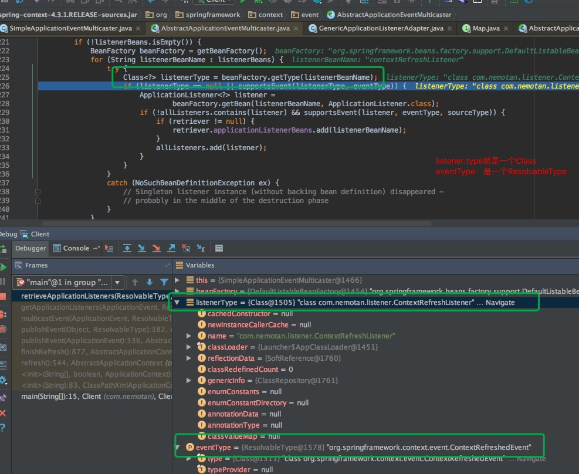


