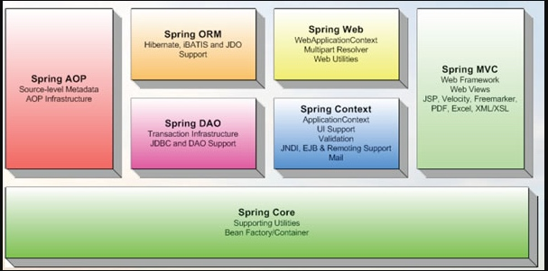

# spring官网介绍

[spring4.3-x源码](https://github.com/spring-projects/spring-framework/tree/4.3.x)
[spring官网-projects](http://spring.io/projects)

Spring Framework 是一个开源的Java/Java EE全功能栈（full-stack）的应用程序框架，以Apache许可证形式发布，也有.NET平台上的移植版本。 该框架基于 Expert One-on-One Java EE Design and Development（ISBN 0-7645-4385-7）一书中的代码，最初由 Rod Johnson 和 Juergen Hoeller等开发。Spring Framework 提供了一个简易的开发方式，这种开发方式，将避免那些可能致使底层代码变得繁杂混乱的大量的属性文件和帮助类。

|项目名称|描述|
|:---|:---|
|spring io|[Spring IO Platform简介及示例](http://www.cnblogs.com/chenpi/p/6295855.html),主要是解决依赖版本冲突问题|
|spring boot|Spring Boot是由Pivotal团队提供的全新框架，其设计目的是用来简化新Spring应用的初始搭建以及开发过程。该框架使用了特定的方式来进行配置，从而使开发人员不再需要定义样板化的配置|
|spring framework|它是一个基于IOC和AOP的构架多层j2ee系统的框架，但它不强迫你必须在每一层中必须使用Spring，因为它模块化的很好，允许你根据自己的需要选择使用它的某一个模块|
|spring cloud|Spring Cloud是一系列框架的有序集合。它利用Spring Boot的开发便利性巧妙地简化了分布式系统基础设施的开发，如服务发现注册、配置中心、消息总线、负载均衡、断路器、数据监控等|
|spring data|[Spring Data](http://www.infoq.com/cn/articles/spring-data-intro/) 作为SpringSource的其中一个父项目， 旨在统一和简化对各类型持久化存储， 而不拘泥于是关系型数据库还是NoSQL 数据存储。|
|spring mobile|当我们想在同一个项目中同时服务普通版网站 和 移动版网站，Spring Mobile就能帮上忙了。[Spring Mobile](http://cavenfeng.iteye.com/blog/1558629)是Spring MVC的一个扩展，他提供了在移动开发中一些方便的功能|
|spring-security|是一个提供了[spring](http://projects.spring.io/spring-security/)权限和授权的项目|

# 感兴趣的子项目
- spring framework

主要是集成了ioc和aop底层基础架构，希望通过该门课程学习spring的底层源码和架构设计。

- spring boot

微服务，学习源码和设计架构。

- spring mvc

这个应该比较简单一些，

