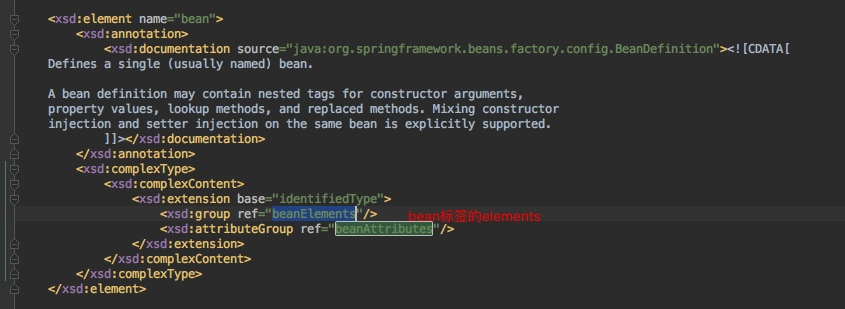
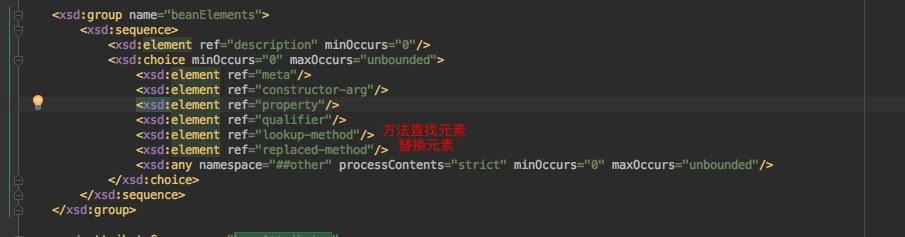
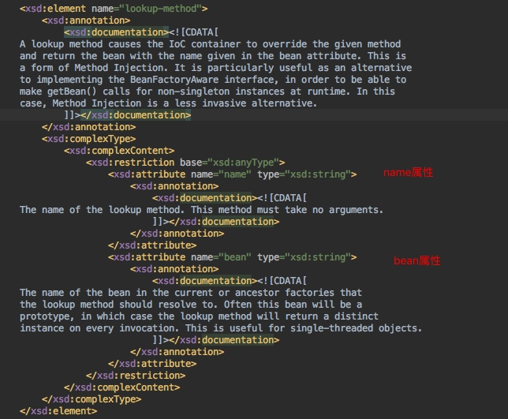
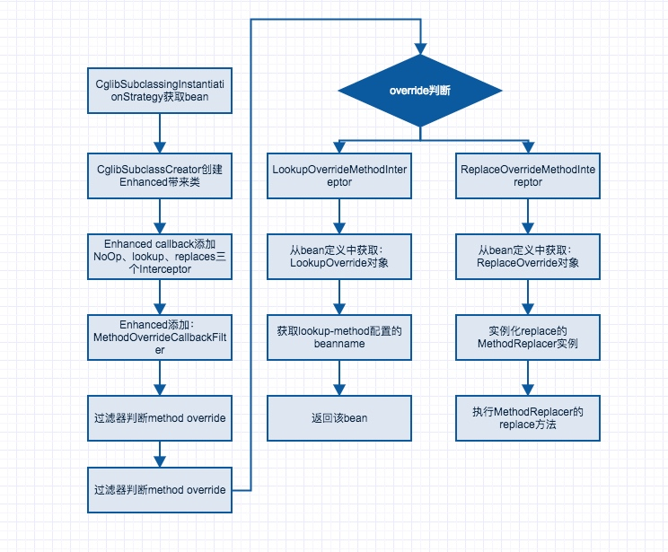

[toc]

# spring日常使用技巧问题
## spring 循环依赖问题

- 假设一个场景：beanA 依赖beanB,beanB依赖beanA
- 如果过bean默认的scope为singleton，那么spring上线文加载bean定义没有问题
- 如果beanA或者beanB在构造方法中依赖则会抛异常
- 如果beanA或者beanB的scop为prototpe也也会抛异常


## spring bean重名问题

[其他解决方案](http://m.blog.csdn.net/article/details?id=39380477)

### bean重名定义加载原理
- spring context加载bean定义
- 如果没有加载bean定义，则直接解析bean定义并且放beanDefinitionMap中缓存
- 如果已经加载，则获取已经加载的bean定义，赋值为：oldBeanDefinition
- 进一步判断：isAllowBeanDefinitionOverriding，是否允许重载
- 允许，则bean定义覆盖old的bean定义
- 非允许，则抛出异常
- DefaultListableBeanFactory .registerBeanDefinition(String beanName, BeanDefinition beanDefinition)中进行判断逻辑

```java
// oldbean定义
oldBeanDefinition = this.beanDefinitionMap.get(beanName);
		if (oldBeanDefinition != null) {
			// 不允许重载，则直接抛出异常
			if (!isAllowBeanDefinitionOverriding()) {
				throw new BeanDefinitionStoreException(beanDefinition.getResourceDescription(), beanName,
						"Cannot register bean definition [" + beanDefinition + "] for bean '" + beanName +
						"': There is already [" + oldBeanDefinition + "] bound.");
			}
			// 允许重载，则根据bean的role权重进行加载
			else if (oldBeanDefinition.getRole() < beanDefinition.getRole()) {
				// e.g. was ROLE_APPLICATION, now overriding with ROLE_SUPPORT or ROLE_INFRASTRUCTURE
				if (this.logger.isWarnEnabled()) {
					this.logger.warn("Overriding user-defined bean definition for bean '" + beanName +
							"' with a framework-generated bean definition: replacing [" +
							oldBeanDefinition + "] with [" + beanDefinition + "]");
				}
			}
			else if (!beanDefinition.equals(oldBeanDefinition)) {
				if (this.logger.isInfoEnabled()) {
					this.logger.info("Overriding bean definition for bean '" + beanName +
							"' with a different definition: replacing [" + oldBeanDefinition +
							"] with [" + beanDefinition + "]");
				}
			}
			else {
				if (this.logger.isDebugEnabled()) {
					this.logger.debug("Overriding bean definition for bean '" + beanName +
							"' with an equivalent definition: replacing [" + oldBeanDefinition +
							"] with [" + beanDefinition + "]");
				}
			}
			this.beanDefinitionMap.put(beanName, beanDefinition);
		}
		else {
			if (hasBeanCreationStarted()) {
				// Cannot modify startup-time collection elements anymore (for stable iteration)
				synchronized (this.beanDefinitionMap) {
					this.beanDefinitionMap.put(beanName, beanDefinition);
					List<String> updatedDefinitions = new ArrayList<String>(this.beanDefinitionNames.size() + 1);
					updatedDefinitions.addAll(this.beanDefinitionNames);
					updatedDefinitions.add(beanName);
					this.beanDefinitionNames = updatedDefinitions;
					if (this.manualSingletonNames.contains(beanName)) {
						Set<String> updatedSingletons = new LinkedHashSet<String>(this.manualSingletonNames);
						updatedSingletons.remove(beanName);
						this.manualSingletonNames = updatedSingletons;
					}
				}
			}
			else {
				// Still in startup registration phase
				this.beanDefinitionMap.put(beanName, beanDefinition);
				this.beanDefinitionNames.add(beanName);
				this.manualSingletonNames.remove(beanName);
			}
			this.frozenBeanDefinitionNames = null;
		}

		if (oldBeanDefinition != null || containsSingleton(beanName)) {
			resetBeanDefinition(beanName);
		}

```
### 自定义spring context实现bean重名抛出异常
步骤

- 从上面的原理看出，需要进行设置：DefaultListableBeanFactory该实例beanFactory的allowBeanDefinitionOverriding属性为false
- 因此需要自定义一个spring context和自定义一个beanFactory，代码如下

```java
// 自定义一个spring context，注入自定义的beanFactory
public class CustomerContext extends ClassPathXmlApplicationContext{

    public CustomerContext(String[] strings) {
        super(strings);
    }

    @Override
    protected DefaultListableBeanFactory createBeanFactory() {
        return new CustomerBeanFactory();
    }
}

// 自定义beanFactory。设置isAllowBeanDefinitionOverriding是false
public class CustomerBeanFactory extends DefaultListableBeanFactory {

    @Override
    public boolean isAllowBeanDefinitionOverriding() {
        return false;
    }

}
// 配置文件，两个文件分别配置，否则xml会报重复错误
<bean id="beanA" name="beanA" class="com.nemo.BeanA"></bean> //Beans.xml
<bean id="beanA1" name="beanA" class="com.nemo.BeanA"><//bean>Beans_repeat.xml

// client
public class BeanOverrideMain {
    public static void main(String[] args) {
        final ConfigurableApplicationContext context = new CustomerContext(
            new String[]{"Beans.xml","Beans_repeat.xml"});
        System.out.println(context.getBean(BeanA.class));
    }
}
// 最终结果就会抛异常了

```


## spring-方法查找和方法替换

场景：面向对象设计的[开辟原则](http://baike.baidu.com/link?url=S1dmk--jjfbTxPwLLarOYg9i8ueLFd28_SxL0CsIhoDY31toGazBnrbwhoE9pCShT3o_557eE4mjrAbjs9HqMYnuLUv3BXos9K-j-eW8xuap3qsW4m4IG8512keVx6_g)

- 修改bean的一个方法的行为，而不修改源码或者原有类
- 新增一个组件扩展或者修改系统的行为
- 修改jar包中的原有类的行为
- 实现原理：代理模式

### bean标签配置原理

xsd文件中可以看到bean标签到底有哪些元素 element


找到了lookup-method元素和replaced-method element




### 实例配置

```java
public abstract class CommandManager {
	public Object process() {
		Command command = createCommand();
		System.out.println(command);
		preHandle(command);
		return command.execute();
	}

	// 使用方法替换
	public void preHandle(Command command) {
		System.out.println("preHandle:"+command);
		
	}

	// 使用方法查找
	public abstract Command createCommand();
}

#spring 的配置代码
<bean id="command" class="com.nemotan.AsyncCommand"
		scope="prototype" />
<bean id="methodReplacer" class="com.nemotan.CommandManagerReplacer" />

<bean id="commandManager" class="com.nemotan..CommandManager">
		<lookup-method name="createCommand" bean="command" />
		<replaced-method name="preHandle" replacer="methodReplacer" />
</bean>
```
### 原理分析：CglibSubclassingInstantiationStrategy

- AbstractAutowireCapableBeanFactory. doCreateBean(final String beanName, final RootBeanDefinition mbd, final Object[] args) #获取bean实例
- AbstractAutowireCapableBeanFactory. getInstantiationStrategy().instantiate(mbd, beanName, parent) #获取bean实例
- CglibSubclassingInstantiationStrategy .instantiate(mbd, beanName, parent) #使用cglibStrategy获取bean实例
- new CglibSubclassCreator(bd, owner).instantiate(ctor, args); 创建bean实例
- 这里使用的cglib创建代理的方式[cglib代理](http://blog.csdn.net/wenhuayuzhihui/article/details/51722885)

---

CglibSubclassCreator源码

```java
// 三个Interceptor
private static final Class<?>[] CALLBACK_TYPES = new Class<?>[]
		{NoOp.class, LookupOverrideMethodInterceptor.class, ReplaceOverrideMethodInterceptor.class};


public Object instantiate(Constructor<?> ctor, Object... args) {
		 # 创建一个Enhancer
			Class<?> subclass = createEnhancedSubclass(this.beanDefinition);
			Object instance;
			if (ctor == null) {
				instance = BeanUtils.instantiate(subclass);
			}
			else {
				try {
					Constructor<?> enhancedSubclassConstructor = subclass.getConstructor(ctor.getParameterTypes());
					instance = enhancedSubclassConstructor.newInstance(args);
				}
				catch (Exception ex) {
					throw new BeanInstantiationException(this.beanDefinition.getBeanClass(),
							"Failed to invoke constructor for CGLIB enhanced subclass [" + subclass.getName() + "]", ex);
				}
			}
			// SPR-10785: set callbacks directly on the instance instead of in the
			// enhanced class (via the Enhancer) in order to avoid memory leaks.
			// 最终生成该Enhancer生成的子类
			// LookupOverrideMethodIntereptor
			// ReplaceOverrideMethodInterceptor
			Factory factory = (Factory) instance;
			factory.setCallbacks(new Callback[] {NoOp.INSTANCE,
					new LookupOverrideMethodInterceptor(this.beanDefinition, this.owner),
					new ReplaceOverrideMethodInterceptor(this.beanDefinition, this.owner)});
			return instance;
		}

		/**
		 * Create an enhanced subclass of the bean class for the provided bean      使用cglib创建一个代理类
		 * definition, using CGLIB.
		 */
		private Class<?> createEnhancedSubclass(RootBeanDefinition beanDefinition) {
			Enhancer enhancer = new Enhancer();
			enhancer.setSuperclass(beanDefinition.getBeanClass());
			enhancer.setNamingPolicy(SpringNamingPolicy.INSTANCE);
			if (this.owner instanceof ConfigurableBeanFactory) {
				ClassLoader cl = ((ConfigurableBeanFactory) this.owner).getBeanClassLoader();
				enhancer.setStrategy(new ClassLoaderAwareGeneratorStrategy(cl));
			}
			# 方法过滤，根据lookup和replace进行过滤
			enhancer.setCallbackFilter(new MethodOverrideCallbackFilter(beanDefinition));
			// CALLBACK_TYPES 就是MethodInterceptor的两个子类
			// LookupOverrideMethodInterceptor.class, 			// ReplaceOverrideMethodInterceptor.class
			enhancer.setCallbackTypes(CALLBACK_TYPES);
			return enhancer.createClass();
		}
	}

```

MethodOverrideCallbackFilter 源码

```java
@Override
public int accept(Method method) {
// 获取每个方法的overide
			MethodOverride methodOverride = getBeanDefinition().getMethodOverrides().getOverride(method);
			if (logger.isTraceEnabled()) {
				logger.trace("Override for '" + method.getName() + "' is [" + methodOverride + "]");
			}
			if (methodOverride == null) {
				return PASSTHROUGH; //0
			}
			// LookupOverride
			else if (methodOverride instanceof LookupOverride) {
				return LOOKUP_OVERRIDE; //1
			}
			// ReplaceOverride
			else if (methodOverride instanceof ReplaceOverride) {
				return METHOD_REPLACER; //2
			}
			throw new UnsupportedOperationException("Unexpected MethodOverride subclass: " +
			

```

- createEnhancedSubclass也就是创建代理类
- 创建代理类中，Enhancer的callback中添加三个Interceptor
- Enhancer添加 MethodOverrideCallbackFilter
- 如果method的methodOverride == null，则返回0对应callback中的NoOp,不处理
- 如果methodOverride instanceof LookupOverride，则返回1，执行LookupOverrideMethodInterceptor
- return this.owner.getBean(lo.getBeanName(), argsToUse);返回一个bean
- 如果methodOverride instanceof ReplaceOverride，则返回1，执行ReplaceOverrideMethodInterceptor
- return this.owner.getBean(lo.getBeanName(), argsToUse);
- BeanUtils.instantiate(subclass)，实例化bean


### 方法查找- LookupOverrideMethodIntereptor

```java

private static class LookupOverrideMethodInterceptor extends CglibIdentitySupport implements MethodInterceptor {

		private final BeanFactory owner;

		public LookupOverrideMethodInterceptor(RootBeanDefinition beanDefinition, BeanFactory owner) {
			super(beanDefinition);
			this.owner = owner;
		}

		@Override
		public Object intercept(Object obj, Method method, Object[] args, MethodProxy mp) throws Throwable {
			// Cast is safe, as CallbackFilter filters are used selectively.
			LookupOverride lo = (LookupOverride) getBeanDefinition().getMethodOverrides().getOverride(method);
			Object[] argsToUse = (args.length > 0 ? args : null);  // if no-arg, don't insist on args at all
			if (StringUtils.hasText(lo.getBeanName())) {
				return this.owner.getBean(lo.getBeanName(), argsToUse);
			}
			else {
				return this.owner.getBean(method.getReturnType(), argsToUse);
			}
		}
}
```
### 方法替换- ReplaceOverrideMethodIntereptor

同LookupOverrideMethodIntereptor。


### 流程图




