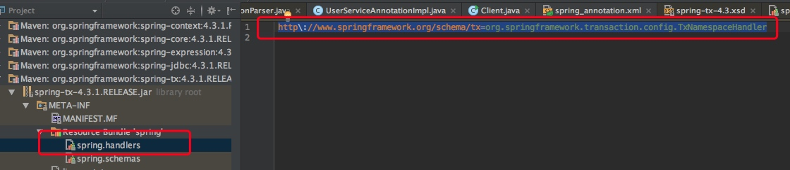
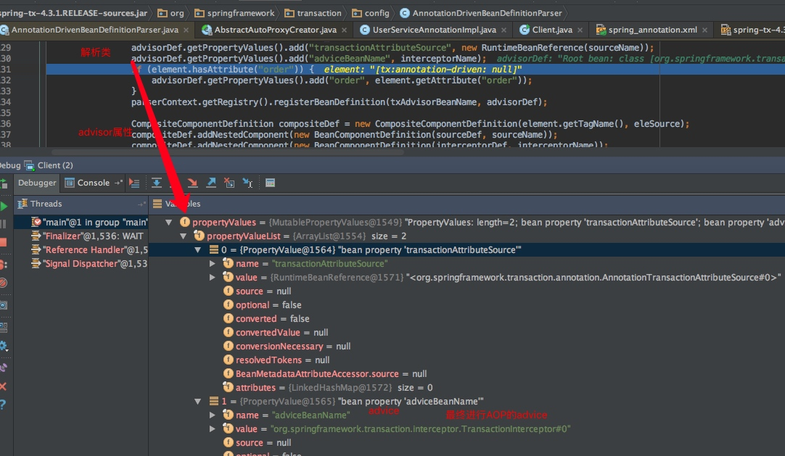
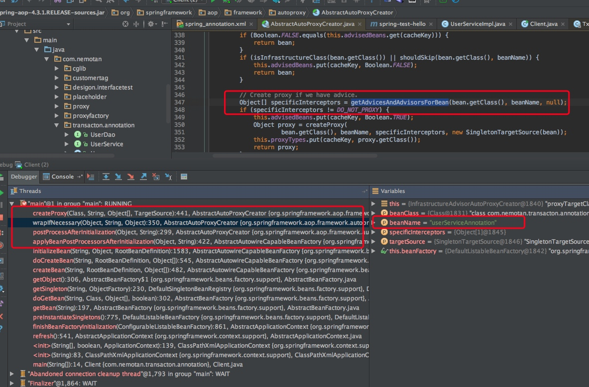
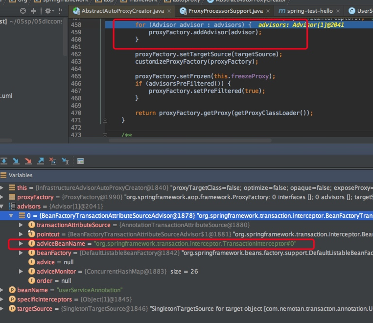
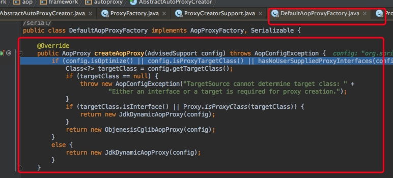
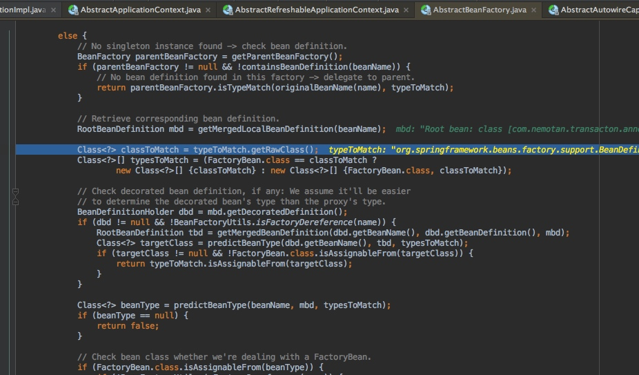
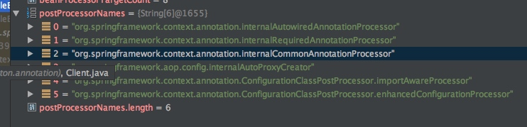
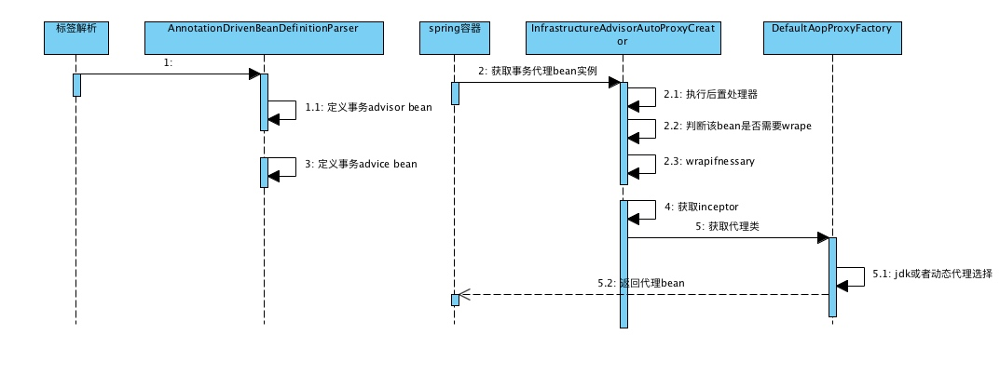
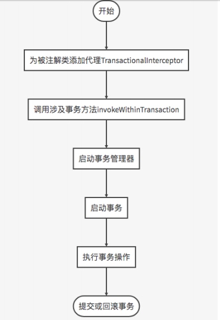
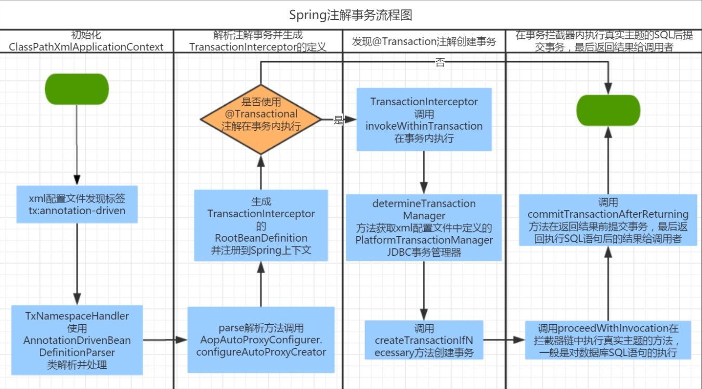

[toc]
# spring注解事务原理
## 1. spring处理事务的几种方式

- 编程式事务 
- 事务管理模板
- 事务代理
- Aop通知
- 注解驱动

## 2.注解驱动事务实例
### 2.1 标签解析
**spring配置文件**

```xml
<tx:annotation-driven transaction-manager="transactionManager"/>
<bean id="userServiceAnnotation" class="com.nemotan.transacton.annotation.UserServiceAnnotationImpl"/>

```

**使用**

```java


@Transactional
public class UserServiceAnnotationImpl {
    @Autowired
    UserDao userDao;

    @Transactional(propagation = Propagation.REQUIRED)
    public void testTracs() {
   		 // 转账程序差不多类似
        User user = new User("1", "2");
        User user2 = new User("2", "2");
        userDao.save(user);
        userDao.save(user2);
    }

}
```
	
- 发现标签TxNamespaceHandler,最终解析类为AnnotationDrivenBeanDefinitionParser

--- 



	
### 2.2 AnnotationDrivenBeanDefinitionParser

- 会创建一个advisor的bean定义,该advisor关联TransactionInterceptor
- 创建TransactionInterceptor定义
- 最终实现AOP的原理

---




### 2.3 Transactional注解原理

#### 2.3.1 创建代理

- 在获取userServiceAnnotation实例的时候，会执行bean的后置处理器，进行创建proxy的逻辑。
- 执行的后置处理器是：InfrastructureAdvisorAutoProxyCreator
- 该后置处理器是在初始化spring容起registerBeanPostProcessors添加进去
- beanname = internalAutoProxyCreator spring内部自动代理创建的一个处理器
- InfrastructureAdvisorAutoProxyCreator 在这个后置处理器中，在获取bean实例之后就会创建代理
- InfrastructureAdvisorAutoProxyCreator【基本Advisor代理bean】 继承 AbstractAdvisorAutoProxyCreator
- AbstractAdvisorAutoProxyCreator. wrapIfNecessary 判断该bean是否需要包装
- getAdvicesAndAdvisorsForBean(bean.getClass(), beanName, null) #获取该bean的Advisor，如果存在
- 当获取：userServiceAnnotation实例的时候，进行获取advisor





创建proxy的时候该bean的advisor的advice就是TransactionInterceptor实例。



最后调用DefaultAopProxyFactory根据jdk或者cglib进行创建代理



#### 2.3.2 AbstractAutoProxyCreator.wrapIfNecessary原理

在这里发现userServiceAnnotation发现继承了AbstractAutoProxyCreator进行自动代理创建，那么这里会找到该bean的advice，也就是TransactionInterceptor。

```java
// Create proxy if we have advice.
Object[] specificInterceptors = getAdvicesAndAdvisorsForBean(bean.getClass(), beanName, null);
if (specificInterceptors != DO_NOT_PROXY) {
	this.advisedBeans.put(cacheKey, Boolean.TRUE);
	Object proxy = createProxy(
			bean.getClass(), beanName, specificInterceptors, new SingletonTargetSource(bean));
	this.proxyTypes.put(cacheKey, proxy.getClass());
	return proxy;
}
```







### 2.4 流程图










