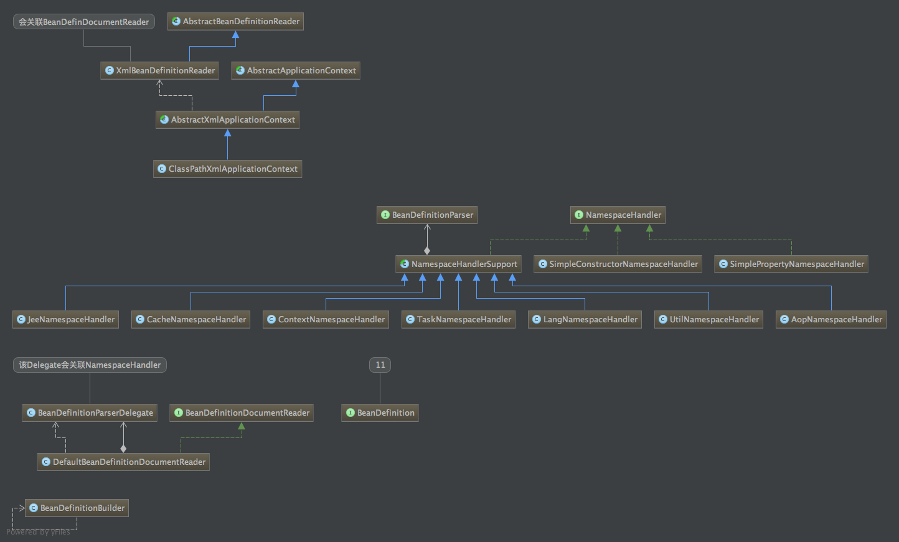
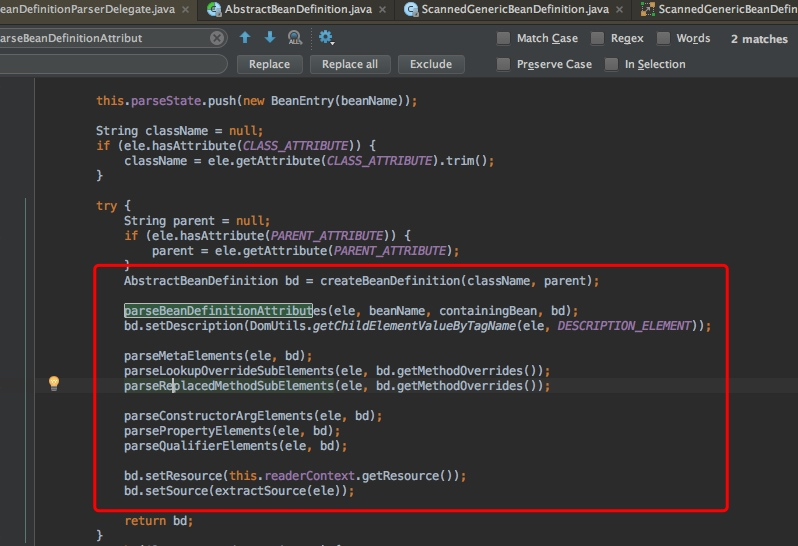

[toc]

# spring类加载机制原理（一）-bean定义加载

主要入口是实例化了一个**ClassPathXmlApplicationContext**对象,该类整体体系结构如下
图，最终实现了BeanFactory接口以及ResourceLoader接口。

## Context主要方法
在实例化ClassPathXmlApplicationContext的过程中主要会依次调用以下几个方法：

	- prepareRefresh
		- 初始化系统placeholder
		- 校验必须要设置的Property是否已经设置
	- obtainFreshBeanFactory
		- 创建beanFactory
		- 定义beanFactory的一些属性
		- 加载bean定义
	- prepareBeanFactory
		- 设置classloader
		- SpelExpression解析器
		- 设置PropertyEditor注册器
		- 注册ApplicationContextAwareProcessor
		- ignoreDependencyInterface
		- 注册一些特定类型的autowired值
		- 注册一些系统单例
	- postProcessBeanFactory
		- 扩展接口，一些web context会在此做些特殊的处理
	- invokeBeanFactoryPostProcessors
		- 调用 BeanFactoryPostProcessor
		- 可用于修改bean的定义
	- registerBeanPostProcessors
		- 注册Bean Post Processor
	- initMessageSource
	- initApplicationEventMulticaster
	- onRefresh
	- registerListeners
	- finishBeanFactoryInitialization
	- finishRefresh
		- 初始化LifecycleProcessor
		- 触发ContextRefreshedEvent事件
		- 注册MBean

## obtainFreshBeanFactory加载bean定义分析

applicationContxt设置beanFactory属性。

### 创建beanFactory的主要流程

	- AbstractApplicationContext .obtainFreshBeanFactory()
	- AbstractApplicationContext .refreshBeanFactory()
		- 默认创建DefaultListableBeanFactory 
	- AbstractXmlApplicationContext .loadBeanDefinitions(DefaultListableBeanFactory beanFactory)
		- 进行加载bean定义

### 进行bean定义加载的流程

bean定义加载使用的是BeanDefinitionReader实例。

`bean主要解析流程如下：`

	1. AbstractBeanDefinitionReader .loadBeanDefinitions #加载resource
	2. XmlBeanDefinitionReader .loadBeanDefinitions #加载
	3. XmlBeanDefinitionReader .doLoadBeanDefinitions #读取文件
	4. DefaultBeanDefinitionDocumentReader .registerBeanDefinitions #注册bean定义
	5. DefaultBeanDefinitionDocumentReader .doRegisterBeanDefinitions #注册每个bean定义
	6. BeanDefinitionParserDelegate .parseCustomElement(ele) #bean解析委派进行解析
	7. NamespaceHandlerSupport .parse(Element element, ParserContext parserContext) #解析
	8. BeanDefinitionParser parser = this.parsers.get(localName); #获取beanparser
	9. BeanDefinition parse(Element element, ParserContext parserContext) #使用bean解析器解析bean

`bean解析器一角--package scan`

具体的解析可以debug进入doLoadBeanDefinitions，最终的解析结果是在beanFactory的对象中初始化了bean定义的一些属性，如bean的name，实现类，以及lazy等等属性。

### 配置文件解析流程

sprin.xml最终的解析入口是在**DefaultBeanDefinitionDocumentReader .registerBeanDefinitions**这个方法里面。主要流程如下

	1. parseDefaultElement() #解析Element，并且按照类型区分
	2. processBeanDefinition() #解析bean element，当然此处还有其他：如beans
	3. delegate.parseBeanDefinitionElement(ele); #创建beanholder
	4. BeanDefinitionReaderUtils.registerBeanDefinition #进行注册
	5. BeanDefinitionRegistry. registerBeanDefinition(beanName, definitionHolder.getBeanDefinition() 
	# 这里直接把bean注册到beanFactory中,体系图如下图
	
`DefaultListableBeanFactory体系图`

	6. BeanDefinitionParserDelegate. parseBeanDefinitionElement(Element)
	# 根据配置文件中的属性进行读取配置文件，如singleTon，prototype等等
	7. BeanDefinitionParserDelegate #这个类定义了配置常量，以后可以查看这个啦
	8. BeanDefinitionParserDelegate. parseBeanDefinitionAttributes(AbstractBeanDefinition)
	# 解析类把bean解析到bean定义实例中此处为xml文件格式的bean配置文件赌徒，如下图
	
	
`bean解析所有的类UML图:`

	

## 总结

