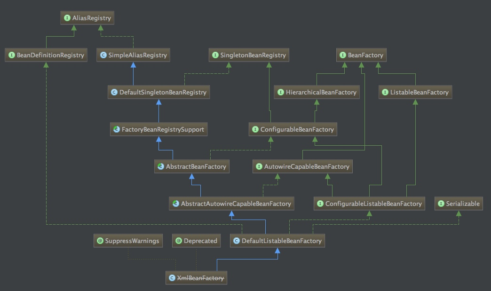
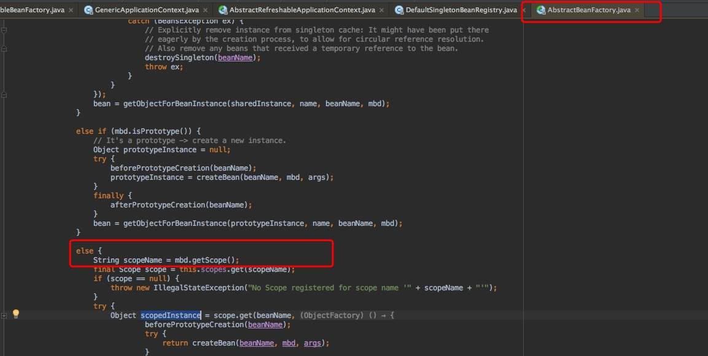
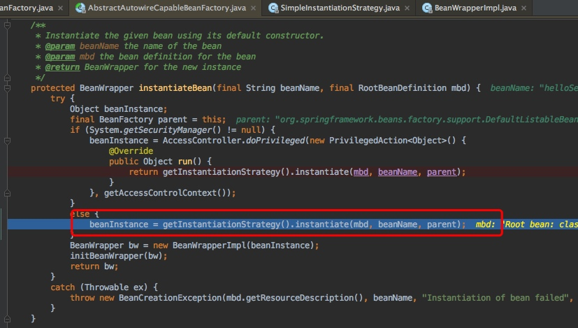
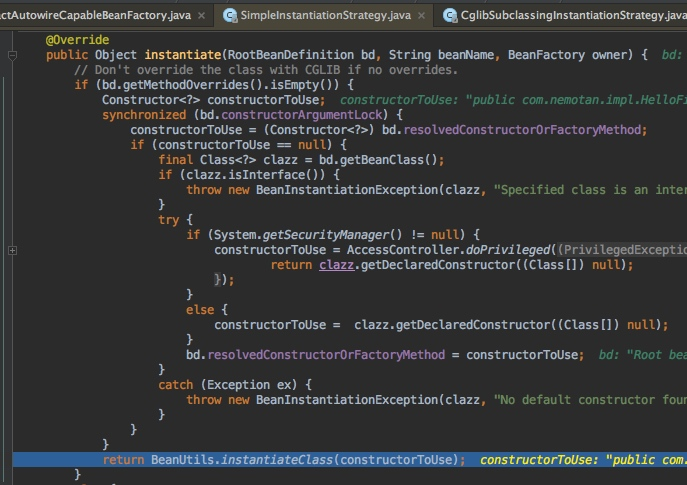
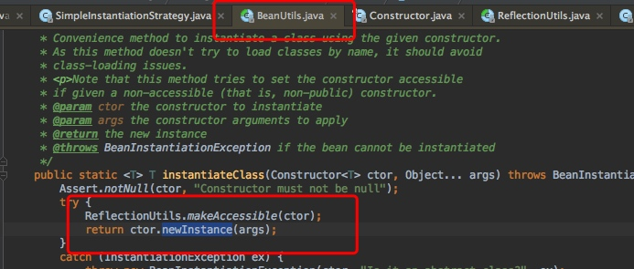
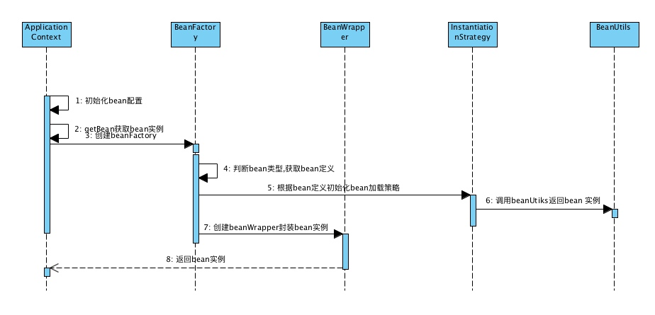

[toc]

# spring类加载机制原理（二）-bean实例加载
## 获取bean实例过程

上面记录到在AbstractApplicationContext.java中的prepareBeanFactory（）方法，该方法主要是加载了配置文件中的bean定义。接下来分析一下，在bean实例加载的过程。

主要流程：
	
	1. AbstractApplicationContext .preInstantiateSingletons() #初始化所有的
	2. DefaultListableBeanFactory .preInstantiateSingletons() #初始

`factory体系结构`

	
	3. getBean（）# 获取bean
	4. AbstractBeanFactory .doGetBean() #获取bean
	5. Object sharedInstance = getSingleton(beanName); #检查缓存，如果存在直接返回
	6. isPrototypeCurrentlyInCreation(beanName) #正在创建中，失败
	7. BeanFactory parentBeanFactory = getParentBeanFactory() # 检查bean是否定义
	8. String[] dependsOn = mbd.getDependsOn(); #检查bean依赖，初始化依赖bean
	9. mbd.isSingleton() #判断是否为单例模式
	10. getSingleton(beanName, new ObjectFactory<Object>() #实例化

	

`bean类型判断`

## 单例bean加载过程
### 创建bean逻辑

由于spring默认配置的bean scop就是单例的，这里着重分析下单例bean的实例化过程！

	1. Object getSingleton(String beanName, ObjectFactory<?> singletonFactory)  #获取单例
	2. Object singletonObject = this.singletonObjects.get(beanName);#获取缓存
	3. AbstractAutowireCapableBeanFactory .createBean(String beanName, RootBeanDefinition mbd, Object[] args) 
	4. mbdToUse.prepareMethodOverrides(); #准备重载信息
	5. Object bean = resolveBeforeInstantiation(beanName, mbdToUse); #获取该bean的代理bean信息
	6. doCreateBean(final String beanName, final RootBeanDefinition mbd, final Object[] args)  #进一步创建
	
### 创建beanwrapper

在上面已经执行到AbstractAutowireCapableBeanFactory. doGreateBean（）这个方法， 这个方法返回的就是bean的一个实例，在返回之前还创建了一个beanwrapper对象。
	
	1. instanceWrapper = createBeanInstance(beanName, mbd, args); #创建wrapper

	
	2. SimpleInstantiationStrategy .instantiate(RootBeanDefinition bd, String beanName, BeanFactory owner)  #实例化bean

	3. BeanUtils .instantiate(constructorToUse)

--- 

## 总结
	
	1. ApplicationContext是整个spring容器的上下文
	2. 初始化该容器的时候会读取配送文件中的bean，并且每一个具体的bean信息都存放在BeanDefinition（bean定义实体中）
	3. 当getBean的时候会读取BeanDefinition的信息，会使用BeanFactory进行实例化创建bean实例

`整体流程图`

