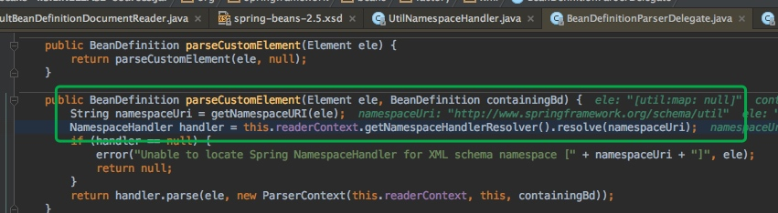

[toc]

# 标签解析原理和自定义标签
## 基本原理	

	Handler
	Parser
	xsd原理
	
## 实例

下面我们按照下面的一个bean进行分析进行源码分析

```xml
  <util:map id="testMap">
        <entry key="a" value="a"></entry>
        <entry key="b" value="b"></entry>
        <entry key="c" value="c"></entry>
    </util:map>
```

## 获取NamespaceHandler定义

	首先DefaultBeanDefinitionDocumentReader进行解析标签，并且判断是否为用户自定义标签
	


	
	使用BeanDefinitionParserDelegate 解析委派接口进行解析
	并且获取NamespaceHandler  命名空间处理器
	获取Handler的时候会进行执行init初始化方法
	调用NamespaceHandler接口的handler接口方法进行解析bean定义





## parse解析Beandefine

`获取Parser:`
	
	根据标签名自获取Parser，在Handler的init()方法中已经注册过。
	该实例获取的Parser是：MapBeanDefinitionParser
	


`解析标签:`

	Parser接口主要是一个parser方法，这个方法是所有的parser入口。

```java

public interface BeanDefinitionParser {
	/**
	 * Parse the specified {@link Element} and register the resulting
	 * {@link BeanDefinition BeanDefinition(s)} with the
	 * {@link org.springframework.beans.factory.xml.ParserContext#getRegistry() BeanDefinitionRegistry}
	 * embedded in the supplied {@link ParserContext}.
	 * <p>Implementations must return the primary {@link BeanDefinition} that results
	 * from the parse if they will ever be used in a nested fashion (for example as
	 * an inner tag in a {@code <property/>} tag). Implementations may return
	 * {@code null} if they will <strong>not</strong> be used in a nested fashion.
	 * @param element the element that is to be parsed into one or more {@link BeanDefinition BeanDefinitions}
	 * @param parserContext the object encapsulating the current state of the parsing process;
	 * provides access to a {@link org.springframework.beans.factory.support.BeanDefinitionRegistry}
	 * @return the primary {@link BeanDefinition}
	 */
	BeanDefinition parse(Element element, ParserContext parserContext);

}
```
	1. 在poarser的时候会委派BeanDefinitionBuilder 进行解析
	2. 会进行设置bean的scope
	3. 解析xml element
	

	
	MapBeanDefinitionParser子类Parser调用
	doParse(Element element, ParserContext parserContext, BeanDefinitionBuilder builder)方法，进行读取具体的值
	最终解析文件会为派给：BeanDefinitionParserDelegate
	


## BeanDefinitionBuilder --builder模式

	1. 接下来回顾一下BeanDefinitionBuilder类，从上面的分析可以得知， 
	2. BeanDefinitionBuilder封装了BeanDefinition.
	3. BeanDefinitionBuilder使用了builder模式
	4. 部分代码如下：genericBeanDefinition，rootBeanDefinition，childBeanDefinition 会构建不同的BeanDefinition


```java
public class BeanDefinitionBuilder {

	/**
	 * Create a new {@code BeanDefinitionBuilder} used to construct a {@link GenericBeanDefinition}.
	 */
	public static BeanDefinitionBuilder genericBeanDefinition() {
		BeanDefinitionBuilder builder = new BeanDefinitionBuilder();
		builder.beanDefinition = new GenericBeanDefinition();
		return builder;
	}

	/**
	 * Create a new {@code BeanDefinitionBuilder} used to construct a {@link GenericBeanDefinition}.
	 * @param beanClass the {@code Class} of the bean that the definition is being created for
	 */
	public static BeanDefinitionBuilder genericBeanDefinition(Class<?> beanClass) {
		BeanDefinitionBuilder builder = new BeanDefinitionBuilder();
		builder.beanDefinition = new GenericBeanDefinition();
		builder.beanDefinition.setBeanClass(beanClass);
		return builder;
	}

	/**
	 * Create a new {@code BeanDefinitionBuilder} used to construct a {@link GenericBeanDefinition}.
	 * @param beanClassName the class name for the bean that the definition is being created for
	 */
	public static BeanDefinitionBuilder genericBeanDefinition(String beanClassName) {
		BeanDefinitionBuilder builder = new BeanDefinitionBuilder();
		builder.beanDefinition = new GenericBeanDefinition();
		builder.beanDefinition.setBeanClassName(beanClassName);
		return builder;
	}

	/**
	 * Create a new {@code BeanDefinitionBuilder} used to construct a {@link RootBeanDefinition}.
	 * @param beanClass the {@code Class} of the bean that the definition is being created for
	 */
	public static BeanDefinitionBuilder rootBeanDefinition(Class<?> beanClass) {
		return rootBeanDefinition(beanClass, null);
	}

	/**
	 * Create a new {@code BeanDefinitionBuilder} used to construct a {@link RootBeanDefinition}.
	 * @param beanClass the {@code Class} of the bean that the definition is being created for
	 * @param factoryMethodName the name of the method to use to construct the bean instance
	 */
	public static BeanDefinitionBuilder rootBeanDefinition(Class<?> beanClass, String factoryMethodName) {
		BeanDefinitionBuilder builder = new BeanDefinitionBuilder();
		builder.beanDefinition = new RootBeanDefinition();
		builder.beanDefinition.setBeanClass(beanClass);
		builder.beanDefinition.setFactoryMethodName(factoryMethodName);
		return builder;
	}

```

## BeanDefinitionBuilder :


如下图，最终返回的是该一个标签Parser中的BeanClass。


	
## 总结

	1. 所有的spring标签，都会首先被命名空间对应的一个NamespaceHandler解析
	2. NamespaceHandler中注册了很多Parser，每一个标签对应一个Parser
	3. 每一个Parser有一个 getBeanClass，返回该bean的定义的class
	4. 最终所有的Bean定义都注册在Application中


