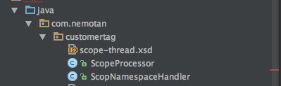
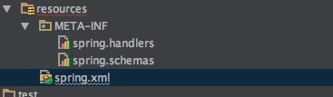

[toc]

# 自定义一个Scope和标签

## 描述
	
	自定义一个spring的标签：<scope:thread/> 就让spring容器新增一个Scope。

## 开发步骤
	
`新建一个NamespaceHandlerSupport子类:ScopNamespaceHandler`

```java
public class ScopNamespaceHandler extends NamespaceHandlerSupport {
    @Override
    public void init() {
        registerBeanDefinitionParser("thread", new ThreadBeanDefinitionParser());
    }

    private static class ThreadBeanDefinitionParser extends AbstractSingleBeanDefinitionParser {

        @Override
        protected Class<?> getBeanClass(Element element) {
            return ScopeProcessor.class;
        }

        @Override
        protected void doParse(Element element, ParserContext parserContext, BeanDefinitionBuilder builder) {
        }
    }
}
```

``新建ScopeProcessor实现BeanFactoryPostProcessor接口``

```java
public class ScopeProcessor
    implements BeanFactoryPostProcessor {
    /**
     * Modify the application context's internal bean factory after its standard
     * initialization. All bean definitions will have been loaded, but no beans
     * will have been instantiated yet. This allows for overriding or adding
     * properties even to eager-initializing beans.
     *
     * @param beanFactory the bean factory used by the application context
     * @throws BeansException in case of errors
     */
    @Override
    public void postProcessBeanFactory(ConfigurableListableBeanFactory beanFactory) throws BeansException {
        beanFactory.registerScope("thread", new SimpleThreadScope());
    }
}
```

``新建scope-thread.xsd``

```java
<?xml version="1.0" encoding="UTF-8" standalone="no"?>

<xsd:schema xmlns="http://www.nemotan.org/schema/scope"
            xmlns:xsd="http://www.w3.org/2001/XMLSchema"
            targetNamespace="http://www.nemotan.org/schema/scope">

    <xsd:element name="thread">
        <xsd:annotation>
            <xsd:documentation>
                customer scope
            </xsd:documentation>
        </xsd:annotation>
    </xsd:element>

</xsd:schema>
```

`spring配置：` 

	1. 在resources下新建spring.handlers文件：
	http\://www.nemotan.org/schema/scope=com.nemotan.customertag.ScopNamespaceHandler
	
	2. 在resources下新建spring.schemas文件：
	http\://www.nemotan.org/schema/beans/scope-thread-1.0.xsd=com/nemotan/customertag/scope-thread.xsd
	
	3. 在spring.xml（spring的配置文件中新增）
	在beans标签中添加xsd文件申明：
	xmlns:scope="http://www.nemotan.org/schema/scope	http://www.nemotan.org/schema/scope http://www.nemotan.org/schema/beans/scope-thread-1.0.xsd
	
	添加配置：
	<scope:thread id="scopeThread"/>

`文件目录：`



	
`客户端运行：`

```java
System.out.println("测试scope");
System.out.println("helloServiceT:" + System.identityHashCode(context.getBean("helloServiceT")));
System.out.println("helloServiceT:" + System.identityHashCode(context.getBean("helloServiceT")));
new Thread() {
    @Override
    public void run() {
        System.out.println("helloServiceT:" + System.identityHashCode(context.getBean("helloServiceT")));
    }
}.start();
new Thread() {
    @Override
    public void run() {
        System.out.println("helloServiceT:" + System.identityHashCode(context.getBean("helloServiceT")));
    }	
		 
```	
	
```结果：```

	测试scope
	helloServiceT:983595261
	helloServiceT:983595261
	helloServiceT:1366949418
	helloServiceT:133518620
	
	结果是：第一个实例和第二个实例是一样的，是在同一个线程中创建的
	第三个和第四个都不相同，是从新线程中new出来的实例，因此证明了自定了线程scope。


## 问题
	
**1. 出现找不到xsd文件`**
>Caused by: org.xml.sax.SAXParseException; lineNumber: 35; columnNumber: 37; cvc-complex-type.2.4.c: 通配符的匹配很全面, 但无法找到元素 'scope:thread' 的声明。
Caused by: java.net.UnknownHostException: www.nemotan.org

	出现这个原因进行分析：
	1. 从报错原因来看是因为本地没有找到该xsd文件，导致去线上找，线上ping不通因此报错
	2. 这里spring的xsd:schema解析的规则为：现在本地查找再去线上查找
	3. 那为什么找不到呢？肯定是spring.schemas有问题
	4. 但实际上是有些的呀,去检查一下编译后classes文件夹，果然没有
	
	解决办法：
	1. 因为我的spring.schemas文件放在源码目录，编译之后并没有复制到classes目录下
	2. 用的是intellijidea编译器以及maven编译的方式
	3. 在pom文件中添加resource,添加之后build一下就行了。	
	<build>
        <resources>
            <resource>
                <directory>src/main/java</directory>
                <includes>
                    <include>**/*.xsd</include>
                </includes>
                <filtering>true</filtering>
            </resource>
        </resources>
    </build>
	
	
		
**2. Id is required for element 'thread' when used as a top-level tag**
	
	刚开始的时候，在<scope:thread/>没有添加id属性的时候会报这个错，顶级标签一定需要制定一个id。
	那我们就指定了一个id，就没有问题了

