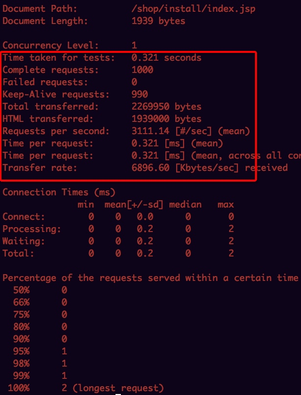
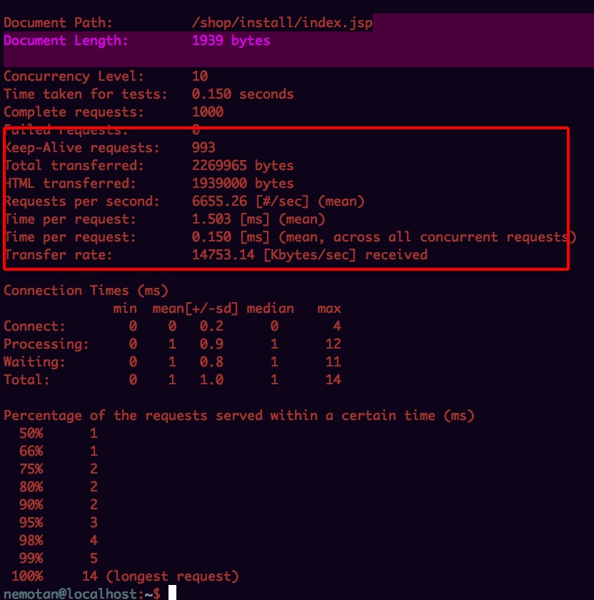
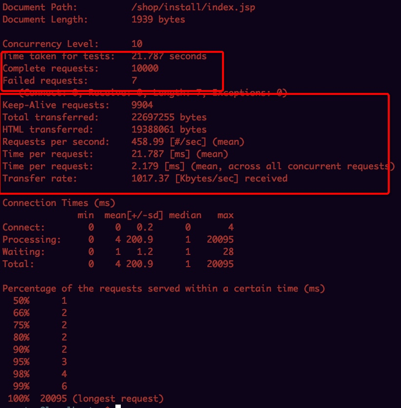
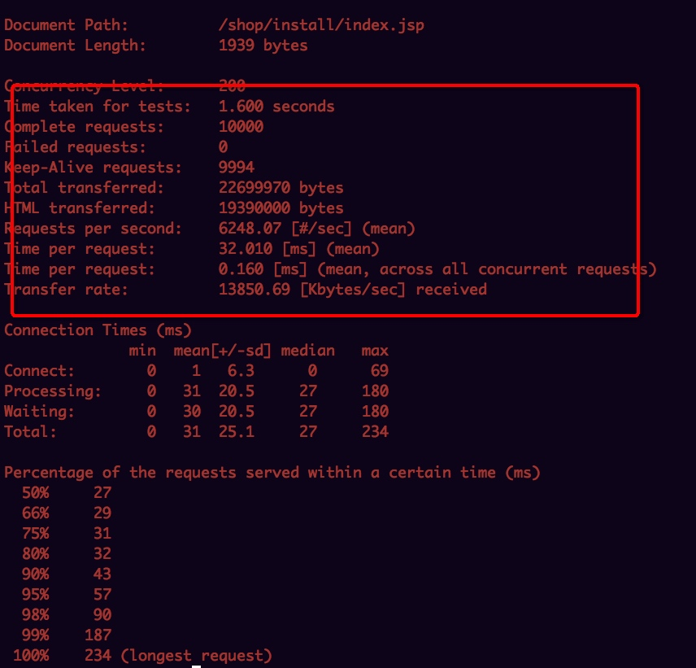
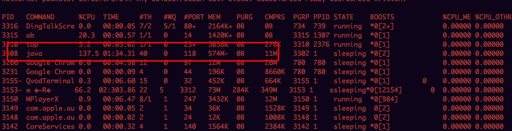
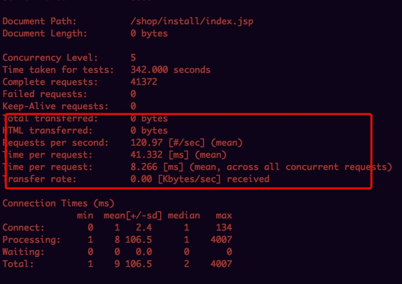
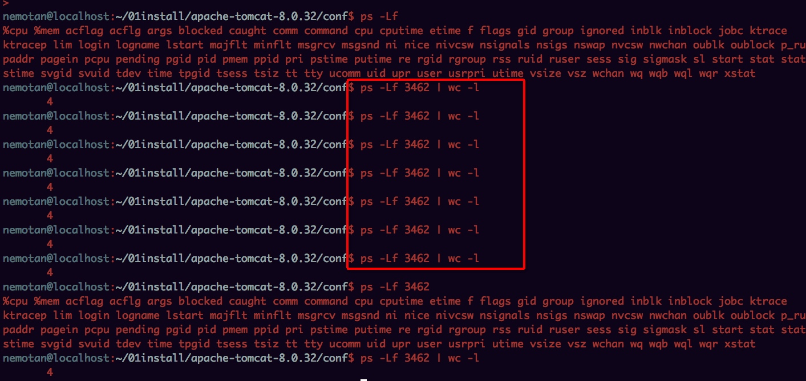
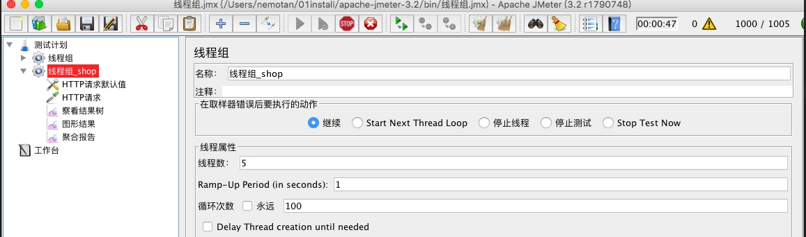
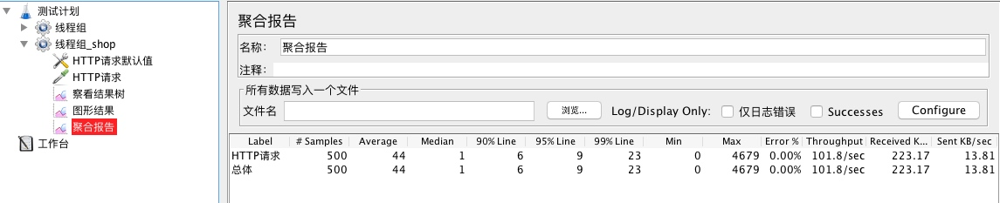

# ab测试

	ab -k -c 1 -n 1000 http://localhost:8080/shop/install/index.jsp
	

	ab -k -c 10 -n 1000 http://localhost:8080/shop/install/index.jsp

	ab -k -c 10 -n 10000 http://localhost:8080/shop/install/index.jsp

	ab -k -c 200 -n 10000 http://http://localhost:8080/jspgou/

qps:能达到6000+

	ab -k -c 5 -n 100000 http://localhost:8080/shop/install/index.jsp

查看进程数： PS -LF pid | WC -L
查看连接数： netstat -untlp | grep 8080 

修改max maxThreads="50"执行上述命令：发现qps变的非常低了

我用mac输入ps -LF输出都是4 奇怪？

# 针对针对tomcat连接器组件调优

使用5线程，100次进行压测：

**默认配置：**

