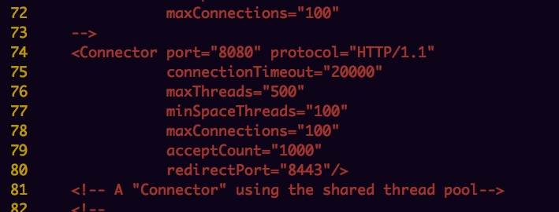

[toc]

### 部署

### 测试jdbc：
	
	cpool.checkoutTimeout=5000
	cpool.minPoolSize=20
	cpool.maxPoolSize=50
	
	cpool.maxIdleTime=7200
	cpool.maxIdleTimeExcessConnections=1800
	cpool.acquireIncrement=10
	
	ab -k -c 1 -n 100 http://localhost:8080/jspgou/

**结果：**
	

	cpool.checkoutTimeout=5000
	cpool.minPoolSize=100
	cpool.maxPoolSize=100
		
	cpool.maxIdleTime=7200
	cpool.maxIdleTimeExcessConnections=1800
	cpool.acquireIncrement=10

	ab -k -c 1 -n 100 http://localhost:8080/jspgou/
	

	

**结论：*

提升了一点点qps,数据量比较小，效果不是很明显！

### [nginx配置：](http://www.cnblogs.com/liuchuanfeng/p/6675612.html)

[nginx负载均衡原理](http://blog.csdn.net/mlc1218559742/article/details/53128382)

**nginx配置：8088端口代理到8080本地tomcat服务器**

**nginx日志：**

**加入nginx之后测试性能：**

	ab -k -c 1 -n 100 http://127.0.0.1:8088/jspgou/

### jvm优化：

压测前：

修改为：

重新启动：

	

**问题分析：**

	经过测试，修改参数之后qps都在8左右拍徘徊，继续使用jmeter进行测试，看看具体原因是什么！估计是限制了qps。

### jmeter压测

压测的结果 throught只有6.1 < ab测试！

改成10个用户数：

### 修改jvm参数重新压测

	结论： 优化性能并不明显

