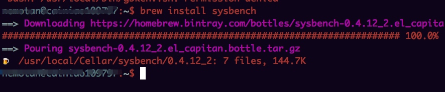
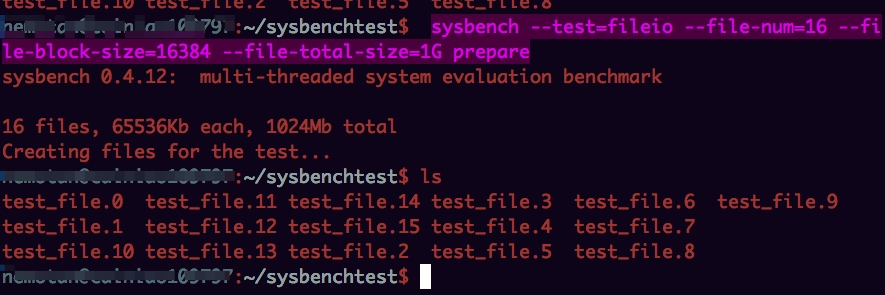
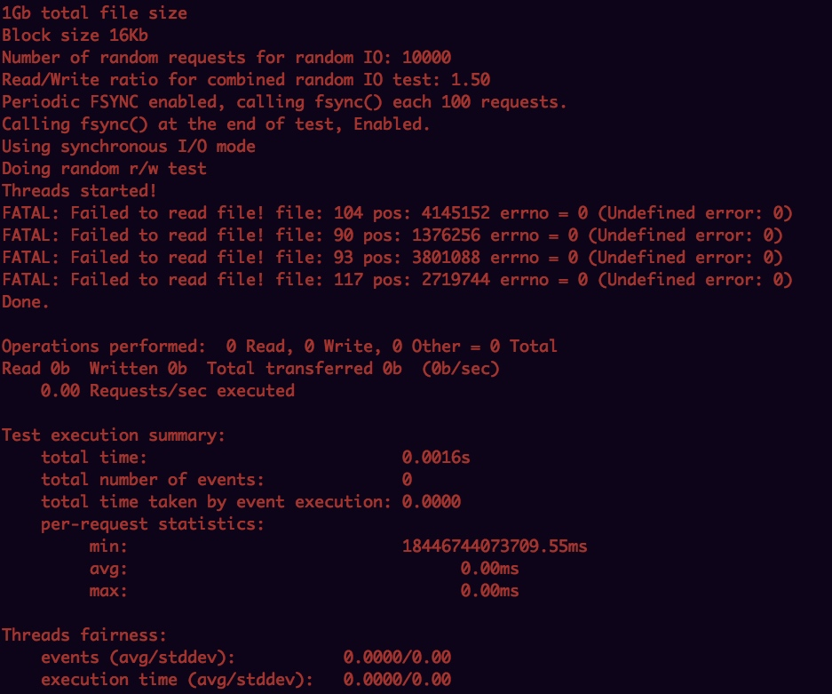
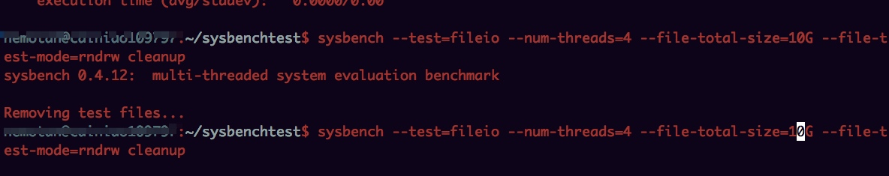

# mac安装

# 测试

数据准备：
	
	sysbench --test=fileio --file-num=16 --file-block-size=16384 --file-total-size=1G prepare
	

测试顺序写入：
	
	sysbench --test=fileio --num-threads=4 --file-total-size=1G --file-test-mode=rndrw run
	
	

清理数据：

