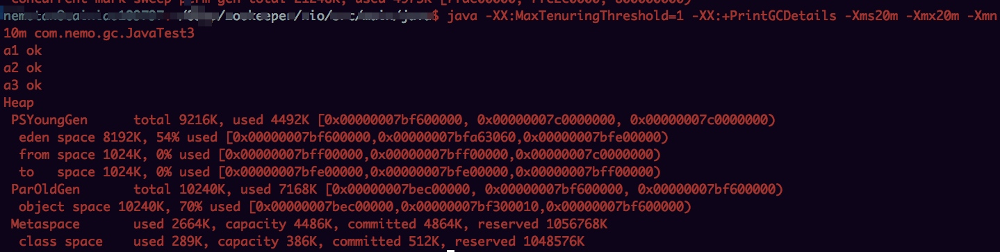

## JDK8执行

	java -Xms20m -Xmx20m -Xmn10m -XX:+PrintGCDetails -XX:PretenureSizeThreshold=3145728  com.nemo.gc.JavaTest2
	
	

	
	java -XX:MaxTenuringThreshold=1 -XX:+PrintGCDetails -Xms20m -Xmx20m -Xmn10m com.nemo.gc.JavaTest3
	

## JDK6执行
	
	/Library/Java/JavaVirtualMachines/1.6.0.jdk/Contents/Home/bin/java -XX:+PrintGC -XX:+PrintGCDateStamps -XX:+PrintHeapAtGC -Xms20m -Xmx20m -Xmn10m -XX:+PrintGCDetails -XX:PretenureSizeThreshold=3145728  com.nemo.gc.JavaTest2
	

	
	/Library/Java/JavaVirtualMachines/1.6.0.jdk/Contents/Home/bin/java -XX:+PrintGC -XX:MaxTenuringThreshold=1 -XX:+PrintGCDetails -Xms20m -Xmx20m -Xmn10m com.nemo.gc.JavaTest3

## JDK7执行

	/Library/Java/JavaVirtualMachines/jdk1.7.0_79.jdk/Contents/Home/bin/java -XX:+PrintGC -XX:+PrintGCDateStamps -XX:+PrintHeapAtGC -Xms20m -Xmx20m -Xmn10m -XX:+PrintGCDetails -XX:PretenureSizeThreshold=3145728  com.nemo.gc.JavaTest2

	/Library/Java/JavaVirtualMachines/jdk1.7.0_79.jdk/Contents/Home/bin/java -XX:+PrintGC -XX:MaxTenuringThreshold=1 -XX:+PrintGCDetails -Xms20m -Xmx20m -Xmn10m com.nemo.gc.JavaTest3

