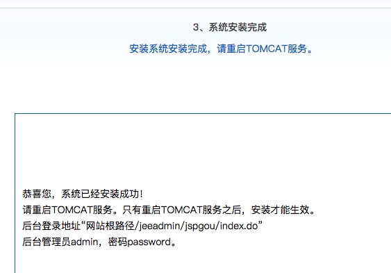

###### 调优测试tomcat jdbc常用参数initialSize、maxActive、maxIdle、minIdle、maxWait、removeAbandoned、removeAbandonedTimeout，并讲解这些参数的具体含义

	initialSize 0 初始化连接:连接池启动时创建的初始化连接数量,1.2版本后支持
	maxActive 8 最大活动连接:连接池在同一时间能够分配的最大活动连接的数量, 如果设置为非正数则表示不限制
	maxIdle 8 最大空闲连接:连接池中容许保持空闲状态的最大连接数量,超过的空闲连接将被释放,如果设置为负数表示不限制
	minIdle 0 最小空闲连接:连接池中容许保持空闲状态的最小连接数量,低于这个数量将创建新的连接,如果设置为0则不创建
	maxWait 无限 最大等待时间:当没有可用连接时,连接池等待连接被归还的最大时间(以毫秒计数),超过时间则抛出异常,如果设置为-1表示无限等待
	removeAbandoned	false 标记是否删除泄露的连接,如果他们超过了removeAbandonedTimout的限制.如果设置为true, 连接被认为是被泄露并且可以被删除,如果空闲时间超过removeAbandonedTimeout. 设置为true可以为写法糟糕的没有关闭连接的程序修复数据库连接.
	removeAbandonedTimeout	300	泄露的连接可以被删除的超时值, 单位秒

###### 版本太新了么？！！

###### 查看sqlmode

设置sqlmode
	
	SET GLOBAL sql_mode = 'ONLY_FULL_GROUP_BY,STRICT_TRANS_TABLES,ERROR_FOR_DIVISION_BY_ZERO,NO_AUTO_CREATE_USER,NO_ENGINE_SUBSTITUTION';

###### 调试jdbc参数

	ab -k -c 1 -n 100 http://localhost:8080/jspgou/

