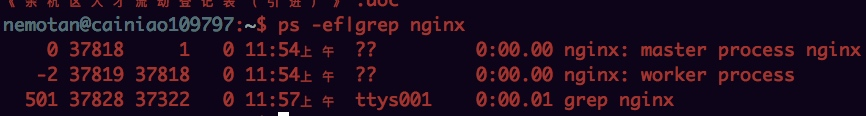
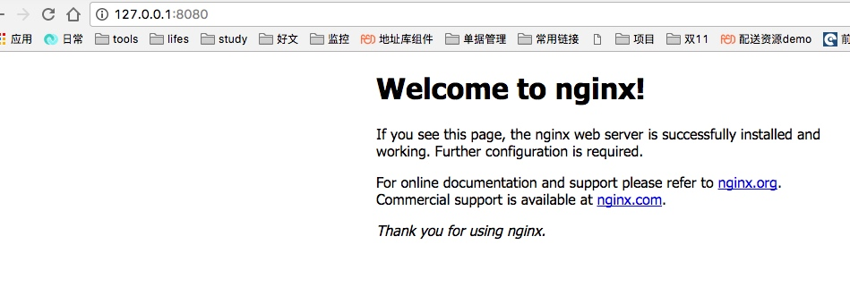

# nginx安装

	1. 安装brew
	brew search nginx
	brew install nginx
	/usr/local/etc/nginx/nginx.conf	#配置文件
	/usr/local/var/www	#服务器默认目录
	/usr/local/Cellar/nginx	#安装目录
	
	2. ngnix常用命令
	
	sudo nginx		#启动
	nginx -h 查看 nginx 命令参数 
	nginx -s reopen | quit | reload | stop 开启 退出 重启 停止 
	nginx -t 测试配置文件是否正确
	
	ps -ef|grep nginx 查看ngnix进程
	
	

# 启动结果

	

# 问题
	
	nginx: [emerg] bind() to [::]:80 failed (98: Address already in use)
	
	sudo lsof -i:80 然后kill 掉

