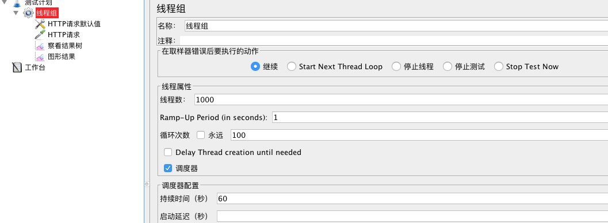
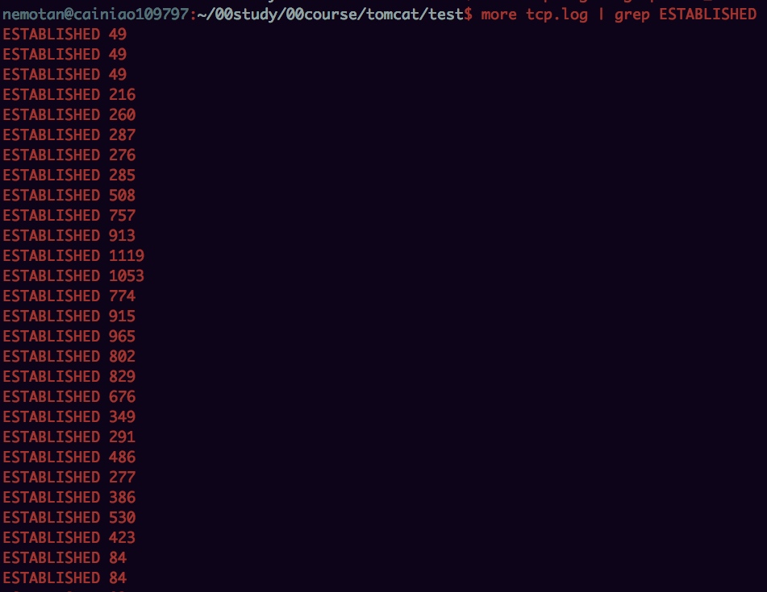
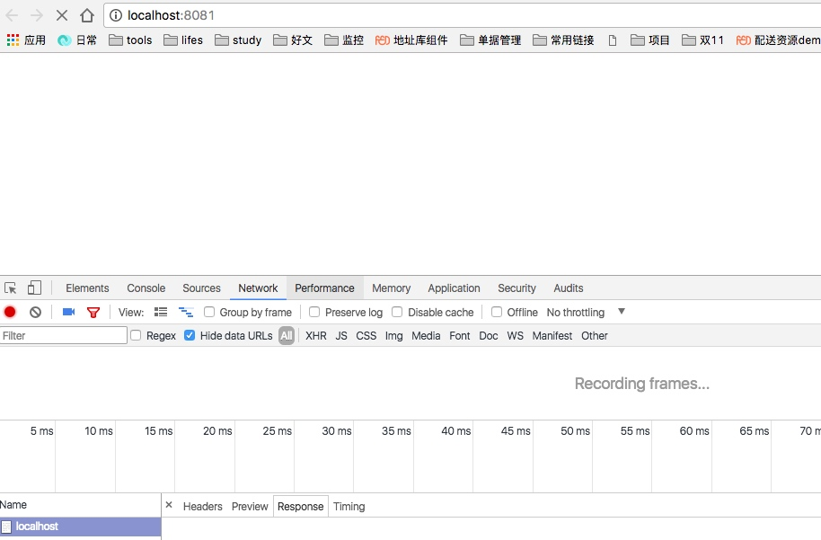
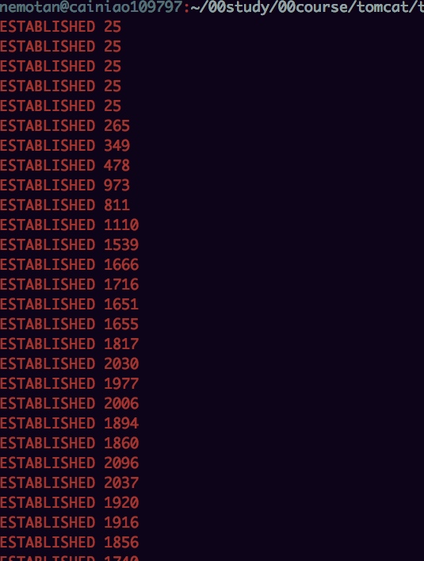
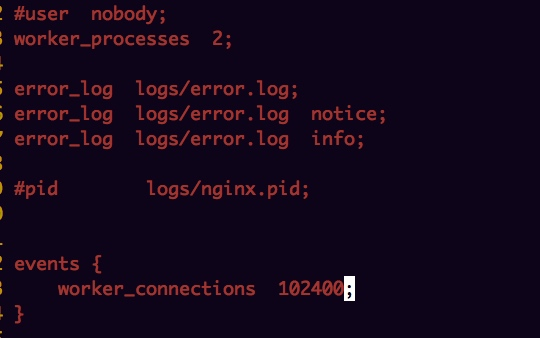

# 环境准备
	
	1. 接着上一课程，自己启动本地的一个tomcat服务器进行jmeter压测和调优
	2. ngnix配置和启动
	3. 环境准备截图如下：
	

	
# 监控脚本
	
	  1 #!/bin/bash
     for i in {1..10000}
            do
                   netstat -n |awk '/^tcp/ {++S[$NF]} END{for(a in S) print a,S[a]}' >> tcp.log
                  # top >> mem.log
                   vm_stat >> cpu.log
                   sleep 1
     done

# 压测数据

[端口状态说明 LISTENING、ESTABLISHED、TIME_WAIT及CLOSE_WAIT](http://blog.csdn.net/zzhongcy/article/details/38851271)

## 线程数：1000

发现没有TIME_WAIT的数据，并且ESTABLISHED数据如图所示：

## 线程数：10000

服务器已经挂了，浏览器已经无法访问

# 调优

