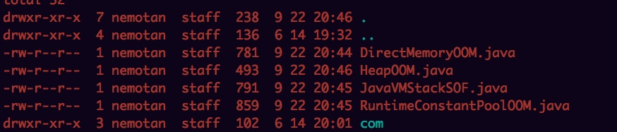
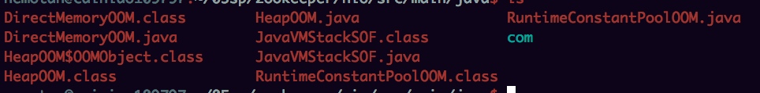
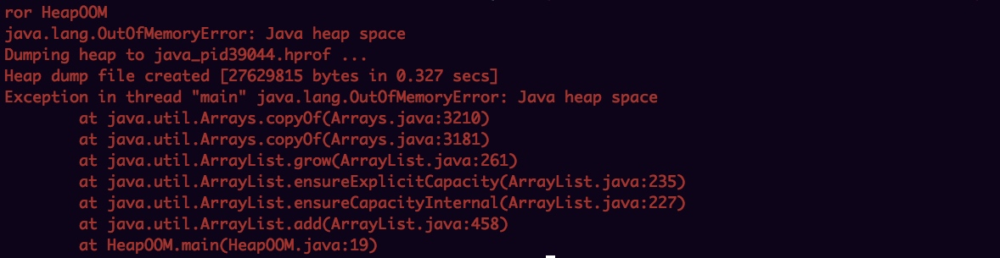
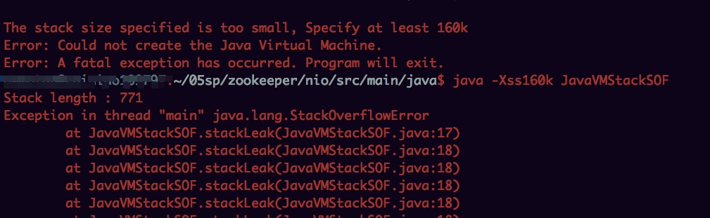
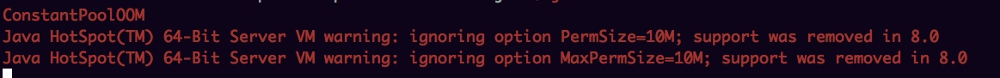

# 编写文件

# 验证

	java -Xms20m -Xmx20m -XX:+HeapDumpOnOutOfMemoryError HeapOOM
	java -Xss160k JavaVMStackSOF
	java -XX:PermSize=10M -XX:MaxPermSize=10M RuntimeConstantPoolOOM
	java -Xms20M -XX:MaxDirectMemorySize=10M DirectMemoryOOM

