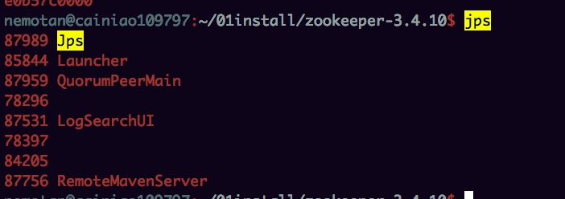

[toc]

# zookeeper单机安装以及常用命令
## 概述
[安装参考](https://zookeeper.apache.org/doc/r3.4.10/zookeeperStarted.html)
[zookeeper系列教程](http://www.cnblogs.com/ggjucheng/p/3352591.html)
## 单机安装

	
	- 下载
	- 修改conf下的zoo.cfg
	- 启动 bin/zkServer.sh start
	- jps 查看
	-  bin/zkCli.sh -server 127.0.0.1:2181 #客户端连接zkServer

## 客户端常用操作
	
	- help #查看命令帮助
	- create /zk_test my_data  创建目录并且放置data
	- get /zk_test
	- set /zk_test junk
	- delete /zk_test

