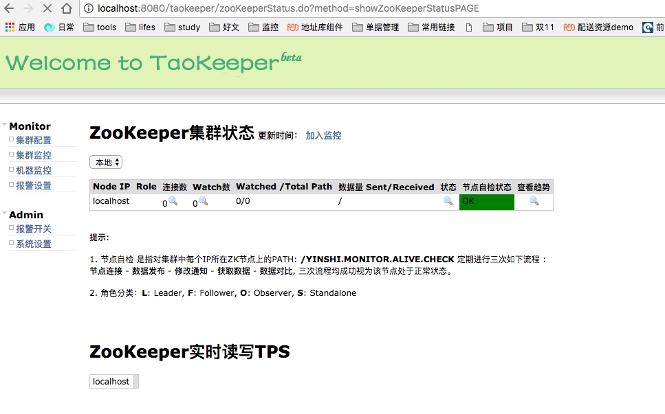
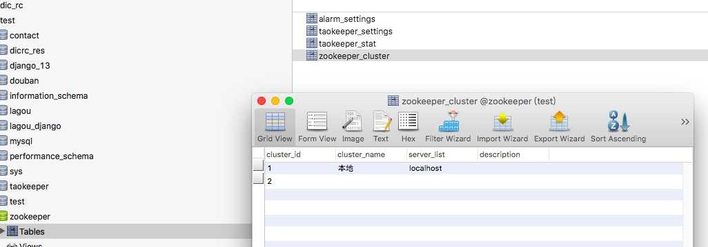
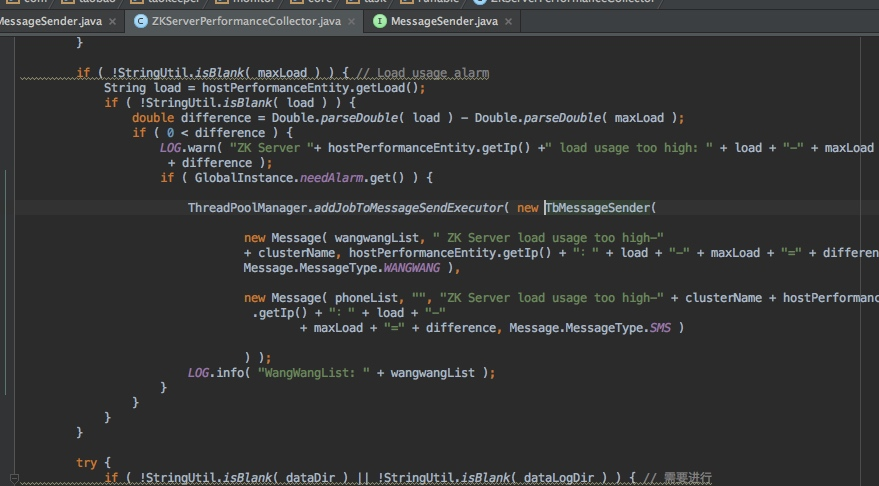

# taozookeeper配置
## 准备工作

[下载部署包](http://vdisk.weibo.com/s/CQ-Nl7qMzVNx)
[下载配置文件](http://vdisk.weibo.com/s/CQ-Nl7qhaSzS)
[初始化mysql](http://vdisk.weibo.com/s/CQ-Nl7qhaSR0)

## 修改tomcat启动参数


JAVA_OPTS=-DconfigFilePath="/Users/nemotan/00study/00course/zookeeper/10/taokeeper-monitor-config.properties"







## 报警配置

**原理：**

使用MessageSender线程进行发送消息，创建一个线程提交到线程池中进行发送消息。添加自定义消息发送器的时候，则addJobToMessageSendExecutor参数中添加为自己的消息发送器即可。



**自定义消息发送器：**

```java
 public class CustomerSender implements MessageSender {
    private static final Logger LOG = LoggerFactory.getLogger( TbMessageSender.class );

    private Message[] messages;

    public CustomerSender( Message... messages ) {
        this.messages = messages;
    }

    @Override
    public void run() {
        if ( null == messages || 0 == messages.length || StringUtil.isBlank( SystemConstant.IP_OF_MESSAGE_SEND ) ){
            LOG.info( "[TaoKeeper]No need to send message: messages.length: " + messages + ", IP_OF_MESSAGE_SEND=" + SystemConstant.IP_OF_MESSAGE_SEND );
            return;
        }

        for ( Message message : this.messages ) {
            try {
                this.sendMessage(StringUtil.trimToEmpty( message.getSubject() ),
                    StringUtil.trimToEmpty( message.getContent() ), StringUtil.trimToEmpty( message.getType().toString() ) );
                LOG.info( "[TaoKeeper]Message send success: " + message );
            } catch ( Exception e ) {
                e.printStackTrace();
                LOG.error( "Message send error: " + message + e.getMessage() );
            }
        }
    }

    private void sendMessage(String subject, String content, String type) {
        // 自定义发送消息
    }
}
```


