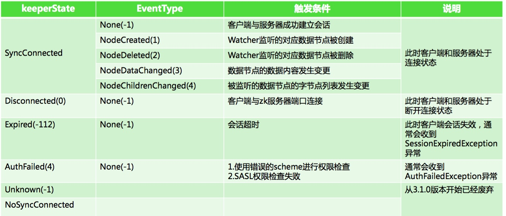

[toc]
## zookeeper客户端连接

### Zookeeper实例化

- zooKeepe构造方法中依赖一个Watcher
- Watcher接口中中process方法
- 每个Watcher值监听一次就会失效，需再注册
- 先启动如下程序
- 会打印出connect事件信息
- 去client中修改node3的信息
- 会打印出DateChanged事件的信息

```java
public class WatchEventTest{
    private static ZooKeeper zooKeeper;

    public static void main(String args[]) throws Exception {
        // 连接的watch
        zooKeeper = new ZooKeeper("127.0.0.1:2181", 5000, new ExampleWatcher());
        System.out.println(zooKeeper.getState().toString());

        // 测试节点
        // 每次都重新注册
        // Watcher 置 ,一旦触发一次即会失效,如果需要一直监 ,就需要再注册
        byte[] bytes = zooKeeper.getData("/node3",new ExampleWatcher(),null);
        System.out.println("node3:"+String.valueOf(bytes));
        Thread.sleep(Integer.MAX_VALUE);
    }
}

public class ExampleWatcher implements Watcher {
    @Override
    public void process(WatchedEvent event) {
        System.out.println("event state:" + event.getState().toString());
        System.out.println("event type:" + event.getType().toString());
    }
}

```

### 事件类状态和类型




