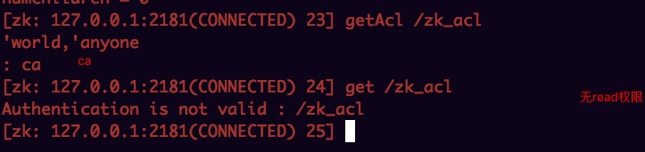

[toc]e3
## 权限操作

### **ACL组成：**

- Scheme:id:permission 比如 world:anyone:crdwa  创建、读取、删除、写入
- Scheme 验证过程中使用的检验策略 
- Id 权限被赋予的对象,比如ip或者某个用户 
- Permission 权限, 面的crdwa,表示五个权限组合 
- 通过setAcl命 置节点的权限 
- 节点的acl 有继承关系 
- getAcl可 查看节点的Acl信息 

### **授权策略一：world**

- world:anyone:crdwa   所有用户授权crdwa
实例：创建一个节点并且授予ca权限

给出的是ca权限，因此当输入get /zk_acl的时候提示没有权限，如下图

### **授权策略二：auth**

- auth:username:password:crdwa  #给认证通过的用户进行授权
- 表示给认证通过的所有用户 置acl权限 
- 同时可添多个用户 
- 通过addauth命进行认证用户的添  addauth digest <username>:<password> 
- Auth策略的本质就是digest 
--- 

实例： 验证授权策略 auth
	
	create /node2 node2
	get /node2
	setAcl /node2 auth:name1:pass1:crdwa #未添加用户，授权失败
	addauth digest name1:pass1 #添加用户
	setAcl /node2 auth:name1:pass1:crdwa  #重新授权
	get /node2

同一窗口


打开新窗口进行获取node2的值，提示无法获取

### **授权策略三：digest**

- Scheme:id:permission ,比如 digest:username:password:crdwa 
- 指定某个用户及它的密码可 问 
- 此处的username:password必 经过SHA-1和BASE64编码 
- 通过addauth命 进行认证用户的添加 ：

---
	addauth digest <username>:<password> 
 
实例：

	create /node4 node4
	get /node4
	setAcl /node4 digest:name4:pass4:crdwa    #和auth scheme不同
	addauth digest name4:pass4 #添加用户
	SHA-1和BASE64编码 
	

	
### **授权策略四：IP**

- Scheme:id:permission ,比如 ip:127.0.0.1:crdwa
- 指定某个ip地址可 问 

--- 
	
实例：
	
	create /node6 node6
	get /node6
	setAcl /node6 ip:127.0.0.1:crdwa    #设置
	get /node6 #可以获取
	setAcl /node6 ip:198.123.0.1:crdwa    #设置其他ip
	get /node6 #重新访问，提示授权失败
	

### **授权策略五：super**

- 供运维人员维护节点使用 
- 有权限操作任何节点 
- 启动时,在命 参数中配置 

--- 
	-Dzookeeper.DigestAuthenticationProvider.superDigest=admin:015uTByzA4zSglcmseJsxTo7n3c= 
	打开zkCli.cmd,在java命 面增 配置

- 用户 和密码也需要通过sha1和base64编码 


	


