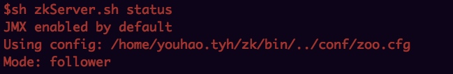
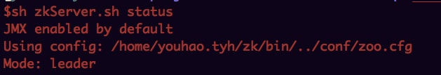
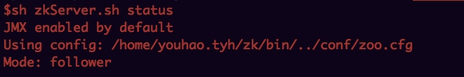

## 解决问题
	
	1.集群部署
	2.基于zk的api实现异步创建节点以及同步修改数据，可以是java语言，也可以是别的语言
	
## 集群部署
	
[参考](http://www.cnblogs.com/fesh/p/3900253.html)
	
|主机名|ip地址|zookeeper|myid|
|:---|:---|:---|:---|
|master| 11.160.120.187	|server.1|1|
|slave1| 11.161.81.163|server.2|2|
|slave2| 11.162.86.18|server.3|3|

**下载：**

	wget http://mirror.bit.edu.cn/apache/zookeeper/zookeeper-3.4.6/zookeeper-3.4.6.tar.gz

**配置三台机器$zoo_home/conf/zoo.cfg:**

	server.1=master:2888:3888
	server.2=slave1:2888:3888
	server.3=slave2:2888:3888	

**分别配置三台机器:$zoo_home/myid**
	
	touch myid
	echo "1" > myid  # master
	echo "2" > myid  # slave1
	echo "3" > myid  # slave2

**设置日志：conf/log4j.properties(可以不改)**

	zookeeper.root.logger=INFO, CONSOLE 改为
	zookeeper.root.logger=INFO, ROLLINGFILE
	
	log4j.appender.ROLLINGFILE=org.apache.log4j.RollingFileAppender 改为：
	log4j.appender.ROLLINGFILE=org.apache.log4j.DailyRollingFileAppender
	
	scp  -r ./zk youhao.tyh@11.161.81.163:/home/youhao.tyh
	scp  -r ./zk youhao.tyh@11.162.86.18:/home/youhao.tyh
	scp  -r ./zk nemotan@30.15.50.110:/home/nemotan
**启动：**
	
	三台机器分别启动：
	master >  slave1 >  slave2
	bin/zkServer.sh start
	bin/zkServer.sh status

**验证：**






## 异步创建节点

```java
public class _22CreateNodeASync implements Watcher {

	private static ZooKeeper zookeeper;

	public static void main(String[] args) throws IOException, InterruptedException {
		zookeeper = new ZooKeeper("127.0.0.1:2181", 5000, new _22CreateNodeASync());
		System.out.println(zookeeper.getState());
		Thread.sleep(Integer.MAX_VALUE);
	}

	@Override
	public void process(WatchedEvent event) {
		System.out.println("收到事件：" + event);
		if (event.getState() == KeeperState.SyncConnected) {
			doSomething();
		}
	}

	private void doSomething() {
		zookeeper.create("/node3", "124".getBytes(), Ids.OPEN_ACL_UNSAFE, CreateMode.PERSISTENT, new IStringCallback(), "创建");
	}

	static class IStringCallback implements AsyncCallback.StringCallback {

		/**
		 * @param rc
		 *            返回码0表示成功
		 * @param path
		 *            我们需要创建的节点的完整路径
		 * @param ctx
		 *            上面传入的值("创建")
		 * @param name
		 *            服务器返回给我们已经创建的节点的真实路径,如果是顺序节点path和name是不一样的
		 */
		@Override
		public void processResult(int rc, String path, Object ctx, String name) {
			StringBuilder sb = new StringBuilder();
			sb.append("rc=" + rc).append("\n");
			sb.append("path=" + path).append("\n");
			sb.append("ctx=" + ctx).append("\n");
			sb.append("name=" + name);
			System.out.println(sb.toString());
		}
	}
	
	/*
	输出：
	CONNECTING
	收到事件：WatchedEvent state:SyncConnected type:None path:null
	rc=0
	path=/node3
	ctx=创建
	name=/node3
	*/

}

```


