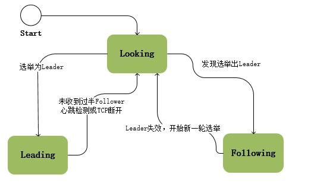
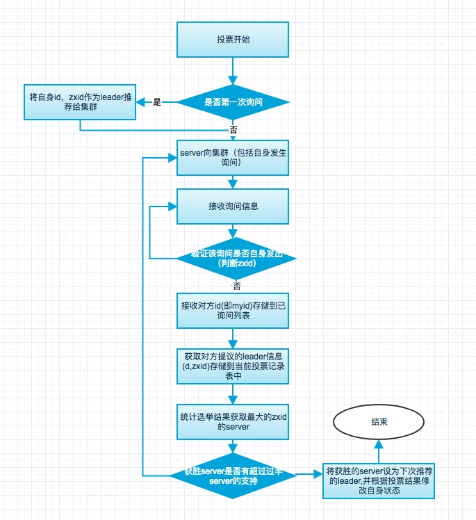
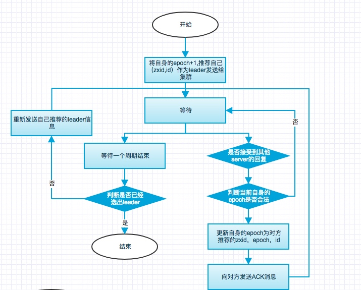

[toc]

# [zookeeper系统宕机恢复](http://cailin.iteye.com/blog/2014486/)

## 角色

zookeeper中的角色主要有三种：

|角色|描述|
|:---|:---|
|领导者（leader）|领导折负责进行投票的发起和决议，更新系统状态|
|跟随者(follower)|Follower用于接收客户请求并向客户端返回结果，在选主过程中参与选票|
|观察者(observer)|observer可以接收客户端连接，将写请求转发给leader节点，你observer不参与投票过程，只同步leader的状态，observer的目的是为了扩展系统，提高读取速度|
|客户端（client）|请求发起方|

## 系统崩溃恢复

当leader崩溃或者leader失去大多数的follower，这时候zk进入恢复模式，恢复模式需要重新选举出一个新的leader，让所有的Server都恢复到一个正确的状态。Zk的选举算法有两种：一种是基于basic paxos实现的，另外一种是基于fast paxos算法实现的。系统默认的选举算法为fast paxos。先介绍basic paxos流程：

- 选举线程由当前Server发起选举的线程担任，其主要功能是对投票结果进行统计，并选出推荐的Server；
- 选举线程首先向所有Server发起一次询问(包括自己)；
- 选举线程收到回复后，验证是否是自己发起的询问(验证zxid是否一致)，然后获取对方的id(myid)，并存储到当前询问对象列表中，最后获取对方提议的leader相关信息(id,zxid)，并将这些信息存储到当次选举的投票记录表中；
- 收到所有Server回复以后，就计算出zxid最大的那个Server，并将这个Server相关信息设置成下一次要投票的Server；
- 线程将当前zxid最大的Server设置为当前Server要推荐的Leader，如果此时获胜的Server获得n/2 + 1的Server票数， 设置当前推荐的leader为获胜的Server，将根据获胜的Server相关信息设置自己的状态，否则，继续这个过程，直到leader被选举出来。

--- 

通过流程分析我们可以得出：要使Leader获得多数Server的支持，则Server总数必须是奇数2n+1，且存活的Server的数目不得少于n+1.
每个Server启动后都会重复以上流程。在恢复模式下，如果是刚从崩溃状态恢复的或者刚启动的server还会从磁盘快照中恢复数据和会话信息，zk会记录事务日志并定期进行快照，方便在恢复时进行状态恢复。选主的具体流程图如下所示：

fast paxos流程是在选举过程中，某Server首先向所有Server提议自己要成为leader，当其它Server收到提议以后，解决epoch和zxid的冲突，并接受对方的提议，然后向对方发送接受提议完成的消息，重复这个流程，最后一定能选举出Leader。其流程图如下所示：

