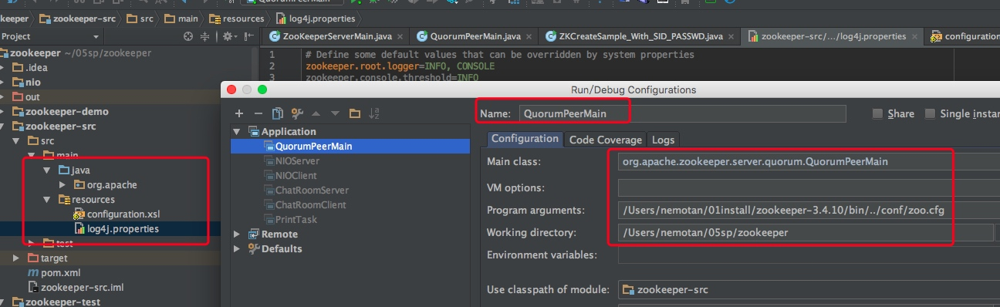
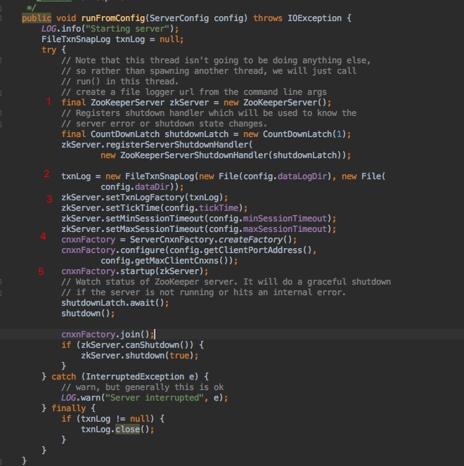
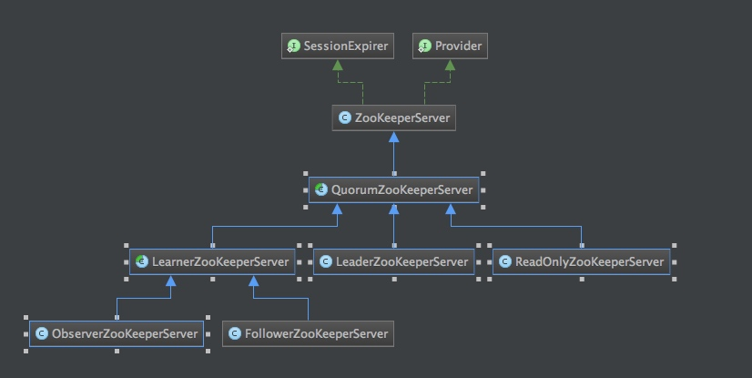
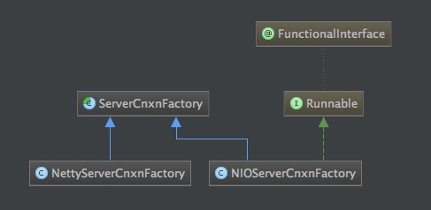
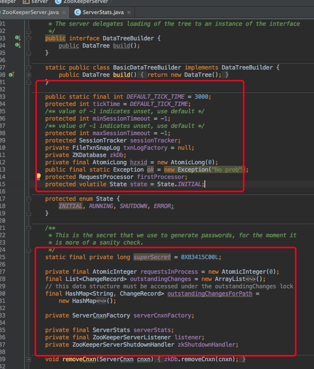
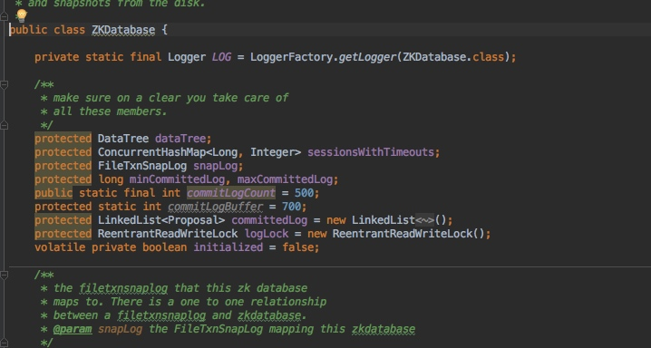
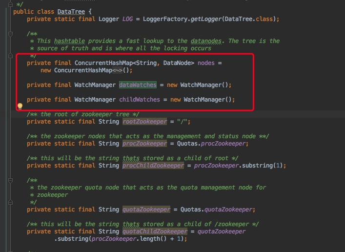
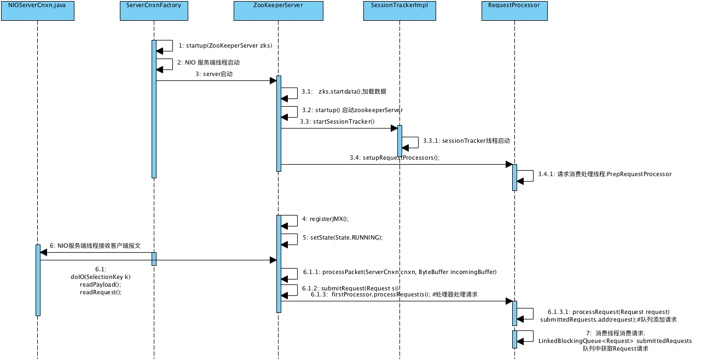
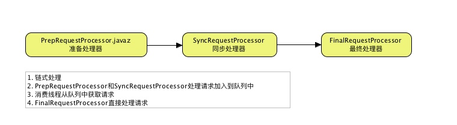
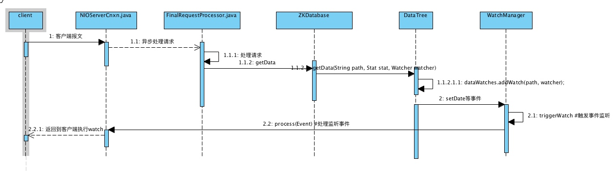

[toc]

# zookeeper源码分析&单机模式通讯协议
## 一. [源码环境搭建](https://my.oschina.net/pingpangkuangmo/blog/484955)
### 1.1 源码脚本分析

我们使用zkServer.sh start 启动zookeeper，对应的类是：
最终如果是本地启动会调用ZooKeeperServerMain.main()方法。

	org.apache.zookeeper.server.quorum.QuorumPeerMain
	ZooKeeperServerMain.main(args);


### 1.2 intellij启动zookeeper服务


### 1.3 zookeeper服务启动步骤




- 1. 创建一个ZooKeeperServer，代表着一个服务器对象
- 2. 根据配置参数dataLogDir和dataDir创建出用于管理事务日志和快照的对象FileTxnSnapLog
- 3. 对ZooKeeperServer设置一些配置参数，如tickTime、minSessionTimeout、maxSessionTimeout
- 4. 创建ServerCnxnFactory，用于创建ServerSocket，等待客户端的socket连接
- 5. 启动ZooKeeperServer服务

#### 1.3.1 ZookeeperServer类

ZooKeeperServer是单机版才使用的服务器对象，集群版都是使用的是它的子类，来看下继承类图



从上图看出集群版分别用的是LeaderZooKeeperServer、FollowerZooKeeperServer、ObserverZooKeeperServer。后两者都属于LearnerZooKeeperServer。

#### 1.3.2 ServerCnxnFactory工厂类分析

获取ServerCnxnFactory源码:zookeeper默认使用的factory是NIOServerCnxnFactory	

```java
static public ServerCnxnFactory createFactory() throws IOException {
		 // 获取系统指定Factoryname：zookeeper.serverCnxnFactory
        String serverCnxnFactoryName =
            System.getProperty(ZOOKEEPER_SERVER_CNXN_FACTORY);
        if (serverCnxnFactoryName == null) {
        	  // 默认使用NIOServerCnxnFactory
            serverCnxnFactoryName = NIOServerCnxnFactory.class.getName();
        }
        try {
            return (ServerCnxnFactory) Class.forName(serverCnxnFactoryName)
                                                .newInstance();
        } catch (Exception e) {
            IOException ioe = new IOException("Couldn't instantiate "
                    + serverCnxnFactoryName);
            ioe.initCause(e);
            throw ioe;
        }
    }
```


zookeeper会支持两种ServerCnxnFactory如下图所示



## 二. ZookeeperServer服务器对象
### 2.1 ZookeeperServer对象重要属性


- tickTime：默认3000ms，用于计算默认的minSessionTimeout、maxSessionTimeout。计算公式如下，同时还用于指定SessionTrackerImpl的执行过期检查的周期时间
	
	---
		minSessionTimeout == -1 ? tickTime * 2 : minSessionTimeout;
		maxSessionTimeout == -1 ? tickTime * 20 : maxSessionTimeout;
	---
- minSessionTimeout、maxSessionTimeout：用于限制客户段给出的sessionTimeout时间
- SessionTracker sessionTracker：负责创建和管理session，同时负责定时进行过期检查
- ZKDatabase zkDb：用于存储ZooKeeper树形数据的模型
- FileTxnSnapLog txnLogFactory：负责管理事务日志和快照日志文件，能根据它加载出数据到ZKDatabase中，同时能将ZKDatabase中的数据以及session保存到快照日志文件中，基本操作如下：
	
	---
		new ZKDatabase(txnLogFactory)
		txnLogFactory.save(zkDb.getDataTree(), zkDb.getSessionWithTimeOuts());

	---
- RequestProcessor firstProcessor：ZooKeeperServer请求处理器链中的第一个处理器
- long hzxid：ZooKeeperServer最大的事务编号，每来一个事务请求，都会分配一个事务编号
- ServerCnxnFactory serverCnxnFactory：负责创建ServerSocket，接受客户端的socket连接
- ServerStats serverStats：负责统计server的运行状态

### 2.2 ZKDatabase分析



- sessionsWithTimeouts : key为sessionId,value为超时时间
- DataTree ： Zookeeper内存节点信息
- committedLog： 用于保存最近提交的一些信息

#### 2.2.1 DataTree

DateTree的属性如下，主要包括了节点的操作以及事件监听，这里着重介绍事件监听。



- dataWatches : 用于管理节点自身数据更新的事件触发
- childWatches : 该节点的所有子节点变动的事件触发


触发事件的流程如下：

- getData(String path, Stat stat, Watcher watcher) #添加该path的watch
- createNode 
- dataWatches.triggerWatch(path, Event.EventType.NodeCreated); #触发事件
- NIOServerCnxn.rocess(WatchedEvent event) # NIOServerCnxn实现Watch接口
- NIOServerCnxn.sendResponse()  #发送给客户端响应

### 2.3 ZooKeeperServer处理请求

### 2.3.1 启动过程

NIOServerCnxnFactory. startup(ZooKeeperServer zks)

```java
  public void startup(ZooKeeperServer zks) throws IOException,
            InterruptedException {
        start(); 
        setZooKeeperServer(zks);
        zks.startdata();
        zks.startup();
   }
```




Processor采用责任链式进行处理请求，如下图：


操作节点流程图：



 
	
	


