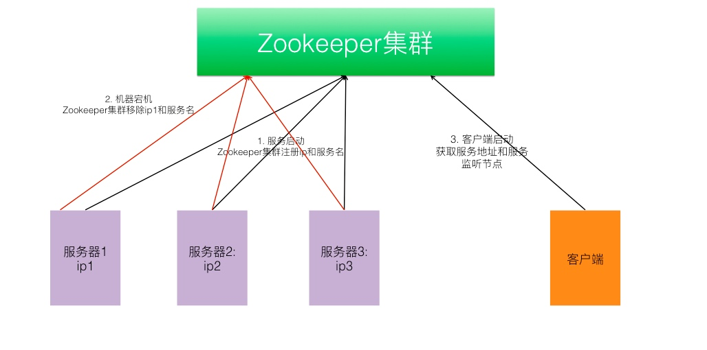
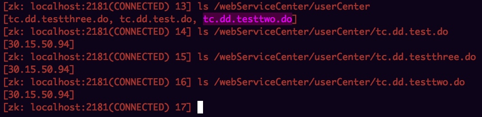

[toc]

# 基于zookeeper-分布式服务&分布式锁的基本实现
ZooKeeper是用于维持配置信息，命名，提供分布式同步，并提供分组服务的集中式服务。是一个高可用的一致性协调框架。基于分布式注册服务我们可以实现自己的分布式系统以及分布式锁。在说明应用场景之前先介绍下zookeeper的节点类型，正式基于zookeeper这些节点类型的特性，才能支撑不同场景的类型。
 
## 节点类型

持久节点（PERSISTENT）
	
在节点创建后，就一直存在，直到有删除操作来主动清除这个节点,不会因为创建该节点的客户端会话失效而消失。

持久顺序节点（PERSISTENT_SEQUENTIAL）

持久化特性和上面保持一致，每个父节点会为他的第一级子节点维护一份时序，会记录每个子节点创建的先后顺序。基于这个特性，在创建子节点的时候，可以设置这个属性，那么在创建节点过程中，ZK会自动为给定节点名加上一个数字后缀，作为新的节点名。这个数字后缀的范围是整型的最大值。

临时节点（EPHEMERAL）

如果客户端会话失效，那么这个节点就会自动被清除掉。注意，这里提到的是会话失效，而非连接断开。另外，在临时节点下面不能创建子节点。

临时顺序节点（EPHEMERAL_SEQUENTIAL）

具备临时性和顺序性。 


## 实现一个类似hsf服务分布式服务框架

在上一篇zookeeper的文章中介绍了zookeeper的基本通信原理，在以及zookeeper的数据模型。在，基于zookeeper分部署注册服务可以实现自己的一个分布式服务。这里使用spring mvc的注解模进行提供http请求的服务。提供服务的基本代码如下：

```java
@Controller
@RequestMapping("/tc/dd")
public class TestControll {

	@RequestMapping("test.do")
```

在服务启动的时候会向zookeeper集群注册一个服务（创建一个 服务名/ip地址的节点）。当部署到不同的服务器上启动的时候，同一个服务下会存在多个ip地址。

在服务宕机的时候想zookeeper集群删除该服务名和/ip地址的节点。

客户端会监听zookeeper该目录，当该服务节点更新的时候，会进行更新服务提供的ip地址。

### 系统架构



### 服务提供

- 服务启动
- 向zookeeper注册服务名+该ip地址
- 系统宕机
- 向zookeeper移除服务名+该ip地址

系统上线结果基本信息如下：


系统宕机（服务下线基本代码：）

```java
# 实现接口
public class ScanControll implements ServletContextListener 

# 注销逻辑
private void destoryBizServices(List<String> services) {
		InetAddress addr;
		try {
			addr = InetAddress.getLocalHost();
			String ip = addr.getHostAddress().toString();
			for (String s : services) {
				String temp = s.replace("/", ".");
				if(temp.startsWith("."))
					temp = temp.substring(1);
				if (client.checkExists().forPath("/" + bizCode +"/"+ temp) != null) {
					// 移除该服务下的该ip节点
					client.delete()
					.deletingChildrenIfNeeded()
					.forPath("/" + bizCode +"/"+ temp+"/"+ip);
			}
			}
		} catch (UnknownHostException e) {
			// TODO Auto-generated catch block
			e.printStackTrace();
		} catch (Exception e) {
			// TODO Auto-generated catch block
			e.printStackTrace();
		}

	}
	
#当服务关闭的时候：
2017-07-06 17:52:12.988 com.web.service.ScanControll destory
System.out: 系统宕机啦------开始注销
2017-07-06 17:52:13.052 org.apache.coyote.AbstractProtocol stop
INFO: Stopping ProtocolHandler ["http-bio-8080"]
2017-07-06 17:52:14.136 org.apache.coyote.AbstractProtocol destroy
INFO: Destroying ProtocolHandler ["http-bio-8080"]
Disconnected from server
```

zookeeper节点情况：已经删除该ip节点


### 客户端

- 客户端启动获取服务+ip地址
- 添加监听，每一次节点删除或者新增都需要进行重新获取服务


**事件代码：**

```JAVA
public void addChildWatcher(String path) throws Exception {
		final PathChildrenCache cache = new PathChildrenCache(this.client,
				path, true);
		cache.start(StartMode.POST_INITIALIZED_EVENT);//ppt中需要讲StartMode
		//System.out.println(cache.getCurrentData().size());
		cache.getListenable().addListener(new PathChildrenCacheListener() {
			public void childEvent(CuratorFramework client,
					PathChildrenCacheEvent event) throws Exception {
				if(event.getType().equals(PathChildrenCacheEvent.Type.INITIALIZED)){
					System.out.println("客户端子节点cache初始化数据完成");
					//System.out.println("size="+cache.getCurrentData().size());
				}else if(event.getType().equals(PathChildrenCacheEvent.Type.CHILD_ADDED)){
					//System.out.println("添加子节点:"+event.getData().getPath());
					//System.out.println("修改子节点数据:"+new String(event.getData().getData()));
					updateLocalService(event.getData().getPath(),0);
				}else if(event.getType().equals(PathChildrenCacheEvent.Type.CHILD_REMOVED)){
					System.out.println("删除子节点:"+event.getData().getPath());
					//if(services.containsKey(event.getData().getPath()))
					//servicesByP.containsKey(event.getData().)
					updateLocalService(event.getData().getPath(),1);
				}else if(event.getType().equals(PathChildrenCacheEvent.Type.CHILD_UPDATED)){
					//System.out.println("修改子节点数据:"+event.getData().getPath());
					//System.out.println("修改子节点数据:"+new String(event.getData().getData()));
				}
			}
		});
	}	

```

**获取服务代码：**


```JAVA
private void updateLocalService(String path,int dOrAdd){
		//userCenter/tcdd.test.do/ip
		if(path.endsWith("/"))
			path = path.substring(0, path.length()-2);
		String nodes[] = path.split("/");
		String serviceName = nodes[nodes.length-2];
		String providerAdd = nodes[nodes.length-1];
		if(serviceName.endsWith(".do")){
			serviceName = serviceName.replace(".", "/");
			serviceName = serviceName.replace("/do", ".do");
			if(!serviceName.startsWith("/"))
				serviceName="/"+serviceName;
		}else{
			serviceName = serviceName.replace(".", "/");
		}		
		if(dOrAdd==0){
			//创建节点
			if(!services.containsKey(serviceName)){
				services.put(serviceName, new HashSet<String>());
			}
			services.get(serviceName).add(providerAdd);
			
			if(!servicesByP.containsKey(providerAdd)){
				servicesByP.put(providerAdd, new HashSet<String>());
			}
			servicesByP.get(providerAdd).add(serviceName);
			
		}else if(dOrAdd==1){
			//删除节点
			services.get(serviceName).remove(providerAdd);
			servicesByP.remove(providerAdd);
		}

		printService();
		
	}

```
上面就实现了分布式服务，服务端提供服务，客户端的请求可以请求到多个服务端进行处理,并且支持服务优雅上下线。

## zookeeper实现分布式排他锁

基本原理：

使用zookeeper临时节点创建的基本原理，可以实现多个线程进行互斥创建一个临时节点，当获取锁的线程进行删除临时节点或者断开链接，其他线程通过监听zookeeper节点事件进行锁的竞争获取。

获取锁的代码：

```java
public static synchronized void getExclusiveLock() {
		while (true) {
			try {
				// 创建一个排他锁节点
				client.create().creatingParentsIfNeeded()
						.withMode(CreateMode.EPHEMERAL)
						.withACL(Ids.OPEN_ACL_UNSAFE)
						.forPath("/ExclusiveLockDemo/lock");
				logger.info("成功获取到锁");
				return;// 如果节点创建成功，即说明获取锁成功
			} catch (Exception e) {
				logger.info("此次获取锁没有成功");
				try {
					// 如果没有获取到锁，需要重新设置同步资源值
					if(latch.getCount()<=0){
						latch = new CountDownLatch(1);
					}
					// 线程阻塞,当获取锁的线程释放锁的时候,进行唤醒
					latch.await();
				} catch (InterruptedException e1) {
					e1.printStackTrace();
					logger.error("", e1);
				}
			}
		}
}
```

释放锁&当前线程进入抢占锁：

```java
if (event.getType().equals(PathChildrenCacheEvent.Type.CHILD_REMOVED)) {
	String path = event.getData().getPath();
	logger.info("收到监听:"+path);
	if(path.contains("ExclusiveLockDemo")){
			logger.info("排他锁,收到锁释放通知");	
			// 当前线程监听到释放所通知，进行线程唤醒，进入	getExclusiveLock进行抢占锁				
			latch.countDown();

	}
}
```


## zookeeper实现分布式共享锁

实现原理：

创建临时顺序节点（EPHEMERAL_SEQUENTIAL），根据创建节点的顺序和当前线程创建的节点进行对比进行判断是否获取锁。

锁定义：

读锁:如果前面线程使用的是读锁,则后续的线程可以以获取读锁,从而可以继续进行读操作
写锁:如果在线程打算获取锁从而进行操作时,无论前面已经含有读锁或者写锁则该线程进入等待

zookeeper实现原理：

获得读锁:利用zk节点的有序性,对于读操作,节点名称带一个R标识,如果前面存在序列数比自身小,并且都是带R标识,则说明前面 的都是读锁,可以继续获取读锁，否则,等待锁释放锁有机会再抢
•获得写锁:只有自己创建的节点序列最小,才能获得读锁,否则,进入等待,
        直到有锁资源被释放,然后再判断是否有机会得到锁
• 释放锁:删除节点或者会话失效
 
获取锁：如果获取不到锁，第一次添加监听并且线程阻塞。

```java
/**
	 * 是否可以获取锁
	 *
	 * @param childrens		锁目录子节集合
	 * @param type			获取锁类型: 0: 读锁  1: 写锁
	 * @param identity		当前节点标记: [ip1:ip2:ip3]
	 * @param reps			是否监听之后获取锁自检,如果为false:需要添加监听
     * @return
     */
	private static boolean canGetLock(List<String> childrens, int type,
			String identity,boolean reps) {
		boolean res = false;
		if(childrens.size()<=0)
			return true;
		
		try {
			String currentSeq = null;
			List<String> seqs = new ArrayList<String>();
			//List<String> identitys = new ArrayList<String>();
			Map<String,String> seqs_identitys = new HashMap<String,String>();
			// 获取当前线程节点例如 00000030后缀
			for (String child : childrens) {
				String splits[] = child.split("-");
				seqs.add(splits[1]);
				//identitys.add(splits[0]);
				//
				seqs_identitys.put(splits[1], splits[0]);
				if (identity.equals(splits[0]))
					currentSeq = splits[1];
			}

			// 节点名称排序
			List<String> sortSeqs = new ArrayList<String>();
			sortSeqs.addAll(seqs);
			Collections.sort(sortSeqs);

			// 第一个节点，则无论是读锁还是写锁都可以获取
			if (currentSeq.equals(sortSeqs.get(0))) {
				res = true;
				logger.info("请求锁,因为是第一个请求锁的请求，所以获取成功,identity:"+identity+",type:"+type+",sortSeqs:"+sortSeqs.toString()+",reps:"+reps);
				return res;
			} else {
				// 当前节点非第一个节点(前面有其他节点),获取写锁需要失败
				if (type == 1) {
					res = false;
					//第一次请求取锁则设置监听，以后就不设置了，因为监听一直存在
					if(reps==false)
						addChildWatcher("/ShardLockDemo");
					logger.info("请求写锁，因为前面有其它锁，所以获取锁失败,identity:"+identity+",type:"+type+",sortSeqs:"+sortSeqs.toString()+",reps:"+reps);
					return res;
				}
			}
			// int index =-1;
			boolean hasW = true;
			for (String seq : sortSeqs) {
				// ++index;
				if (seq.equals(currentSeq)) {
					break;
				}
				// 该节点之前只要有读锁则hasW = false
				if (!seqs_identitys.get(seq).startsWith("W"))
					hasW = false;
			}
			// 当前为读锁并且该节点之前无写锁
			if (type == 0 && hasW == false) {
				res = true;
			} else if (type == 0 && hasW == true) {
				res = false;
			}
			if (res == false) {
				// 添加监听
				addChildWatcher("/ShardLockDemo");
				logger.info("因为没有获取到锁，添加锁的监听器");
			}
		} catch (Exception e) {
			e.printStackTrace();
		}
		return res;
	}

```

释放锁：

```java
public static boolean unlockForShardLock() {
		try {
			if (client.checkExists().forPath(selfNodeName) != null) {
				client.delete().forPath(selfNodeName);
			}
		} catch (Exception e) {
			e.printStackTrace();
			return false;
		}
		return true;
	}
```

监听：

```java
if(path.contains("ShardLockDemo")){
			logger.info("共享锁,收到锁释放通知");	
			//收到自己的通知就不处理
			if(path.contains(selfIdentity))
				return;
			List<String> lockChildrens = client.getChildren().forPath(
					"/ShardLockDemo");
			boolean isLock = false;
			try{
			//当前线程读锁竞争锁
			if(selfIdentity.startsWith("R"))
				isLock = canGetLock(lockChildrens,0,selfIdentity.substring(0, selfIdentity.length() - 1),true);
			else if(selfIdentity.startsWith("W"))
				isLock = canGetLock(lockChildrens,1,selfIdentity.substring(0, selfIdentity.length() - 1),true);
			}catch(Exception e){
				e.printStackTrace();
			}
			logger.info("收到锁释放监听后，重新尝试获取锁，结果为:"+isLock);
			if(isLock){
				//获得锁
				logger.info("获得锁，解除因为获取不到锁的阻塞");
				shardLocklatch.countDown();
			}
	}
```


# 总结

这篇文章主要介绍了zookeeper的使用场景，也就是我们知道了zookeeper是个分布式注册服务，那么我们可以用它来干什么。当zookeeper的使用场景不止上面介绍的，也可以实现分布式队列、分布式命名服务等功能。自己从分布式服务展开分析，实现了一下基本源码。在我们平时用到的hsf、dubbo、hbase分布式框架中分布式的底层实现应当也是使用或者基于类似zookeeper实现的。

